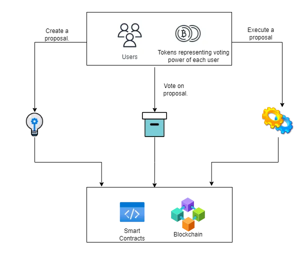
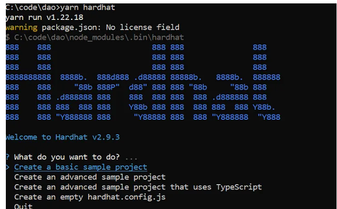
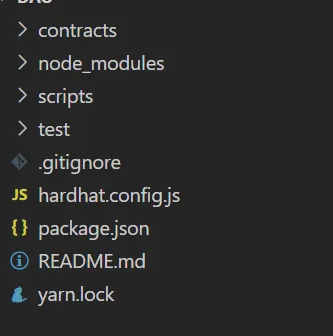

本文将帮助您理解 DAO 的概念，并帮助您构建一个基本的 DAO。

## 什么是 DAO？

您可以将 DAO 视为基于互联网的实体（比如企业），由其股东（拥有代币和比例投票权的成员）共同拥有和管理。在 DAO 中，决策是通过提案做出的，DAO 的成员可以对这些提案进行投票，然后执行它们。

DAO 完全由可公开查看/可验证的代码管理，没有一个人（如 CEO）负责决策。

## DAO 如何运作？

如前所述，DAO 由代码管理，但是如果运行代码的机器的人决定关闭机器或编辑代码怎么办？

所需要的是让相同的代码在由不同实体托管的一组机器上运行，这样即使其中一个关闭，另一个也可以接管。区块链帮助我们解决了上述问题，基于 EVM 的区块链（如 Ethereum 和 Polygon）允许我们在公共去中心化分类账上运行智能合约。部署在这些网络上的智能合约将传播到网络上所有可以查看和验证它的节点，并且没有任何一方控制网络。

具有代币成员资格的 DAO 向其成员发行代币，代币代表系统中的投票权。根据所设置的治理，任何人都可以创建 DAO 更改提案，并将其提交给具有法定人数（通过所需的最低百分比/票数）和投票持续时间的投票。成员可以对提案进行查看和投票，投票权与成员拥有的代币数量成正比。投票期结束后，我们检查提案是否通过，如果通过，则执行。

DAO 的一些示例是[MakerDAO](https://makerdao.com/en/)和[Aragon](https://aragon.org/)。

下图显示了流程。



## 让我们开始建设

我们将在我们的代码库中使用[OpenZeppelin](https://docs.openzeppelin.com/contracts/4.x/governance)合约，我还将使用 Patrick Collins 的[DAO 模板](https://github.com/PatrickAlphaC/dao-template/)中的一些代码。

## 先决条件

您将需要以下内容才能开始。

1. **Node.js ：您可以从 Node.js**[网站](https://nodejs.org/en/)下载最新版本。我在撰写本文时使用的版本是 16.14.2。
2. **Yarn**：我们将使用 Y [arn](https://yarnpkg.com/getting-started)作为包管理器。
3. **Hardhat**：我们将使用[Hardhat](https://hardhat.org/)作为本地开发环境。

## 资料库

我已经编写代码并将其推送到 GitHub，如果您想自己尝试，可以在[此处](https://github.com/pranavkirtani/Basic-Dao)获取代码，不过我建议您留下来，因为我会解释代码。

## 场景

我们将构建一个将执行以下操作的 DAO：

**场景 1**

1. 添加初始成员。（让我们称他们为创始人）。
2. 让创始人创建一个提案。（提出要在智能合约上执行的功能）。
3. 让方正对上述提案进行投票，因为方正拥有 100% 的投票份额，因此它将通过。
4. 执行提案。（以及智能合约中的功能）

**场景 2**

1. 添加一个初始成员（我们称他们为 Founder）。
2. 添加另一个成员并向他们发行价值 20% 的创始人份额的新代币。
3. 让创始人创建一个提案（提出一个要在智能合约上执行的功能）。
4. 让创始人和新成员对上述提案进行投票。法定人数设置为 90%。
5. 执行提案（以及智能合约中的功能）。

## 合约

如前所述，我们将使用 OpenZeppelin 的治理合约。合同如下：

1. **Governor contract：** Governor contract决定了一个quorum所需的票数/百分比（例如，如果quorum是4%，那么只需要4%的选民投票通过该提案），投票周期即多久投票是否开放，投票延迟，即提案创建后多长时间允许成员更改他们拥有的代币数量。总督还提供创建提案、投票和执行提案的功能。
2. **TimeLock：** TimeLock 合约为不同意决定执行前退出系统的成员提供时间。
3. **Token：** Token合约是一种特殊类型的ERC20合约，实现ERC20Votes扩展。这允许将投票权映射到过去余额的快照而不是当前余额，这有助于防止成员知道即将提出重要提案并试图通过购买更多代币然后在之后抛售来增加他们的投票权投票。
4. **目标：**这是合约，其代码将在提案通过投票后执行。

## 代码

让我们开始把这一切放在一起。使用 Hardhat 创建一个空的示例项目。在您的终端中运行以下命令。

> yarn add — 开发安全帽

接下来，让我们使用 hardhat 创建我们的文件夹结构。


你应该看到这样的提示



单击“创建基本示例项目”。该过程完成后，您应该会看到类似这样的内容。




## 合约

让我们开始添加合约，首先让我们添加 GovernorContract。[我们可以从OpenZeppelin](https://docs.openzeppelin.com/contracts/4.x/governance)获得相同的代码，或者您可以复制下面的代码或从我的仓库中复制代码。我的合约代码修复了 OpenZeppelin 版本中的一个[问题](https://github.com/OpenZeppelin/openzeppelin-contracts/issues/3371)，以及投票延迟、法定人数和投票周期的参数化，类似于 Patrick Collins 版本。


```
// SPDX-License-Identifier: MIT
pragma solidity ^0.8.4;
import “@openzeppelin/contracts/governance/Governor.sol”;
import “@openzeppelin/contracts/governance/extensions/GovernorSettings.sol”;
import “@openzeppelin/contracts/governance/extensions/GovernorCountingSimple.sol”;
//import “@openzeppelin/contracts/governance/extensions/GovernorVotes.sol”;
import “@openzeppelin/contracts/governance/extensions/GovernorVotesQuorumFraction.sol”;
import “@openzeppelin/contracts/governance/extensions/GovernorTimelockControl.sol”;
contract GovernorContract is Governor, GovernorSettings, GovernorCountingSimple, GovernorVotes, GovernorVotesQuorumFraction, GovernorTimelockControl {
constructor(IVotes _token, TimelockController _timelock,uint256 _quorumPercentage,
uint256 _votingPeriod,
uint256 _votingDelay)
Governor(“GovernorContract”)
GovernorSettings(_votingDelay,_votingPeriod,0)
GovernorVotes(_token)
GovernorVotesQuorumFraction(_quorumPercentage)
GovernorTimelockControl(_timelock)
{}
// The following functions are overrides required by Solidity.
function votingDelay()
public
view
override(IGovernor, GovernorSettings)
returns (uint256)
{
return super.votingDelay();
}
function votingPeriod()
public
view
override(IGovernor, GovernorSettings)
returns (uint256)
{
return super.votingPeriod();
}
function quorum(uint256 blockNumber)
public
view
override(IGovernor, GovernorVotesQuorumFraction)
returns (uint256)
{
return super.quorum(blockNumber);
}
function getVotes(address account, uint256 blockNumber)
public
view
override(Governor, IGovernor)
returns (uint256)
{
return _getVotes(account, blockNumber, _defaultParams());
}
function state(uint256 proposalId)
public
view
override(Governor, GovernorTimelockControl)
returns (ProposalState)
{
return super.state(proposalId);
}
function propose(address[] memory targets, uint256[] memory values, bytes[] memory calldatas, string memory description)
public
override(Governor, IGovernor)
returns (uint256)
{
return super.propose(targets, values, calldatas, description);
}
function proposalThreshold()
public
view
override(Governor, GovernorSettings)
returns (uint256)
{
return super.proposalThreshold();
}
function _execute(uint256 proposalId, address[] memory targets, uint256[] memory values, bytes[] memory calldatas, bytes32 descriptionHash)
internal
override(Governor, GovernorTimelockControl)
{
super._execute(proposalId, targets, values, calldatas, descriptionHash);
}
function _cancel(address[] memory targets, uint256[] memory values, bytes[] memory calldatas, bytes32 descriptionHash)
internal
override(Governor, GovernorTimelockControl)
returns (uint256)
{
return super._cancel(targets, values, calldatas, descriptionHash);
}
function _executor()
internal
view
override(Governor, GovernorTimelockControl)
returns (address)
{
return super._executor();
}
function supportsInterface(bytes4 interfaceId)
public
view
override(Governor, GovernorTimelockControl)
returns (bool)
{
return super.supportsInterface(interfaceId);
}
}
```

接下来，让我们添加令牌合约，这在 OpenZeppelin 上也是可用的。我的代码有一个额外的“issueToken”函数（稍后会详细介绍）。

```
// SPDX-License-Identifier: MIT
pragma solidity ^0.8.2;
import "@openzeppelin/contracts/token/ERC20/ERC20.sol";
import "@openzeppelin/contracts/token/ERC20/extensions/draft-ERC20Permit.sol";
import "@openzeppelin/contracts/token/ERC20/extensions/ERC20Votes.sol";
contract MyToken is ERC20, ERC20Permit, ERC20Votes {
constructor() ERC20("MyToken", "MTK") ERC20Permit("MyToken") {
_mint(msg.sender, 1000);
}
// The functions below are overrides required by Solidity.
function _afterTokenTransfer(address from, address to, uint256 amount)
internal
override(ERC20, ERC20Votes)
{
super._afterTokenTransfer(from, to, amount);
}
function _mint(address to, uint256 amount)
internal
override(ERC20, ERC20Votes)
{
super._mint(to, amount);
}
function _burn(address account, uint256 amount)
internal
override(ERC20, ERC20Votes)
{
super._burn(account, amount);
}
function issueToken(address to, uint256 amount) public{
_mint(to, amount);
}
}
```

最后，让我们检查一下 Target 合约，在我们的例子中，我们将使用 Patrick Collins 使用的相同 Box 合约。

```
// SPDX-License-Identifier: MIT
pragma solidity ^0.8.0;
import "@openzeppelin/contracts/governance/TimelockController.sol";
contract TimeLock is TimelockController {
// minDelay is how long you have to wait before executing
// proposers is the list of addresses that can propose
// executors is the list of addresses that can execute
constructor(
uint256 minDelay,
address[] memory proposers,
address[] memory executors
) TimelockController(minDelay, proposers, executors) {}
}
```

## 测试

现在我们有了合同，我们需要编写测试。在“test”文件夹下创建一个文件“sample-test.js”。让我们开始编写我们的测试。首先，让我们使用以下数据创建一个名为“helper.config.js”的配置文件。

```
module.exports=
{
      MIN_DELAY:3600,
      QUORUM_PERCENTAGE:90,
      VOTING_PERIOD:5,
      VOTING_DELAY:3,
      ADDRESS_ZERO :"0x0000000000000000000000000000000000000000"
}
```

法定人数为 90%，投票周期为 5 个区块，投票延迟为 3 个区块。TimeLock 的最小延迟为 3600 秒。

让我们编写代码将所有合约部署到本地网络（Hardhat 在内部管理它，我们不需要启动任何进程）

```
governanceToken = await ethers.getContractFactory("MyToken")
deployedToken=await governanceToken.deploy();
await deployedToken.deployed();
transactionResponse = await deployedToken.delegate(owner.address)
await transactionResponse.wait(1)
timeLock = await ethers.getContractFactory("TimeLock")
deployedTimeLock=await timeLock.deploy(MIN_DELAY,[],[]);
await deployedTimeLock.deployed();
governor = await ethers.getContractFactory("GovernorContract")
deployedGovernor=await governor.deploy(deployedToken.address,deployedTimeLock.address,QUORUM_PERCENTAGE,VOTING_PERIOD,VOTING_DELAY);
await deployedGovernor.deployed()
box = await ethers.getContractFactory("Box")
deployedBox=await box.deploy()
await deployedBox.deployed()
```

## 提案创建

接下来，创建提案。我们传递将在 Box 合约及其参数上调用的函数的编码值。

propose 函数的输出是一个包含**Proposal Id 的交易。**这用于跟踪提案。

```
const proposalDescription="propose this data"
let encodedFunctionCall = box.interface.encodeFunctionData("store", [77])
const proposeTx = await deployedGovernor.propose([deployedBox.address],[0],[encodedFunctionCall],proposalDescription);
```

提案是在值为 77 的 Box 合约上触发*存储功能。*

## 表决

然后我们对该提案进行投票，投票“1”表示同意。

**注意：**在这种情况下，我们只有一名成员（拥有 100% 的选票）在投票。

```
const voteWay = 1
const reason = "I vote yes"
let voteTx = await deployedGovernor.castVoteWithReason(proposalId, voteWay, reason)
```

## 队列和执行

接下来，来自 DAO 的任何成员都可以排队并执行该提案，如果提案通过投票，它将被执行，并且 Box 合约上的存储函数将被调用，值为 77。你可能已经注意到像*moveTime*和*moveBlocks ，*这些来自 Patrick Collins [DAO 模板](https://github.com/PatrickAlphaC/dao-template/tree/main/utils)，在开发环境中可用于模拟时间的流逝和区块挖掘，它们帮助我们模拟投票期的完成、时间锁定延迟等。

```
const queueTx = await deployedGovernor.queue([deployedBox.address],[0],[encodedFunctionCall],descriptionHash)
await queueTx.wait(1)
await moveTime(MIN_DELAY + 1)
await moveBlocks(1)
console.log("Executing...")
const executeTx = await deployedGovernor.execute(
[deployedBox.address],
[0],
[encodedFunctionCall],
descriptionHash
)
await executeTx.wait(1)
const value=await deployedBox.retrieve();
console.log(value)
```

**运行测试**

我们现在可以使用以下命令运行测试

> 纱线安全帽测试

## 向新成员发行代币

我们上面看到的是场景 1 的流程。对于场景 2，我们需要向新成员发行新代币并让他们对提案进行投票。

发行代币的代码如下所示

```
[owner, addr1, addr2] = await ethers.getSigners();
const signer=await ethers.getSigner(addr1.address);
const deployedTokenUser2=await deployedToken.connect(signer)
await deployedTokenUser2.issueToken(addr1.address,200)
```

函数*getSigners()*返回 Hardhat 开发环境中所有帐户的列表，然后我们向该地址发行 200 个令牌。

## 新成员投票

现在我们有了另一个成员，我们可以用他来投票，但是新成员不能投票，除非他首先将自己添加为代币合约的代表，这样做是为了让拥有代币但不想参与决策的成员不需要花费额外的 gas 成本来维护他们在账本上的投票权快照。

自委托的代码如下。

```
[owner, addr1, addr2] = await ethers.getSigners();
const signer=await ethers.getSigner(addr1.address);
const deployedTokenUser2=await deployedToken.connect(signer)
await deployedTokenUser2.issueToken(addr1.address,200)
```


文章来源:https://blog.blockmagnates.com/how-to-build-a-dao-decentralized-autonomous-organization-in-solidity-af1cf900d95d