# Part1

打开remix：https://remix.ethereum.org/

右击左侧contracts文件夹 新建文件MyContract

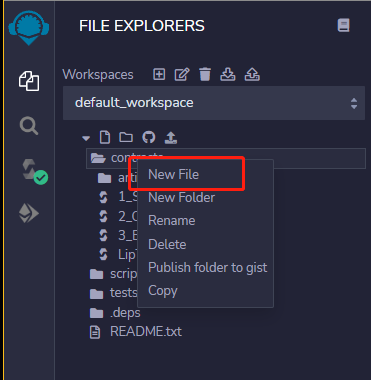

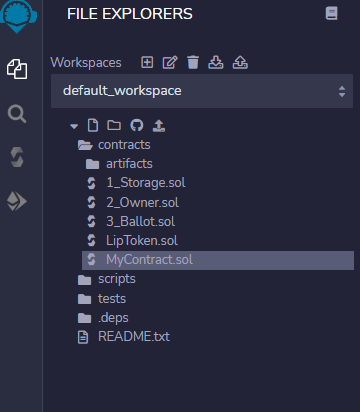

合约、库、事件及[结构体](https://so.csdn.net/so/search?q=结构体&spm=1001.2101.3001.7020)命名应该使用单词首字母大写的方式，这个方式也称为：驼峰式命名法，比如：SimpleToken， SmartBank， CertificateHashRepository，Player。


##  SPDX License 标识

如果他们的源代码是可用的，可以更好地建立对智能合约的信任。 因为提供源代码总是涉及版权方面的法律问题，所以Solidity编译器鼓励使用机器可读的SPDX许可证标识符。 每个源文件都应该以说明其许可的注释开始: 

```
// SPDX-License-Identifier: MIT
```

编译器不验证许可证是否是SPDX允许的列表的一部分，但是它在字节码元数据中包含了提供的字符串。  

如果您不想指定许可，或者如果源代码不是开源的，请使用unlicenses特殊值。  

当然，提供这一注释并不能免除与许可相关的其他义务，比如必须在每个源文件或原始版权持有人中提到特定的许可头。  

编译器可以在文件级别识别文件中的任何地方的注释，但建议将其放在文件的顶部。  

关于如何使用SPDX许可证标识符的更多信息可以在SPDX网站上找到。 

了解更多的SPDX请参考网站 https://spdx.org/ids-how


本例中将在文件头部添加以下注释

```solidity
// SPDX-License-Identifier: GPL-3.0
```


## Pragmas版本设置

pragma 用于确定当前代码所使用的的solidity版本

本例使用0.8.0版本

```solidity
pragma solidity 0.8.0;
```

在文件中设定好所使用的的版本后 修改remix的编译版本

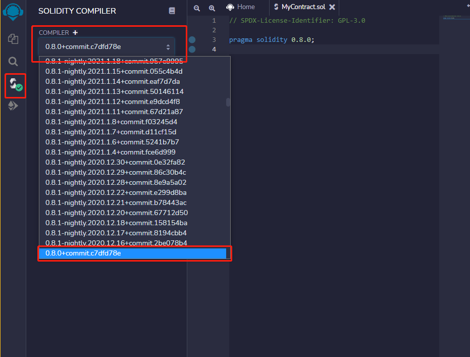


**注：remix中的compiler版本需与文件中所需要的solidity版本一致**


## 注释

1. 在// 后写注释

例子

```solidity
// This is a comment
```


2.在/*      */写入多行注释

```solidity
// SPDX-License-Identifier: GPL-3.0

pragma solidity 0.8.0;

// This is a comment

/* This
    is
    a
    comment
*/
```


## 合约

在**solidity**中，合约的语法和面向对象很相似，在一般的面向对象语言中，我们使用**class**来定义一个类；在这一个类中我们将会有这个类的方法属性。

在**solidity**中，我们使用**contract**来定义一个合约，这个合约可以用对应的合约变量，以及合约的方法。


contract就像一个盒子，开发者可以再contract这个盒子中编写所需的方法或者变量。在完成合约的编写后，可以将合约部署到区块链上 并生成一个合约地址

示例:

```solidity
contract MyContract {
    
}
```


## NATSpec格式

natspec不会再区块链中显示，但他会告诉开发者当前合约的信息

Solidity契约可以使用特殊形式的注释为函数、返回变量等提供丰富的文档。这种特殊形式被命名为以太坊自然语言规范格式（natspec）。

示例：

```solidity
/// @title Basic solidity
/// @author YanAemons
/// @notice You can use this contract for only the most basic simulation
/// @dev All function calls are currently implemented without side effects
/// @custom:experimental This is an experimental contract.
```

| 标签          |                                                  | 语境                                     |
| ------------- | ------------------------------------------------ | ---------------------------------------- |
| `@title`      | 描述合同/接口的标题                              | 合同、库、接口                           |
| `@author`     | 作者姓名                                         | 合同、库、接口                           |
| `@notice`     | 向最终用户解释它的作用                           | 约定、库、接口、函数、公共状态变量、事件 |
| `@dev`        | 向开发人员解释任何额外的细节                     | 约定、库、接口、函数、状态变量、事件     |
| `@param`      | 记录参数，就像在DOOXO中一样(后面必须跟参数名称)  | 功能、事件                               |
| `@return`     | 记录契约函数的返回变量                           | 函数，公共状态变量                       |
| `@inheritdoc` | 从基函数复制所有缺少的标记（后面必须跟合同名称） | 函数，公共状态变量                       |
| `@custom:...` | 自定义标记，语义是应用程序定义的                 | 到处都是                                 |


## 部署合约

在通过编译器测试后便可开始部署合约

左侧绿色的图标代表编译通过

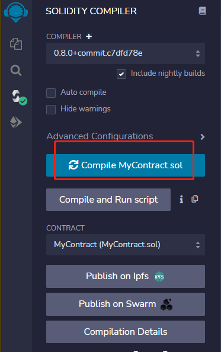


在contract中选择将要部署的合约文件后，点击下方的部署按钮

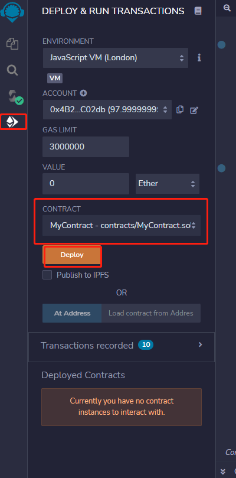


部署后的合约将会在Deployed Contracts中显示

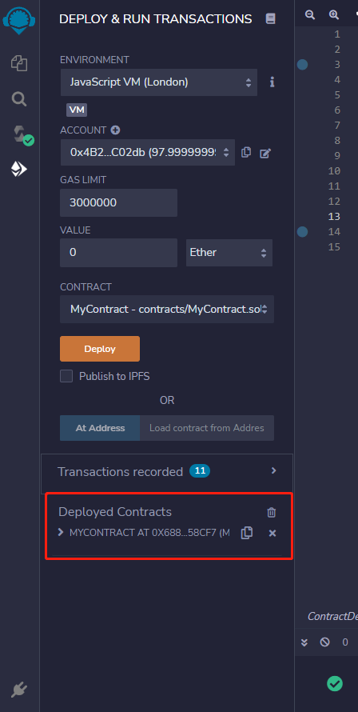

其中**合约地址**在此处查看

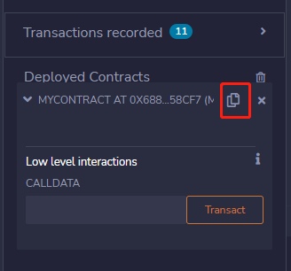


## 编写一个简单的智能合约

声明一个名为name的公共变量，类型为string，并为其赋值LanLian

```solidity
contract MyContract {
    string public name = "LanLian";

}
```


注意使用 ; 标志语句的结束，否则会报错

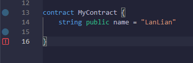

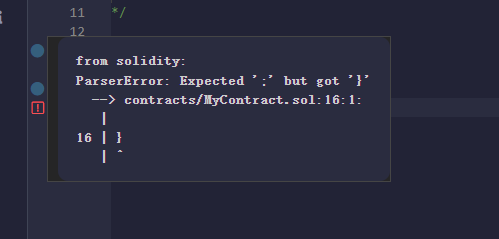


完成变量编写并通过测试后部署当前合约, 将能看到当前所部署合约有一个名为name的按钮，因为是public类型所以可以直接获取其变量值

在solidity中，当你声明了public的变量，solidity将自动为你编写getter()的方法，该方法将自动返回变量值，这就是为什么我们只声明了变量而没写获取方法却可以获取到变量值的原因. 但相应的setter方法需要开发人员自己编写.

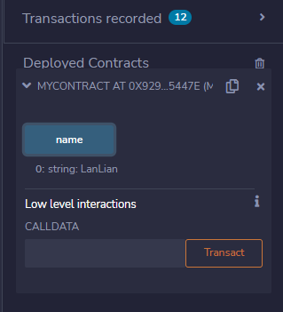

## 编写solidity中的方法

使用function声明一个方法

```solidity
// SPDX-License-Identifier: GPL-3.0

pragma solidity 0.8.0;

// This is a comment

/* This
    is
    a
    comment
*/

contract MyContract {
    string public name = "LanLian";

    function updateName() public {
        name = "New Lanlian";
    }

}
```


编写完成通过测试后部署该合约,  可以注意到刚才编写的updateName方法按钮

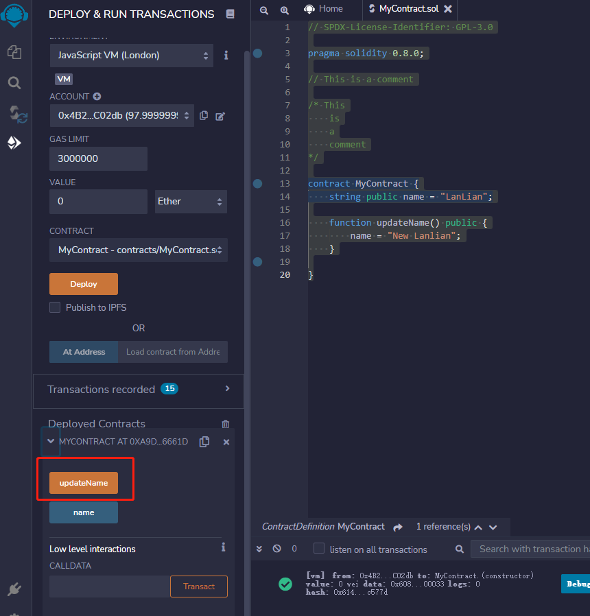


点击方法按钮查看name改变效果

调用updateName方法前

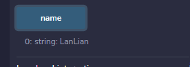

调用updateName方法后

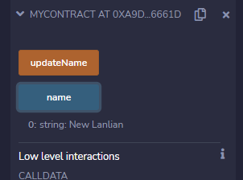

在读取合约变量信息时并没有产生任何交易动作，所以当前并没有产生gas费


## 方法传参

需要在抽象参数前声明该参数的类型

在进行string类型的参数传递时，需要用到内存进行临时保存(非永久)，所以在声明string后还需加上memory

```solidity
    function updateName(string memory _newName) public {
        name = _newName;
    }

```


通过编译后部署合约

在输入字符串后点击updateName方法后在点击name. 发现name值发生改变，说明方法正常运行

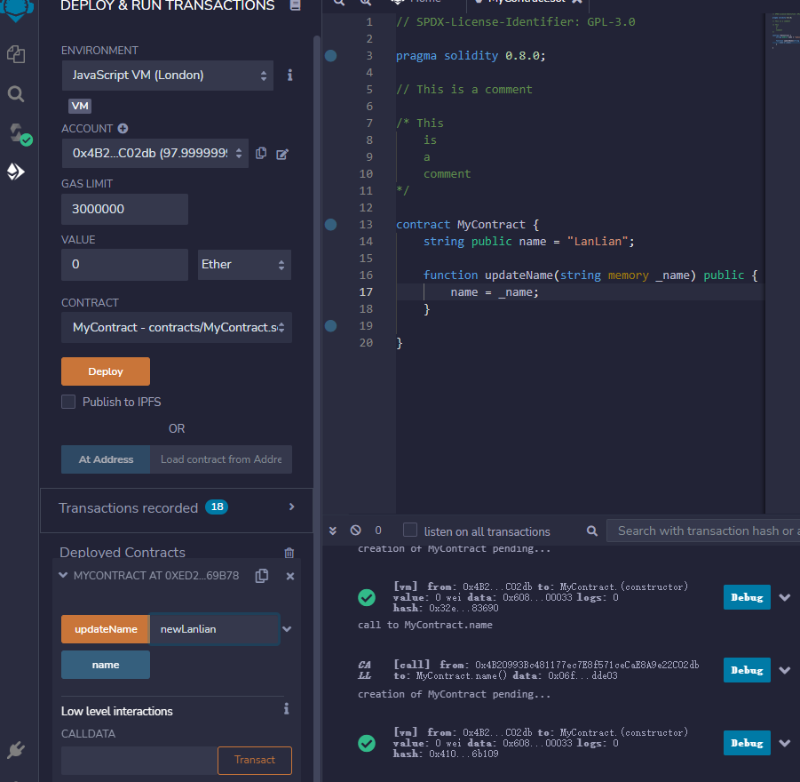

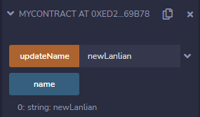


### MyContract完整代码

```solidity
// SPDX-License-Identifier: GPL-3.0

pragma solidity 0.8.0;

// This is a comment

/* This
    is
    a
    comment
*/

contract MyContract {
    string public name = "LanLian";

    ///@notice 该方法将会改变name变量的值
    function updateName(string memory _name) public {
        name = _name;
    }

}
```

