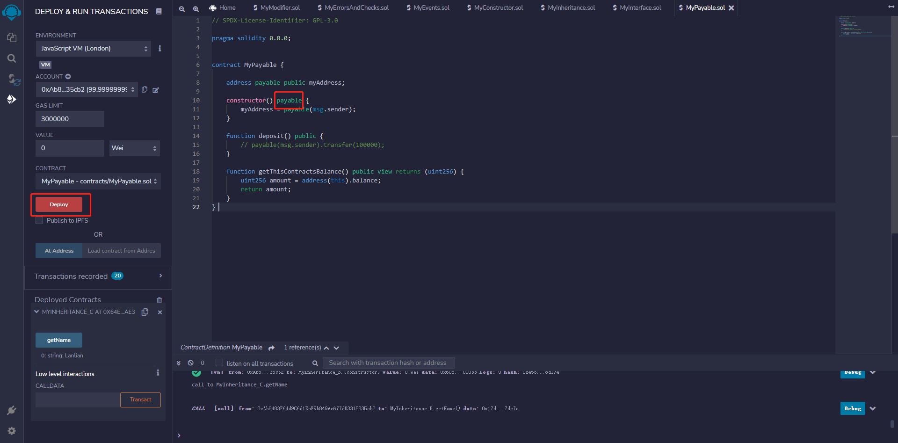
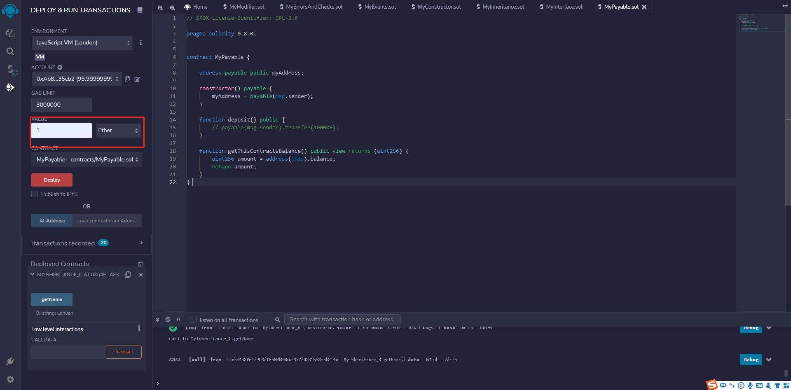
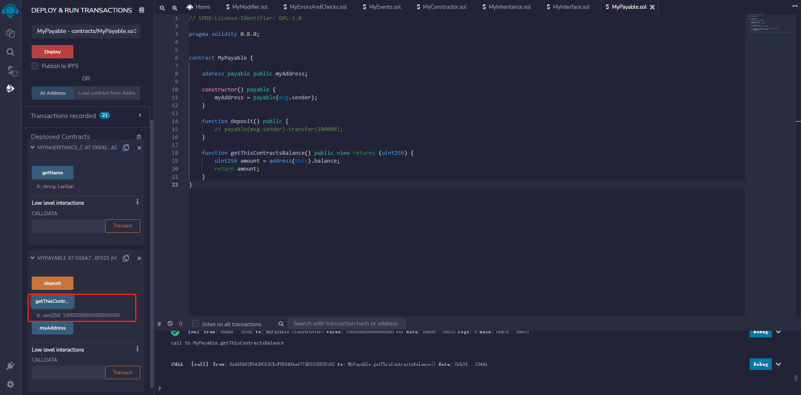

# part10

接口类似于抽象合约，使用`interface`关键字创建，接口只能包含抽象函数，不能包含函数实现。以下是接口的关键特性：

- 接口的函数只能是外部类型。
- 接口不能有构造函数。
- 接口不能有状态变量。
- 接口可以包含enum、struct定义，可以使用`interface_name.`访问它们。


## 编写MyInterface智能合约

注意在继承后的方法要加上`override`，否则编辑器会报错

```solidity
// SPDX-License-Identifier: GPL-3.0

pragma solidity 0.8.0;

interface ICounter {
    function count() external view returns(uint256);
    function addToCount() external;

}

contract MyInterface is ICounter {
    
    uint256 counter = 0;

    function count() external view override returns(uint256) {
        return counter;
    }

    function addToCount() external override {
        counter++;
    }
}
```


## Solidity中的payable

 

在编写智能合约时，您需要确保资金已经发送到合约中，以及从合约中流出。 应付为您做到这一点，在Solidity与应付的任何功能，确保功能可以发送和接收以太。 它可以处理具有非零Ether值的事务，并拒绝任何具有零Ether值的事务。 此外，如果您想要一个处理交易的功能，但没有包括应付关键字在他们的交易将被自动拒绝。 举个例子，假设你有一个带有支付修饰符的receive()函数，这意味着该函数可以在合同中接收金钱，现在假设有一个没有支付修饰符的send()函数，当你想在合同外发送金钱时，它会拒绝交易。 


回退支付函数在Solidity中也有很大的帮助。 想象一下，如果有人在一个没有支付修饰符的函数中向你的合同发送资金，你可以将这种函数定义为一个回退支付函数，以确保交易能够顺利进行。 这就是为什么使用带有名称和应付修饰符的函数的某些版本被认为是一种良好的实践。 注意这里函数的名称是' noname '而不是payable, payable是修饰语。


正如你所看到的，支付关键字不是一个函数，而是一个修饰符。 有时，人们把它与函数混淆，最终改变了整个函数的含义，导致代码出现故障。 就像我们在前面提到的' noname '函数一样，如果有人试图调用另一个没有支付修饰符的函数，它将充当回退，并将发送的以太转移到这个noname函数。 


```solidity
// SPDX-License-Identifier: MIT
pragma solidity ^0.8.15; 

contract payableSample { 
    //向状态变量添加关键字payable
    address payable public Owner;
    
    //设置所有者为msg.sender
    //构造函数默认无需添加public因为其本身可见
    constructor () { 
        Owner = payable(msg.sender); 
    }
    //将所有者设置为msg。 sendcreate一个修饰符。 发件人必须是所有者修饰符 
    modifier onlyOwner{
        require(msg.sender == Owner, 'Not owner'); 
        _;
    } 
    //所有者可以退出合同，因为在上面的状态变量中增加了应付 
    function withdraw (uint _amount) public onlyOwner { 
        Owner.transfer(_amount); 
    }
  
    function transfer(address payable _to, uint _amount) public onlyOwner { 
        _to.transfer(_amount);
    }
}
```


## 编写MyPayable智能合约

```solidity
// SPDX-License-Identifier: GPL-3.0

pragma solidity 0.8.0;


contract MyPayable {

    address payable public myAddress;

    constructor() {
        myAddress = payable(msg.sender);
    }

    function deposit() public {
        payable(msg.sender).transfer(100000);
    }

    function getThisContractsBalance() public view returns (uint256) {
        uint256 amount = address(this).balance;
        return amount;
    }
}
```


部署智能合约

可以发现该智能合约的部署按钮为红色

这是因为在改智能合约的构造器上加上了 payable




在部署该合约时，我们可以向合约的钱包存入1以太币




部署后调用getThisContractsBalance方法可以看到该合约已经有1000000000000000000wei(1 ether)的余额


