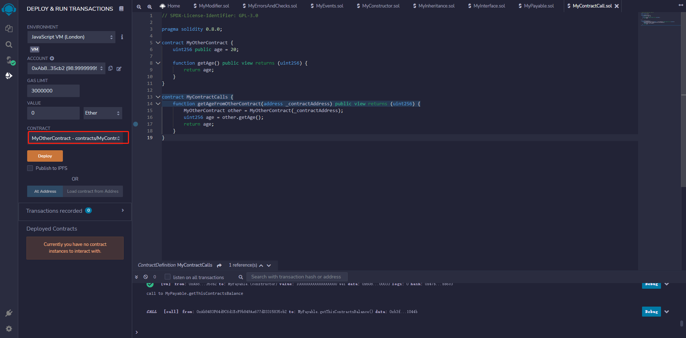
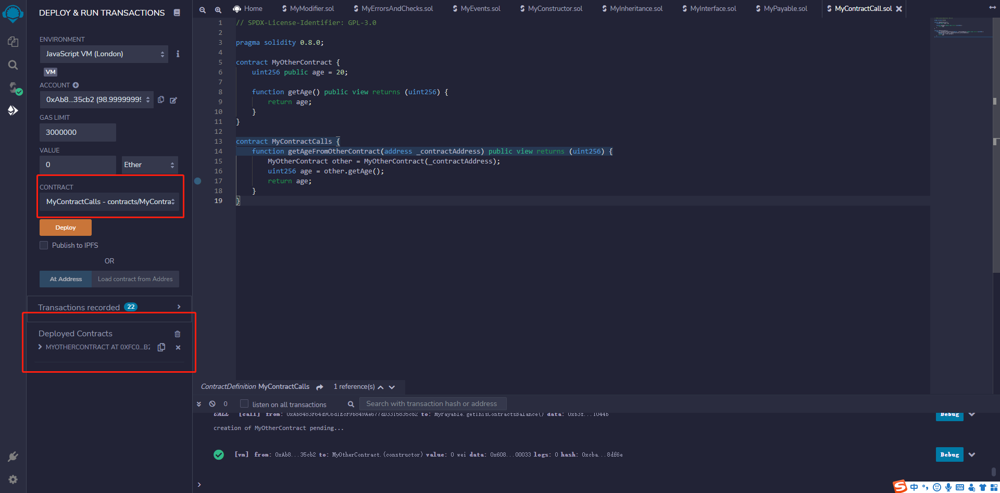
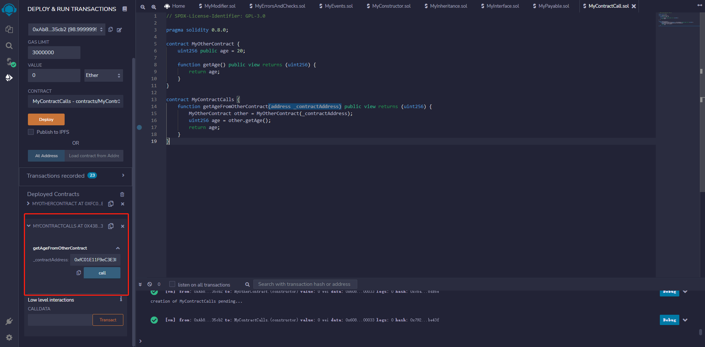
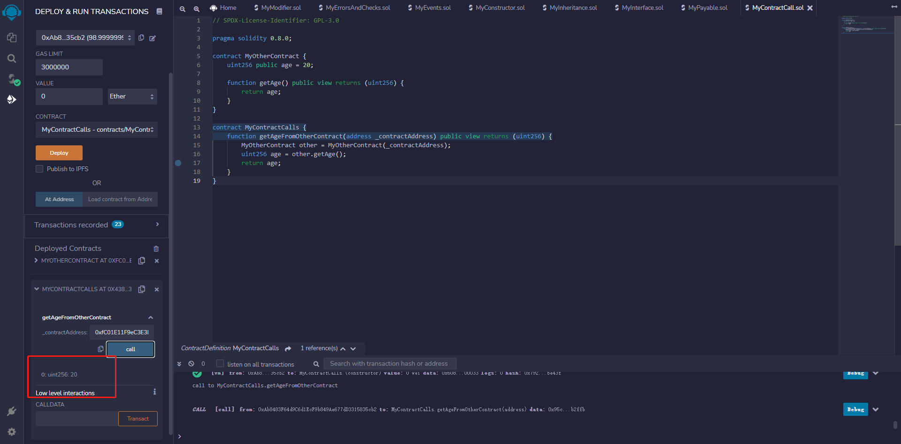
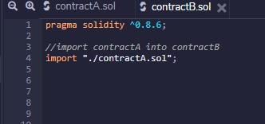
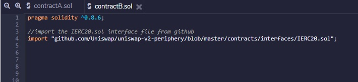
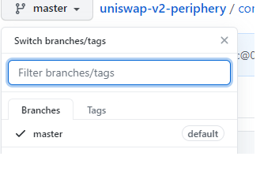

# part11

## call() 方法

`call()`是一个底层的接口，用来向一个合约发送消息，也就是说如果你想实现自己的消息传递，可以使用这个函数。函数支持传入任意类型的任意参数，并将参数打包成32字节，相互拼接后向合约发送这段数据。


## 编写MyOtherContract和MyContractCalls智能合约

```solidity
// SPDX-License-Identifier: GPL-3.0

pragma solidity 0.8.0;

contract MyOtherContract {
    uint256 public age = 20;

    function getAge() public view returns (uint256) {
        return age;
    }
}

contract MyContractCalls {
    function getAgeFromOtherContract(address _contractAddress) public view returns (uint256) {
        MyOtherContract other = MyOtherContract(_contractAddress);
        uint256 age = other.getAge();
        return age;
    }
}
```


先部署MyOtherContract合约, 并复制合约地址

```
0xfC01E11F9eC3E3D3831C010227D84Fa3E65b2FFB
```




在部署MyContractCalls合约，注意不要删除刚才部署的MyOtherContract合约




打开MyContractCalls合约 并再getAgeFromOtherContract方法中输入MyOtherContract的合约地址




可以发现方法返回MyOtherContract中的age值，合约调用成功




## Solidity中的import

#### 引入本地文件

该语句将所有数据从contractA导入到contractB的当前全局范围中。

```
Import “./contractName.sol”;
```



#### 引入github上的开源智能合约



确保所有智能合约的Solidity版本都是相同的。 要在GitHub中找到一个不同版本的合同，请将GitHub分支切换到你的合同正在使用的相同稳固版本，然后复制URL。 




## Solidity中的库

库类似于合约，但主要作用是代码重用。库中包含了可以被合约调用的函数。

Solidity中，对库的使用有一定的限制。以下是库的主要特征。

- 如果库函数不修改状态，则可以直接调用它们。这意味着[纯函数](https://www.qikegu.com/docs/4963)或[视图函数](https://www.qikegu.com/docs/4961)只能从库外部调用。
- 库不能被销毁，因为它被认为是无状态的。
- 库不能有状态变量。
- 库不能继承任何其他元素。
- 库不能被继承。

示例

尝试下面的代码，来理解库是如何工作的。

```javascript
pragma solidity ^0.8.0;

library Search {
   function indexOf(uint[] storage self, uint value) public view returns (uint) {
      for (uint i = 0; i < self.length; i++) if (self[i] == value) return i;
      return uint(-1);
   }
}
contract Test {
   uint[] data;
   constructor() public {
      data.push(1);
      data.push(2);
      data.push(3);
      data.push(4);
      data.push(5);
   }
   function isValuePresent() external view returns(uint){
      uint value = 4;

      // 使用库函数搜索数组中是否存在值
      uint index = Search.indexOf(data, value);
      return index;
   }
}
```


在单击deploy按钮之前，从下拉菜单中选择Test。

**输出**

```shell
0: uint256: 3
```


## Using For

`using A for B`指令，可用于将库A的函数附加到给定类型B。这些函数将把调用者类型作为第一个参数(使用`self`标识)。

**示例**

尝试下面的代码，来理解`Using For`是怎么工作的。

```javascript
pragma solidity ^0.8.0;

library Search {
   function indexOf(uint[] storage self, uint value) public view returns (uint) {
      for (uint i = 0; i < self.length; i++)if (self[i] == value) return i;
      return uint(-1);
   }
}
contract Test {
   using Search for uint[];
   uint[] data;
   constructor() public {
      data.push(1);
      data.push(2);
      data.push(3);
      data.push(4);
      data.push(5);
   }
   function isValuePresent() external view returns(uint){
      uint value = 4;      

      // data 表示库
      uint index = data.indexOf(value);
      return index;
   }
}
```


在单击deploy按钮之前，从下拉菜单中选择Test。

**输出**

```shell
0: uint256: 3
```