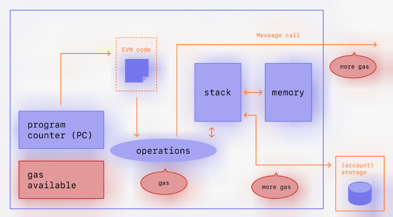
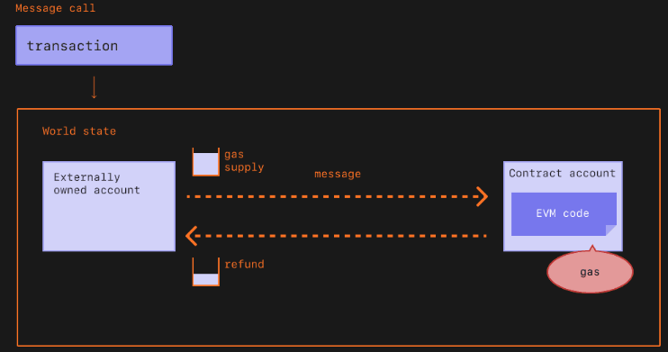
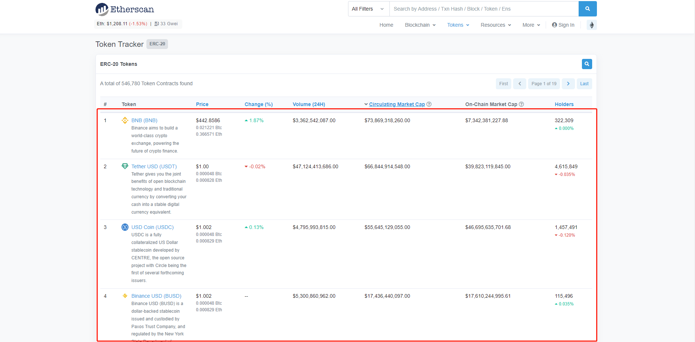
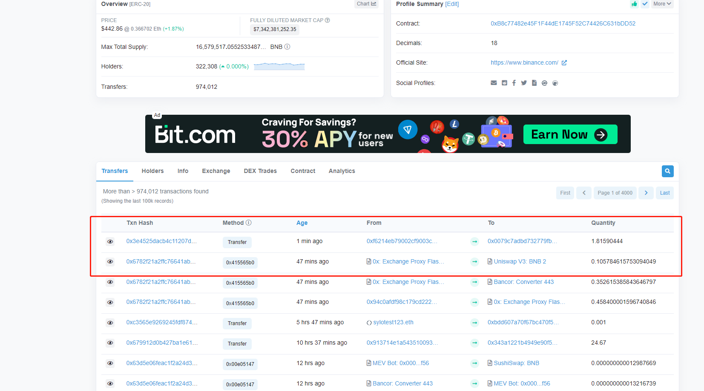
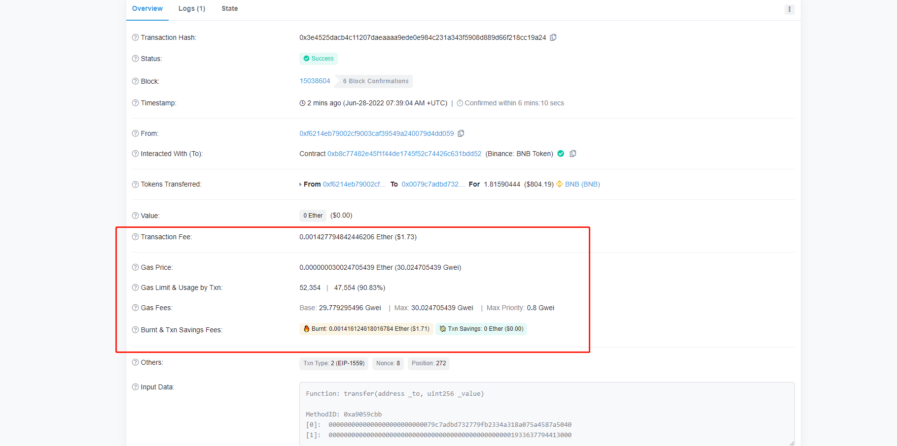

# part5

## 以太坊中的货币单位


wei是用户在以太坊能用的最小的计量单位

在智能合约中，合约的交易默认都是以wei作为交易时的货币

### 以太坊中代币数量的计量单位说明.

| Unit                | Wei Value | Wei                       |
| ------------------- | --------- | ------------------------- |
| wei                 | 1         | 1 wei                     |
| Kwei (babbage)      | 1e3 wei   | 1,000                     |
| Mwei (lovelace)     | 1e6 wei   | 1,000,000                 |
| Gwei (shannon)      | 1e9 wei   | 1,000,000,000             |
| microether (szabo)  | 1e12 wei  | 1,000,000,000,000         |
| milliether (finney) | 1e15 wei  | 1,000,000,000,000,000     |
| ether               | 1e18 wei  | 1,000,000,000,000,000,000 |


## 智能合约中声明一个价格

设定价格为400000000wei

```solidity
// SPDX-License-Identifier: GPL-3.0

pragma solidity 0.8.0;

contract MyUnits {
    uint256 costOfNFT = 400000000;
}
```


由于有太多的0导致价格设定的不方便，因此还有一种设定价格的方法, 在值后添加 ether

设定价格为0.05个以太

```solidity
// SPDX-License-Identifier: GPL-3.0

pragma solidity 0.8.0;

contract MyUnits {
    // uint256 costOfNFT = 400000000;
    uint256 costOfNFT = 0.05 ether;
}
```


## solidity中的时间单位

与货币单位相似，Solidity中的时间单位如下：

```solidity
assert(1 seconds == 1);
assert(1 minutes == 60 seconds);
assert(1 hours == 60 minutes);
assert(1 day == 24 hours);
assert(1 week == 7 days);
```


## Gas费

 

Gas是指度量在以太坊网络上执行特定操作所需计算工作量的单位。  

 

由于每笔以太坊交易都需要计算资源来执行，所以每笔交易都需要付费。 Gas是指在以太坊成功进行交易所需的费用。 



 

gas费用以以太坊的原生货币以太币(ETH)支付。gas价格用gwei表示，gwei本身是一个ETH，每个gwei等于0.000000001 ETH (10-9 ETH)。 例如，与其说你的gas 花费0.000000001 ether，不如说你的gas 花费1 gwei。 “gwei”这个词本身的意思是“giga-wei”，它等于1,000,000,000 wei。


## 在伦敦升级之前

 

以太坊网络交易费用的计算方式随着2021年8月的伦敦升级而改变。 以下是事情过去是如何运作的概要:  

假设Alice要付给Bob 1eth。 在此次交易中，gas限额为2.1万个，价格为200 gwei。  

总费用应该是:gas的单位(上限)*gas单价，即21,000 * 200 = 4,200,000 gwei或0.0042 ETH  

Alice汇款时，会从Alice的账户中扣除1.0042 ETH。 Bob将被记入1.0000 ETH。 矿工将获得0.0042 ETH。 


## 在伦敦升级之后

 

伦敦升级于2021年8月5日实施，通过彻底改革以太坊的交易收费机制，使以太坊上的交易对用户来说更可预测。 这一变化带来的高水平好处包括更好的交易费用估算，通常更快的交易纳入，以及通过燃烧一定比例的交易费用来抵消ETH的发行。  

从伦敦网络升级开始，每个区块都有一个基本费用，即包含在该区块内的每单位gas的最低价格，由网络根据区块空间的需求计算。 由于交易费用的基础费用被烧毁，用户也会在交易中设置小费(优先级费)。 该技巧补偿了矿工在块中执行和传播用户事务的能力，并有望由大多数钱包自动设置。  

交易总费用计算方法如下:gas单位(限额)*(基础费用+小费)  

假设Jordan要付给Taylor 1 ETH。 此次交易的gas上限为2.1万个，基准费用为100gwei。 乔丹给了10的gwei。  

使用上面的公式，我们可以计算为21000 * (100 + 10)= 2310000 gwei或0.00231 ETH。  

当Jordan汇款时，会从Jordan的账户中扣除1.00231 ETH。 Taylor 将获得1.000 ETH。 Miner收到0.00021 ETH。 燃烧0.0021 ETH的基础费用。  

此外，Jordan还可以为交易设定最高收费(maxFeePerGas)。 最高费用与实际费用的差额会退还给乔Jordan，即退款=最高费用-(基本费用+优先费用)。 Jordan可以设定交易执行的最高支付金额，而不用担心交易执行时支付的“超过”基本费用。  


## 块大小

在伦敦升级之前，以太坊有固定大小的区块。 在网络需求高的时候，这些区块以总容量运行。 因此，用户常常不得不等待高需求减少才能被包含在一个块中，这导致了糟糕的用户体验。  

伦敦升级向以太坊引入了可变大小的区块。 每个区块都有1500万gas的目标大小，但区块的大小将根据网络需求增减，直到3000万gas的区块限制(目标区块尺寸的两倍)。 协议通过tâtonnement的处理，平均达到1500万均衡块大小。 这意味着如果块大小大于目标块大小，协议将增加以下块的基本费用。 同样，如果块大小小于目标块大小，协议将降低基本费用。 调整基础费用的金额与当前区块大小距离目标的距离成正比。


## 基本费用(base fee)

 

每个区块都有一个基本费用，作为保留价格。 为了有资格被包含在一个区块中，每个gas的报价必须至少等于基本费用。 基础费用是独立于当前区块计算的，是由它之前的区块决定的——这使得交易费用对用户来说更容易预测。 当区块被开采时，基本费用被“烧掉”，使其不再流通。  

 

基础费用是通过一个公式来计算的，该公式将前一个区块的大小(所有交易使用的天然气量)与目标大小进行比较。 如果超过目标区块大小，每个区块的基本费用将最多增加12.5%。 这种指数级增长使得区块大小无限期保持在高位在经济上是不可行的。 


| Block Number | Included Gas | Fee Increase | Current Base Fee |
| :----------- | :----------- | :----------- | :--------------- |
| 1            | 15M          | 0%           | 100 gwei         |
| 2            | 30M          | 0%           | 100 gwei         |
| 3            | 30M          | 12.5%        | 112.5 gwei       |
| 4            | 30M          | 12.5%        | 126.6 gwei       |
| 5            | 30M          | 12.5%        | 142.4 gwei       |
| 6            | 30M          | 12.5%        | 160.2 gwei       |
| 7            | 30M          | 12.5%        | 180.2 gwei       |
| 8            | 30M          | 12.5%        | 202.7 gwei       |

 

相对于伦敦之前的gas拍卖市场，这种交易-费用-机制的变化使得费用预测更加可靠。 根据上面的表格——在9号区块上创建一个交易，一个钱包会让用户确定添加到下一个区块的最大基础费用是


当前基础费用* 112.5%或202.8 gwei * 112.5% = 2281 gwei。  

 

同样重要的是，我们不太可能看到完整区块的扩展峰值，因为基本费用的增长速度在整个区块进行。 


| Block Number | Included Gas | Fee Increase | Current Base Fee |
| :----------- | :----------- | :----------- | :--------------- |
| 30           | 30M          | 12.5%        | 2705.6 gwei      |
| ...          | ...          | 12.5%        | ...              |
| 50           | 30M          | 12.5%        | 28531.3 gwei     |
| ...          | ...          | 12.5%        | ...              |
| 100          | 30M          | 12.5%        | 10302608.6 gwei  |


## 优先费用(Priority fee)

 

在伦敦升级之前，矿工将从区块中包含的任何交易中获得全部gas费。  

 

由于新的基本费用被消耗殆尽，伦敦升级引入了优先费用(小费)，以激励矿工在区块中包括交易。 如果没有提示，矿工会发现挖空区块在经济上是可行的，因为他们会得到相同的区块奖励。 在正常情况下，一小笔小费对矿工交易的激励作用很小。 对于需要在同一区块的其他交易之前优先执行的交易，更高的小费将是必要的，以试图击败竞争的交易出价 


## 最高费用(Max fee)

 

要在网络上执行交易，用户可以指定他们愿意为交易执行支付的最大限额。 这个可选参数被称为maxFeePerGas。 一笔交易的最高费用必须超过基本费用和小费的总和。 交易发送者将获得最高费用与基本费用和小费之和之间的差额 


## 计算费用(Calculating fees)

 

伦敦升级的主要好处之一是改善了用户在设置交易费用时的体验。 对于支持升级的钱包，钱包提供商不会明确说明你愿意支付多少gas用来完成交易，而是会自动设置一个推荐交易费用(基础费用+推荐优先级费用)，以减少用户负担的复杂性。  


## 为什么要有gas费

简而言之，gas费用有助于保持以太坊网络的安全。 通过对网络上执行的每一次计算都收取一定的费用，我们可以防止不法分子在网络上散布垃圾信息。 为了避免意外或恶意的无限循环或代码中的其他计算浪费，每个事务都需要设置一个它可以使用的代码执行计算步骤的限制。 计算的基本单位是“gas”。  

 

虽然每笔交易都有额度限制，但交易中未使用的gas会被返还给用户(即最高费用-(基础费用+小费))。 




## 什么是gas上限

 

gas上限是指你愿意在一笔交易中消耗的最大gas量。 涉及智能合约的更复杂的交易需要更多的计算工作，因此它们需要比简单的支付更高的gas限额。 标准的ETH传输需要21,000单位的gas上限  

 

例如，如果你将一个简单的ETH传输的gas上限为50,000,EVM将消耗21,000，而你将得到剩余的29,000。 然而，如果您指定的gas太少，例如，一个简单的ETH传输的gas上限为20,000,EVM将消耗您的20,000个gas单位试图完成交易，但它将无法完成。 然后，EVM会恢复任何变化，但由于矿工已经完成了2万gas的工作，这些gas会被消耗掉


## 为什么gas费会这么高

 

高昂的gas费用是由于以太坊的普及。 在以太坊上执行任何操作都需要消耗gas，而每个区块的gas空间是有限的。 费用包括计算、存储或操纵数据，或转移代币，消耗不同数量的“gas”单位。 随着dapp功能变得越来越复杂，智能合约执行的操作数量也在增加，这意味着每个交易在一个有限大小的块中占据了更多的空间。 如果有太多的需求，用户必须提供更高的小费金额，以尝试出价高于其他用户的交易。 小费越高，你的交易越有可能进入下一个区块。  

 

gas费本身并不能决定我们为一笔特定交易支付多少钱。 为了计算交易费用，我们需要将使用的gas乘以交易费用，交易费用的单位是gwei 


## 降低gas费

以太坊的可扩展性升级应该最终解决一些gas费用问题，这反过来将使平台能够每秒处理数千笔交易，并在全球范围内扩展。  

 

第2层扩展是一项主要举措，可以大大提高gas成本、用户体验和可伸缩性。  

 

Beacon Chain上引入的新的桩证明模型应该可以减少高功耗和对专用硬件的依赖。 这条链将允许去中心化的以太坊网络同意并保持网络安全，同时通过要求财务承诺来限制能源消耗。  

 

任何拥有至少32个ETH的人都可以下注，并成为一个验证者，负责处理交易，验证区块，并提出新的区块添加到链中。 ETH小于32的用户可以加入staking pools


参考链接： https://ethereum.org/en/developers/docs/gas/#:~:text=Gas%20refers%20to%20the%20fee,a%20transaction%20on%20Ethereum%20successfully.&text=Gas%20fees%20are%20paid%20in,(10%2D9%20ETH).


## 在Etherscan查看交易的gas费

Etherscan链接 ：https://cn.etherscan.com/tokens

点击下列任意一个币种



 

查看任意交易信息




显示交易费用，Gas费用，gas上限，gas价格，和燃烧费用

当交易产生的gas费用大于gas上限时，交易会失败

