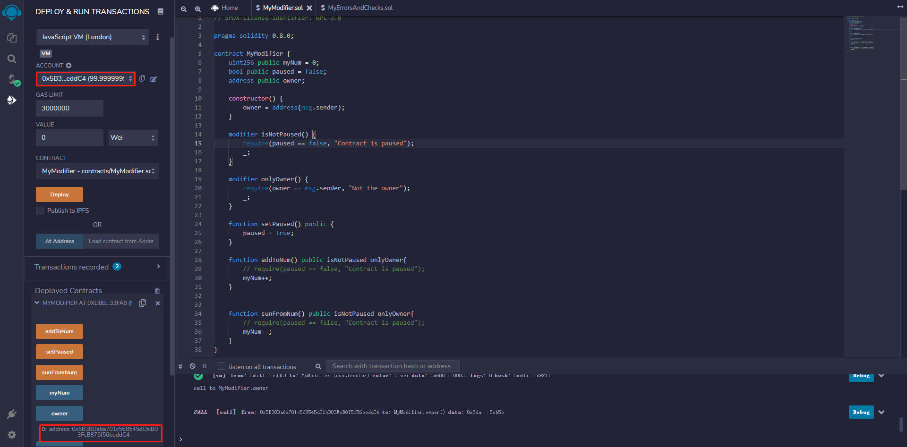
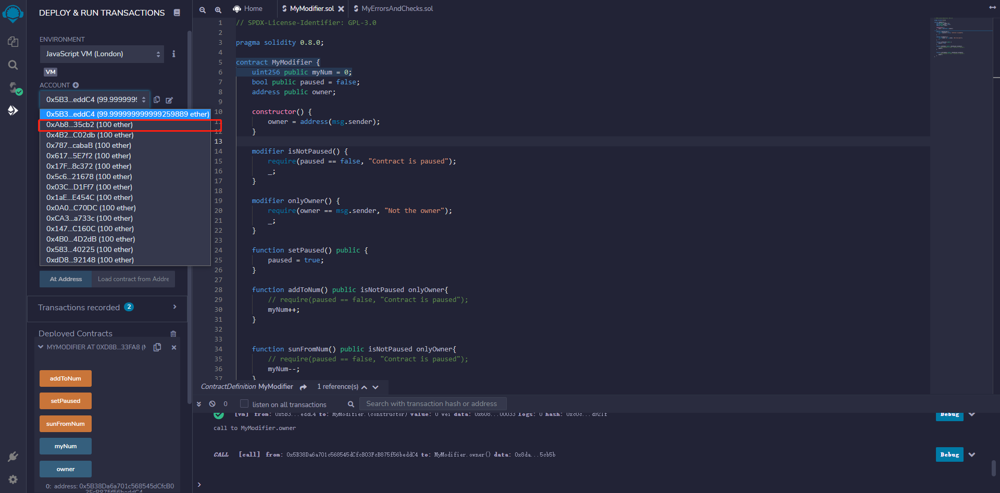
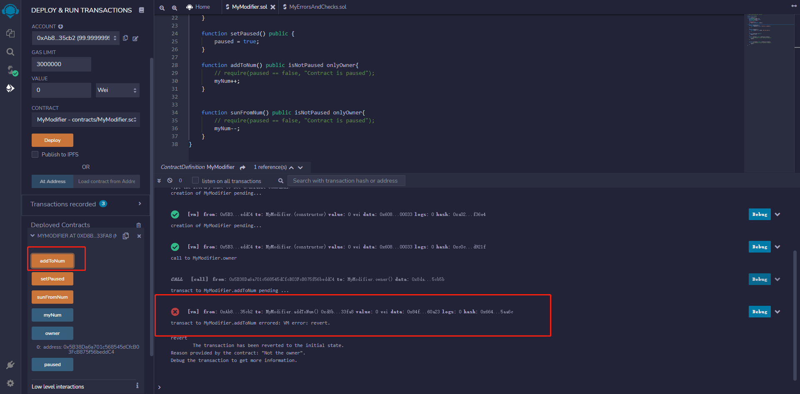
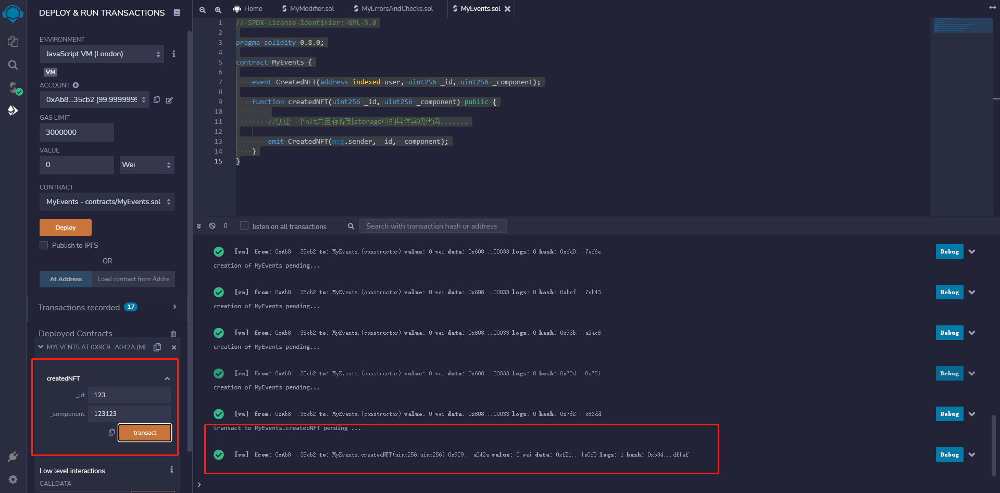
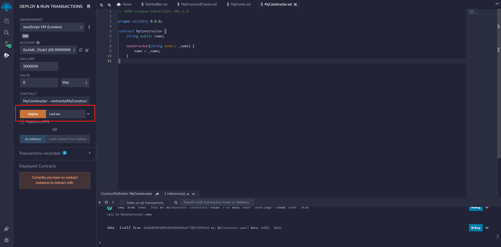
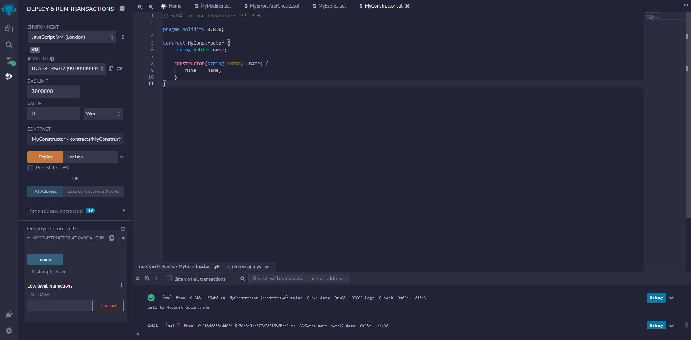
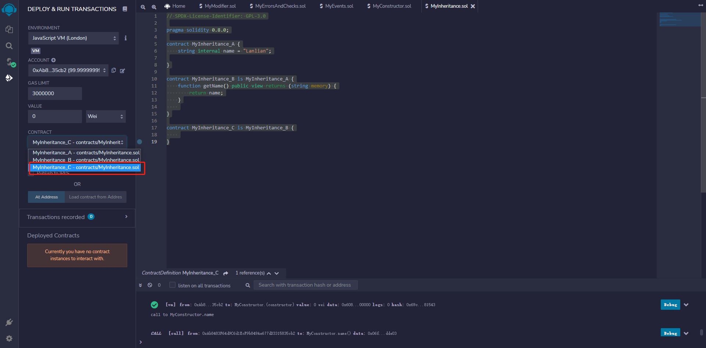
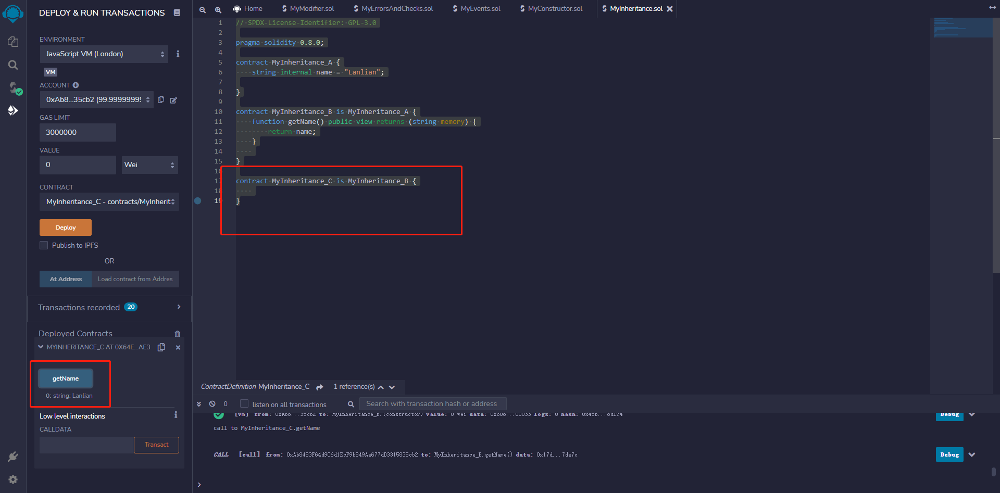

# part9

## 修饰符(modifier)


函数修饰符用于修改函数的行为。例如，向函数添加条件限制。

创建带参数修饰符和不带参数修饰符，如下所示：

```javascript
contract Owner {

   // 定义修饰符 onlyOwner 不带参数
   modifier onlyOwner {
      require(msg.sender == owner);
      _;
   }

   // 定义修饰符 costs 带参数
   modifier costs(uint price) {
      if (msg.value >= price) {
         _;
      }
   }
}
```


修饰符定义中出现特殊符号`_`的地方，用于插入函数体。如果在调用此函数时，满足了修饰符的条件，则执行该函数，否则将抛出异常。

```solidity
pragma solidity ^0.8.0;

contract Owner {
   address owner;

   constructor() public {
      owner = msg.sender;
   }

   // 定义修饰符 onlyOwner 不带参数
   modifier onlyOwner {
      require(msg.sender == owner);
      _;
   }

   // 定义修饰符 costs 带参数
   modifier costs(uint price) {
      if (msg.value >= price) {
         _;
      }
   }
}

contract Register is Owner {
   mapping (address => bool) registeredAddresses;
   uint price;

   constructor(uint initialPrice) public { price = initialPrice; }

   // 使用修饰符 costs
   function register() public payable costs(price) {
      registeredAddresses[msg.sender] = true;
   }

   // 使用修饰符 onlyOwner
   function changePrice(uint _price) public onlyOwner {
      price = _price;
   }
}
```


## 编写MyModifier智能合约

```solidity
// SPDX-License-Identifier: GPL-3.0

pragma solidity 0.8.0;

contract MyModifier {
    uint256 public myNum = 0;
    bool public paused = false;

    function setPaused() public {
        paused = true;
    }

    function addToNum() public {
        require(paused == false, "Contract is paused");
        myNum++;
    }


    function sunFromNum() public {
        require(paused == false, "Contract is paused");
        myNum--;
    }
}
```


在上述只能合约中，我们编写了addToNum和sunFromNum两个方法来对myNum变量进行大小的控制，可以看到在这两个方法都用到了require(paused == false, "Contract is paused"); 为了提高代码的复用性 我们使用修饰器, 下列是修改后的代码

```solidity
// SPDX-License-Identifier: GPL-3.0

pragma solidity 0.8.0;

contract MyModifier {
    uint256 public myNum = 0;
    bool public paused = false;
    address public owner;

    constructor() {
        owner = address(msg.sender);
    }

    modifier isNotPaused(bool _bypass) {
        if(_bypass == true) {
            require(paused == false, "Contract is paused");
        }
        _;
    }

    modifier onlyOwner() {
        require(owner == msg.sender, "Not the owner");
        _;
    }

    function setPaused() public {
        paused = true;
    }

    function addToNum() public isNotPaused(true) onlyOwner{
        // require(paused == false, "Contract is paused");
        myNum++;
    }


    function sunFromNum() public isNotPaused(false) onlyOwner{
        // require(paused == false, "Contract is paused");
        myNum--;
    }
}
```


部署合约

可以看到owner的地址就是当时部署合约的用户地址




切换当前用户,并使用addToNum方法




可以发现程序报错，因为当前用户地址并不是owner地址(当时部署合约的用户地址) 引发修饰器onlyOwner的报错从而终止程序的执行




## Solidity中的event

事件是智能合约发出的信号。智能合约的前端UI，例如，DApps、web.js，或者任何与Ethereum JSON-RPC API连接的东西，都可以侦听这些事件。事件可以被索引，以便以后可以搜索事件记录。

> **事件在区块链中的存储**
>
> 区块链是一个区块链表，这些块的内容基本上是交易记录。每个交易都有一个附加的交易日志，事件结果存放在交易日志里。合约发出的事件，可以使用合约地址访问。

## 

Solidity中，要定义事件，可以使用`event`关键字(在用法上类似于`function`关键字)。然后可以在函数中使用`emit`关键字触发事件。

```javascript
// 声明一个事件
event Deposit(address indexed _from, bytes32 indexed _id, uint _value);

// 触发事件
emit Deposit(msg.sender, _id, msg.value);
```


**示例**

创建合约并发出一个事件。

```javascript
pragma solidity ^0.8.0;

contract Counter {pragma solidity ^0.8.0;
    uint256 public count = 0;

    event Increment(address who);   // 声明事件

    function increment() public {
        emit Increment(msg.sender); // 触发事件
        count += 1;
    }
}
```


上面的代码中,

- `event Increment(address who)` 声明一个合约级事件，该事件接受一个address类型的参数，该参数是执行`increment`操作的账户地址。
- `emit Increment(msg.sender)` 触发事件，事件会记入区块链中。

按照惯例，事件名称以大写字母开头，以区别于函数。

## 用JavaScript监听事件

下面的JavaScript代码侦听`Increment`事件，并更新UI。

```javascript
counter = web3.eth.contract(abi).at(address);

counter.Increment(function (err, result) {
  if (err) {
    return error(err);
  }

  log("Count was incremented by address: " + result.args.who);
  getCount();
});

getCount();
```


- `contract.Increment(...)` 开始侦听递增事件，并使用回调函数对其进行参数化。
- `getCount()` 是一个获取最新计数并更新UI的函数。

## 索引(indexed)参数

一个事件最多有3个参数可以标记为索引。可以使用索引参数有效地过滤事件。下面的代码增强了前面的示例，来跟踪多个计数器，每个计数器由一个数字ID标识:

```javascript
pragma solidity ^0.8.0;

contract Multicounter {
    mapping (uint256 => uint256) public counts;

    event Increment(uint256 indexed which, address who);

    function increment(uint256 which) public {
        emit Increment(which, msg.sender);
        counts[which] += 1;
    }
}
```


- `counts`替换`count`，`counts`是一个map。
- `event Increment(uint256 indexed which, address who)` 添加一个索引参数，该参数表示哪个计数器。
- `emit Increment(which, msg.sender)` 用2个参数记录事件。

在Javascript中，可以使用索引访问计数器：

```javascript
... 

counter.Increment({ which: counterId }, function (err, result) {
  if (err) {
    return error(err);
  }

  log("Counter " + result.args.which + " was incremented by address: "
      + result.args.who);
  getCount();
});

...
```


## 事件的局限

事件构建在Ethereum中，底层的日志接口之上。虽然您通常不会直接处理日志消息，但是了解它们的限制非常重要。

日志结构最多有4个“主题”和一个“数据”字段。第一个主题用于存储事件签名的哈希值，这样就只剩下三个主题用于索引参数。主题需要32字节长，因此，如果使用数组作为索引参数(包括类型string和bytes)，那么首先将哈希值转换为32字节。非索引参数存储在数据字段中，没有大小限制。

日志，包括记录在日志中的事件，不能从Ethereum虚拟机(EVM)中访问。这意味着合约不能读取自己的或其他合约的日志及事件。

## 

- Solidity 提供了一种记录交易期间事件的方法。
- 智能合约前端(DApp)可以监听这些事件。
- 索引(indexed)参数为过滤事件提供了一种高效的方法。
- 事件受其构建基础日志机制的限制


## 编写MyEvents智能合约

```solidity
// SPDX-License-Identifier: GPL-3.0

pragma solidity 0.8.0;

contract MyEvents {

    event CreatedNFT(address indexed user, uint256 _id, uint256 _component);

    function createdNFT(uint256 _id, uint256 _component) public {
        
        //创建一个nft并且存储到storage中的具体实现代码.......

        emit CreatedNFT(msg.sender, _id, _component);
    }
}
```


部署合约

在调用方法后可以发现关于这个事件的pending




## 合约的继承

就像Java、C++中，类的继承一样，Solidity中，合约继承是扩展合约功能的一种方式。Solidity支持单继承和多继承。Solidity中，合约继承的重要特点：

- 派生合约可以访问父合约的所有非私有成员，包括内部方法和状态变量。但是不允许使用`this`。
- 如果函数签名保持不变，则允许函数重写。如果输出参数不同，编译将失败。
- 可以使用`super`关键字或父合同名称调用父合同的函数。
- 在多重继承的情况下，使用`super`的父合约函数调用，优先选择被最多继承的合约。

**示例**

```javascript
pragma solidity ^0.8.0;

contract C {
   //private state variable
   uint private data;

   //public state variable
   uint public info;

   //constructor
   constructor() public {
      info = 10;
   }
   //private function
   function increment(uint a) private pure returns(uint) { return a + 1; }

   //public function
   function updateData(uint a) public { data = a; }
   function getData() public view returns(uint) { return data; }
   function compute(uint a, uint b) internal pure returns (uint) { return a + b; }
}

//Derived Contract
contract E is C {

   uint private result;
   C private c;

   constructor() public {
      c = new C();
   }  
   function getComputedResult() public {      
      result = compute(3, 5); 
   }
   function getResult() public view returns(uint) { return result; }
   function getData() public view returns(uint) { return c.info(); }
}
```


执行各种合约方法，例如，先执行`E.getComputedResult()`，再执行`E.getResult()`：

**输出**

```shell
0: uint256: 8
```


## Solidity中的构造函数

构造函数是使用`constructor`关键字声明的特殊函数，用于初始化合约的状态变量。合约中构造函数是可选的，可以省略。

构造函数有以下重要特性：

- 一个合约只能有一个构造函数。
- 构造函数在创建合约时执行一次，用于初始化合约状态。
- 在执行构造函数之后，合约最终代码被部署到区块链。合约最终代码包括公共函数和可通过公共函数访问的代码。构造函数代码或仅由构造函数使用的任何内部方法不包括在最终代码中。
- 构造函数可以是公共的，也可以是内部的。
- 内部构造函数将合约标记为抽象合约。
- 如果没有定义构造函数，则使用默认构造函数。

```solidity
pragma solidity ^0.8.0;

contract Test {
   constructor() public {}
}
```


- 如果基合约具有带参数的构造函数，则每个派生/继承的合约也都必须包含参数。
- 可以使用下面的方法直接初始化基构造函数

```solidity
pragma solidity ^0.8.0;

contract Base {
   uint data;
   constructor(uint _data) public {
      data = _data;   
   }
}
contract Derived is Base (5) {
   constructor() public {}
}
```


- 可以使用以下方法间接初始化基构造函数

```solidity
pragma solidity ^0.8.0;

contract Base {
   uint data;
   constructor(uint _data) public {
      data = _data;   
   }
}
contract Derived is Base {
   constructor(uint _info) Base(_info * _info) public {}
}
```


- 不允许直接或间接地初始化基合约构造函数。
- 如果派生合约没有将参数传递给基合约构造函数，则派生合约将成为抽象合约。


## 编写MyConstructor智能合约

```solidity
// SPDX-License-Identifier: GPL-3.0

pragma solidity 0.8.0;

contract MyConstructor {
    string public name;

    constructor(string memory _name) {
        name = _name;
    }
}
```


编译合约

可以发现在编译按钮中可以属于_name变量




部署后获取name变量的值 可以发现就是部署前设置的字符串




## Solidity中的继承

就像Java、C++中，类的继承一样，Solidity中，合约继承是扩展合约功能的一种方式。Solidity支持单继承和多继承。Solidity中，合约继承的重要特点：

- 派生合约可以访问父合约的所有非私有成员，包括内部方法和状态变量。但是不允许使用`this`。
- 如果函数签名保持不变，则允许函数重写。如果输出参数不同，编译将失败。
- 可以使用`super`关键字或父合同名称调用父合同的函数。
- 在多重继承的情况下，使用`super`的父合约函数调用，优先选择被最多继承的合约。

**示例**

```solidity
pragma solidity ^0.5.0;

contract C {
   //private state variable
   uint private data;

   //public state variable
   uint public info;

   //constructor
   constructor() public {
      info = 10;
   }
   //private function
   function increment(uint a) private pure returns(uint) { return a + 1; }

   //public function
   function updateData(uint a) public { data = a; }
   function getData() public view returns(uint) { return data; }
   function compute(uint a, uint b) internal pure returns (uint) { return a + b; }
}

//Derived Contract
contract E is C {

   uint private result;
   C private c;

   constructor() public {
      c = new C();
   }  
   function getComputedResult() public {      
      result = compute(3, 5); 
   }
   function getResult() public view returns(uint) { return result; }
   function getData() public view returns(uint) { return c.info(); }
}
```


执行各种合约方法，例如，先执行`E.getComputedResult()`，再执行`E.getResult()`：

**输出**

```solidity
0: uint256: 8
```


## 编写MyInheritance智能合约

```solidity
// SPDX-License-Identifier: GPL-3.0

pragma solidity 0.8.0;

contract MyInheritance_A {
    string internal name = "Lanlian";

}

contract MyInheritance_B is MyInheritance_A {
    function getName() public view returns (string memory) {
        return name;
    }
    
}

contract MyInheritance_C is MyInheritance_B {
    
}
```


部署合约C




可以发现，即便MyInheritance_C合约内没有任何内容，部署合约C仍有getName方法并且在调用后仍能返回Lanlian


