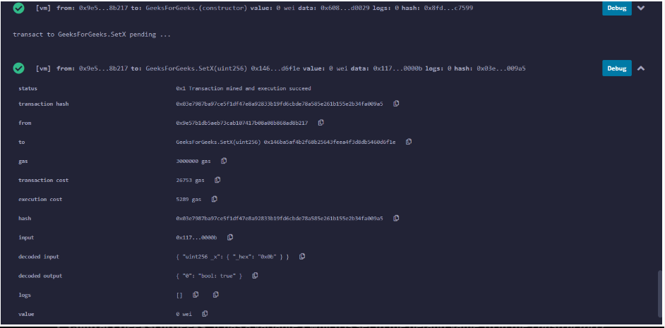

# Solidity中的回退函数

如果没有其他函数与函数标识符匹配，或者函数调用没有提供数据，则执行回退函数。一个合约只能拥有一个未命名函数，并且当合约接收到没有任何数据的以太币时，该回退函数就会被执行。为了接收以太币并将其添加到合约的总余额中，回退函数必须标记为“payable”。如果不存在这样的函数，合约将无法通过常规转账接收Ether，并将抛出异常。

回退函数的属性:

1. 没有名称或参数。

2. 如果它没有被标记为payable，它收到没有数据的普通以太币将抛出一个异常，。

3. 不可return任何值

4. 每个合约只能定义一个。

5. 如果调用者调用一个不可用或者不存在的函数，也会执行该函数

6. 必须将其标记为external。

   

   示例:在下面的示例中，创建Contract来演示不同回退函数的不同条件。

```solidity
// SPDX-License-Identifier: GPL-3.0
pragma solidity ^0.8.0;

// 创建一个合约
contract Fallback
{
  // 声明一个状态变量
  uint x;
  
  // 余额的映射
  mapping(address => uint) balance;

  // 创建一个构造器
  constructor()
  {
    // 设置x的值为10
    x=10;

  }

  // 创建一个方法
  function SetX(uint _x) public returns(bool)
  {
    // 重新设置x的值
    x=_x;
    return true;
  }
  
  // 回调函数
  fallback() external payable
  {
    balance[msg.sender] += msg.value;
  }
}

// 创建一个sender合约
contract Sender
{
function transfer() public payable
{
  // Fallback的合约地址
  address _receiver =
      0xbcc0185441de06F0452D45AEd6Ad8b98017796fb;
        
  // 向Fallback合约转入100以太币   
  payable(_receiver).transfer(100);
}
}

```




1.Fallback合约:它有一个变量x，在构造函数()中被设置为默认值10。合约有一个名为SetX(uint _x)的函数，它将函数值设置为在函数调用期间发送的所需参数。下面的声明创建了名为balance的映射，它将通过输入地址返回地址的余额

```solidity
mapping(address => uint) balance;
```


2.Sender合约:这是一份完全独立和无关的合同。它发送100wei给Fallback合约。合约不知道Fallback合约的机制。发送一个没有任何消息且只有以太币的事务会导致错误。
下面的语句声明了一个地址类型的变量_receiver。它显式地存储合同Fallback的地址。然后它使用address.transfer(value)将Ether传输到合约。

```solidity
address _receiver = 0xbcc0185441de06F0452D45AEd6Ad8b98017796fb;  //Fallback合约的地址, 更具自身部署地址修改该地址值
_receiver.transfer(100); 
```


3.function() public payable:下面的函数是一个回退函数。它被宣布payable，这允许它接受交易。有两种情况

1. 合约只接收以太币，不接收数据。
2. 即使帐户收到了数据，也没有匹配的函数调用。

这有助于我们保护函数不抛出错误。 在这个程序中，合约Fallback只接收以太，回退函数使用接收到的值添加到与发送地址相关的余额中。 

```solidity
function() public payable
    {
        balance[msg.sender] += msg.value;
    }
```

