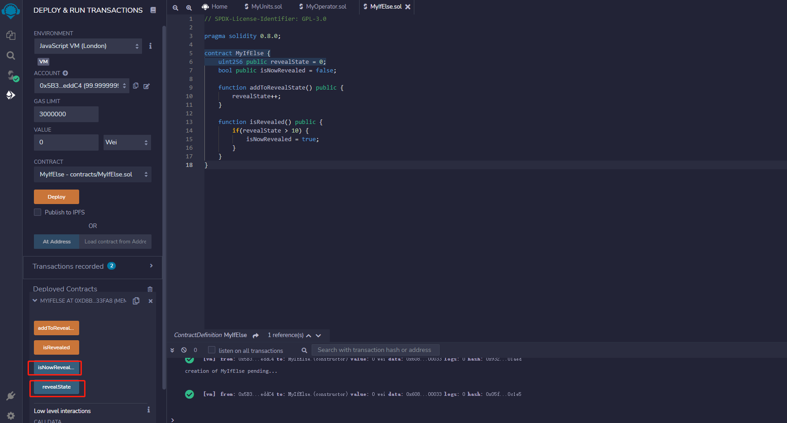
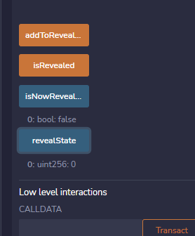
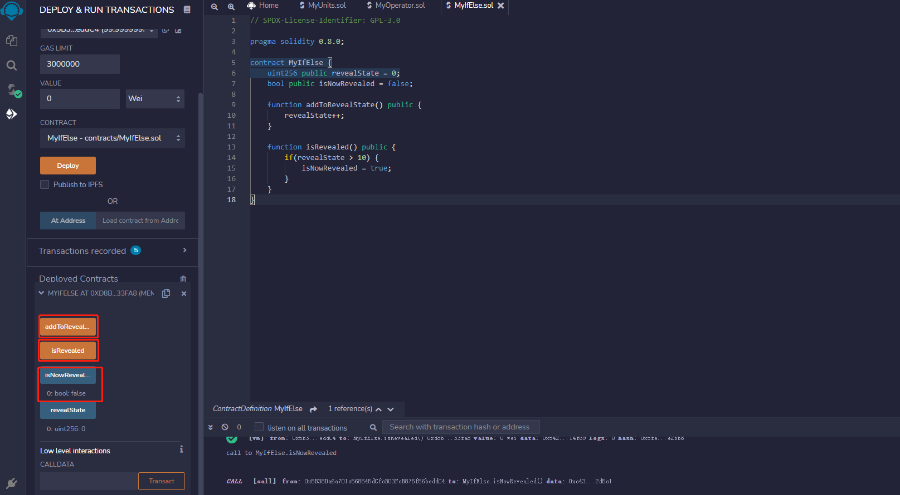
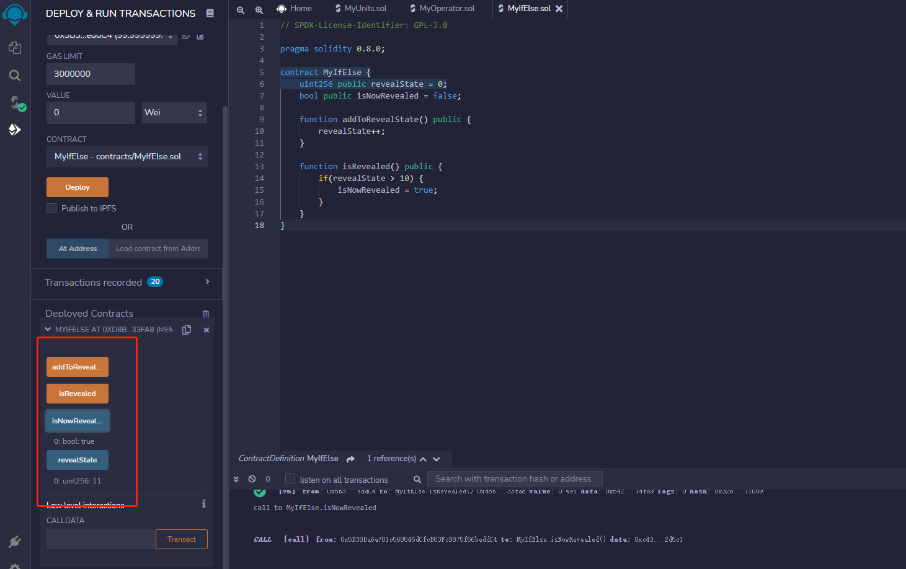
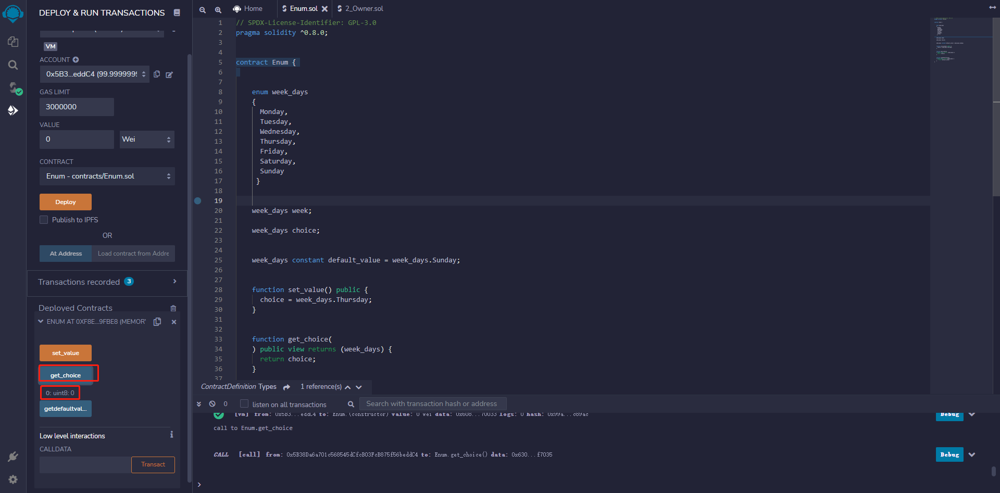
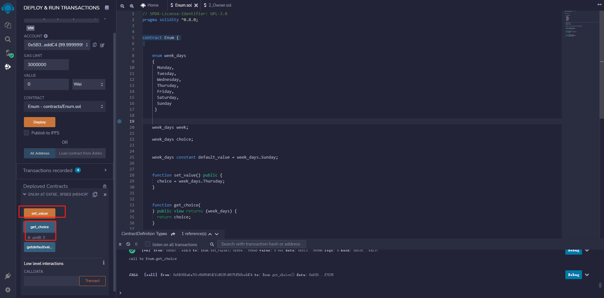

 

# Part 6

## 条件语句

编写MyIfElse合约

```solidity
// SPDX-License-Identifier: GPL-3.0

pragma solidity 0.8.0;

contract MyIfElse {
    uint256 public revealState = 0;
    bool isNowRevealed = false;

    function addToRevealState() public {
        revealState++;
    }

    function isRevealed() public {
        if(revealState > 10) {
            isNowRevealed = true;
        }
    }
}
```


编写编译完成后部署该合约




点击revealState和IsNowRevealed分别查看当前的变量值

可以看到IsNowRevealed的值为flase，revealState的值为1




依次点击addToRevealState, isRevealed, isNowRevealed后可以发现 isNowRevealed变量任为false，这是因为revealState的值为1，在if条件判断中1不大于0，程序未进入判断内，也就是并没有执行15行的isNowRevealed = true语句





点击addToRevealState方法十次，将revealState变量累加至11后，在依次点击isRevealed, isNowRevealed，可以发现isNowRevealed的值变为true，因为当前isRevealed变量的值为11，已经大于10，在执行if条件判断，结果为true，进入条件体内，执行isNowRevealed = true;语句




## Solidity – if…else语句

## 语法

```solidity
if (条件表达式) {
  被执行语句(如果条件为真)
} else {
  被执行语句(如果条件为假)
}
```


## 示例

展示 **if...else**语句用法。

```solidity
pragma solidity ^0.8.0;
contract SolidityTest {
  uint storedData;
  constructor() public{
   storedData = 10;
  }
  function getResult() **public** view returns(string memory){
   uint a = 1;
   uint b = 2;
   uint result
   if( a > b) { // if else 语句
     result = a;
   } else {
     result = b;
   }
   return integerToString(result);
  }
  function integerToString(uint _i) internal pure
   returns (string memory) {
   if (_i == 0) {
     return "0";
   }
   uint j = _i;
   uint len;
   while (j != 0) {
     len++;
     j /= 10;
   }
   bytes memory bstr = new bytes(len);
   uint k = len - 1;
   while (_i != 0) {
     bstr[k--] = byte(uint8(48 + _i % 10));
     _i /= 10;
   }
   return string(bstr);// 访问局部变量
  }
}
```

可以参考Solidity – 第一个程序中的步骤，运行上述程序。

输出

0: string: 2

## Solidity – if…else if…语句

## 语法

```solidity
if (条件表达式 1) {
  被执行语句(如果条件 1 为真)
} else if (条件表达式 2) {
  被执行语句(如果条件 2 为真)
} else if (条件表达式 3) {
  被执行语句(如果条件 3 为真)
} else {
  被执行语句(如果所有条件为假)
}
```


## 示例

展示 **if...else if...**语句用法。

```solidity
pragma solidity ^0.8.0;
contract SolidityTest {
  uint storedData; // State variable
  constructor() public {
   storedData = 10;
  }
  function getResult() public view returns(string memory) {
   uint a = 1;
   uint b = 2;
   uint c = 3;
   uint result
   if( a > b && a > c) { // if else if 语句
     result = a;
   } else if( b > a && b > c ){
     result = b;
   } else {
     result = c;
   }
   return integerToString(result);
  }
  function integerToString(uint _i) internal pure
   returns (string memory) {
   if (_i == 0) {
     return "0";
   }
   uint j = _i;
   uint len;
   while (j != 0) {
     len++;
     j /= 10;
   }
   bytes memory bstr = **new** bytes(len);
   uint k = len - 1;
   while (_i != 0) {
     bstr[k--] = byte(uint8(48 + _i % 10));
     _i /= 10;
   }
   return string(bstr);// 访问局部变量
  }
}
```


## 编写MyLoop智能合约

与其他语言类似，Solidity语言支持循环结构，Solidity提供以下循环语句。

while do ... while for**循环控制语句：**break**、**continue。

## Solidity – while循环

## 语法

Solidity 中， while循环的语法如下：

```solidity
while (表达式) {
  被执行语句(如果表示为真)
}
```


## 示例

```solidity
pragma solidity ^0.8.0;
contract SolidityTest {
  uint storedData;
  constructor() public{
   storedData = 10;
  }
  function getResult() public view returns(string memory){
   uint a = 10;
   uint b = 2;
   uint result = a + b;
   return integerToString(result);
  }
  function integerToString(uint _i) internal pure
   returns (string memory) {
   if (_i == 0) {
     return "0";
   }
   uint j = _i;
   uint len;
   while (j != 0) {
     len++;
     j /= 10;
   }
   bytes memory bstr = new bytes(len);
   uint k = len - 1;
   while (_i != 0) { // while 循环
     bstr[k--] = byte(uint8(48 + _i % 10));
     _i /= 10;
   }
   return string(bstr);
  }
}
```

可以参考Solidity – 第一个程序中的步骤，运行上述程序。

输出

```solidity
0: string: 12
```


## Solidity – do…while循环

## 语法

Solidity 中， do…while循环的语法如下：

```solidity
do {
  被执行语句(如果表示为真)
} while (表达式);
```

**注意:** 不要漏掉do后面的分号。

## 示例

```solidity
pragma solidity ^0.8.0;
contract SolidityTest {
  uint storedData;
  constructor() public{
   storedData = 10;
  }
  function getResult() public view returns(string memory){
   uint a = 10;
   uint b = 2;
   uint result = a + b;
   return integerToString(result);
  }
  function integerToString(uint _i) internal pure
   returns (string memory) {
   if (_i == 0) {
     return "0";
   }
   uint j = _i;
   uint len;
   while (j != 0) {
     len++;
     j /= 10;
   }
   bytes memory bstr = **new** bytes(len);
   uint k = len - 1;
   do { // do while 循环
     bstr[k--] = byte(uint8(48 + _i % 10));
     _i /= 10;
   }
   while (_i != 0);
   return string(bstr);
  }
}
```

可以参考Solidity – 第一个程序中的步骤，运行上述程序。

输出

```solidity
0: string: 12
```


## Solidity – for循环

## 语法

Solidity 中， for循环的语法如下：

```solidity
for (初始化; 测试条件; 迭代语句) {
  被执行语句(如果表示为真)
}
```


## 示例

```solidity
pragma solidity ^0.8.0;
contract SolidityTest {
  uint storedData;
  constructor() public{
   storedData = 10;
  }
  function getResult() **public** view returns(string memory){
   uint a = 10;
   uint b = 2;
   uint result = a + b;
   return integerToString(result);
  }
  function integerToString(uint _i) internal pure
   returns (string memory) {
   if (_i == 0) {
     return "0";
   }
   uint j=0;
   uint len;
   for (j = _i; j != 0; j /= 10) { //for循环的例子
     len++;
   }
   bytes memory bstr = new bytes(len);
   uint k = len - 1;
   while (_i != 0) {
     bstr[k--] = byte(uint8(48 + _i % 10));
     _i /= 10;
   }
   return string(bstr);//访问局部变量
  }
}
```

可以参考Solidity – 第一个程序中的步骤，运行上述程序。

输出

```solidity
0: string: 12
```


## Solidity – break与continue

**continue** – 跳出本次循环，继续执行接下来的循环**break** – 跳出循环(或跳出代码块)

## break 示例

```solidity
pragma solidity ^0.8.0;
contract SolidityTest {
  uint storedData;
  constructor() public{
   storedData = 10;
  }
  function getResult() public view returns(string memory){
   uint a = 1;
   uint b = 2;
   uint result = a + b;
   return integerToString(result);
  }
  function integerToString(uint _i) internal pure
   returns (string memory) {
   if (_i == 0) {
     return "0";
   }
   uint j = _i;
   uint len;
   while (true) {
     len++;
     j /= 10;
     if(j==0){
      break; // break 语句跳出循环
     }
   }
   bytes memory bstr = new bytes(len);
   uint k = len - 1;
   while (_i != 0) {
     bstr[k--] = byte(uint8(48 + _i % 10));
     _i /= 10;
   }
   return string(bstr);
  }
}
```

可以参考Solidity – 第一个程序中的步骤，运行上述程序。

输出

```solidity
0: string: 3
```


## continue 示例

```solidity
pragma solidity ^0.8.0;
contract SolidityTest {
  uint storedData;
  constructor() public{
   storedData = 10;
  }
  function getResult() public view returns(string memory){
   uint n = 1;
   uint sum = 0;
   while( n < 10){
     n++;
     if(n == 5){
      continue; // 当n的和是5时，跳过n。
     }
     sum = sum + n;
   }
   return integerToString(sum);
  }
  function integerToString(uint _i) internal pure
   returns (string memory) {
   if (_i == 0) {
     return "0";
   }
   uint j = _i;
   uint len;
   while (true) {
     len++;
     j /= 10;
     if(j==0){
      break; // **break**跳出循环
     }
   }
   bytes memory bstr = new bytes(len);
   uint k = len - 1;
   while (_i != 0) {
     bstr[k--] = byte(uint8(48 + _i % 10));
     _i /= 10;
   }
   return string(bstr);
  }
}
```


## Solidity中的映射(Mapping)

与数组和结构体一样，映射也是引用类型。下面是声明映射类型的语法。

```
mapping(_KeyType => _ValueType)
```

**_KeyType** – 可以是任何内置类型，或者bytes和字符串。不允许使用引用类型或复杂对象。**_ValueType** – 可以是任何类型。

注意

映射的数据位置(data location)只能是storage，通常用于状态变量。映射可以标记为public，Solidity 自动为它创建getter。

示例

```solidity
pragma solidity ^0.8.0;
contract LedgerBalance {
  mapping(address => uint) public balances;
  function updateBalance(uint newBalance) public {
   balances[msg.sender] = newBalance;
  }
}
contract Updater {
  function updateBalance() public returns (uint) {
   LedgerBalance ledgerBalance = new LedgerBalance();
   ledgerBalance.updateBalance(10);
   return ledgerBalance.balances(address(this));
  }
}
```

可以参考Solidity – 第一个程序中的步骤，运行上述程序。

首先单击 **updateBalance**按钮将值设置为10，然后查看日志输出：

输出

```solidity
{
  "0": "uint256: 10"
}
```


## Solidity中的数组(array)

数组是一种数据结构，它是存储同类元素的有序集合。

数组中的特定元素由索引访问，索引值从0开始。例如，声明一个数组变量，如numbers，可以使用numbers[0]、numbers[1]和…，数字[99]表示单个变量。

数组可以是固定大小的，也可以是动态长度的。

对于存储( **storage**)数组，元素类型可以是任意的(可以是其他数组、映射或结构)。对于内存( **memory**)数组，元素类型不能是映射类型，如果它是一个公共函数的参数，那么元素类型必须是ABI类型。

类型为 **bytes**和字符串的变量是特殊数组。 **bytes**类似于 **byte[]**，但它在 **calldata**中被紧密地打包。字符串等价于 **bytes**，但(目前)不允许长度或索引访问。

因此，相比于 **byte[]**， **bytes**应该优先使用，因为更便宜。

## 声明数组

要声明一个固定长度的数组，需要指定元素类型和数量，如下所示

```solidity
type[ arraySize ] arrayName;
```

这是一维数组。 **arraySize**必须是一个大于零的整数数字， **type**可以是任何数据类型。例如，声明一个 **uint**类型，长度为10的数组： **balance**，如下所示：

```solidity
uint[10] balance;
```


## 初始化数组

初始化数组，可以使用下面的语句

```solidity
uint[3] balance = [1, 2, 3];
```

可以省略数组长度：

```solidity
uint[]  balance= [1, 2, 3];
```

将创建与前一个示例完全相同的数组。

```solidity
balance[2] = 5;
```

上面的语句，将数组中第3个元素赋值为5、

## 访问数组元素

可以通过索引访问数组元素。例如

```solidity
uint salary = balance[2];
```

上面的语句将从数组中取出第三个元素，并将值赋给salary变量。

## 创建内存数组

可以使用 **new**关键字在内存中创建动态数组。与存储数组相反，不能通过设置 **.length**成员来调整内存动态数组的长度。

```solidity
pragma solidity ^0.8.0;
contract C {
  function f(uint len) {
    uint[] memory a = new uint[](7);
    bytes memory b = new bytes(len);
    // a.length == 7, b.length == len
    a[6] = 8;
  }
}
```


## 数组成员

### length

数组有一个 **length**成员来表示元素数量。动态数组可以通过更改 **.length**成员，在存储器(而不是内存)中调整大小。创建后，内存数组的大小是固定的(但是是动态的，长度可以是函数参数)。

### push

动态存储数组和 **bytes**(不是字符串)有一个名为push的成员函数，可用于在数组末尾追加一个元素，函数返回新的长度。

```solidity
pragma solidity ^0.4.0;
contract ArrayContract {
  uint[2**20] m_aLotOfIntegers;
  bool[2][] m_pairsOfFlags;
  // newpair存储在内存中——这是函数参数的默认存储位置
  function setAllFlagPairs(bool[2][] newPairs) {
    // 对存储数组赋值，替换传入的整个数组
    m_pairsOfFlags = newPairs;
  }
  function setFlagPair(uint index, bool flagA, bool flagB) {
    // 访问不存在的索引将引发异常
    m_pairsOfFlags[index][0] = flagA;
    m_pairsOfFlags[index][1] = flagB;
  }
  function changeFlagArraySize(uint newSize) {
    // 如果newSize更小，则删除的数组元素将被清除
    m_pairsOfFlags.length = newSize;
  }
  function clear() {
    // 完全清除数组
    delete m_pairsOfFlags;
    delete m_aLotOfIntegers;
    // 效果相同
    m_pairsOfFlags.length = 0;
  }
  bytes m_byteData;
  function byteArrays(bytes data) {
    // **byte** 数组 ("bytes") 存储时没有填充(padding),
    // 但是可以与“uint8[]”相同处理
    m_byteData = data;
    m_byteData.length += 7;
    m_byteData[3] = 8;
    delete m_byteData[2];
  }
  function addFlag(bool[2] flag) returns (uint) {
    return m_pairsOfFlags.push(flag);
  }
  function createMemoryArray(uint size) returns (bytes) {
    // 使用“new”创建动态内存数组:
    uint[2][] memory arrayOfPairs = new uint[2][](size);
    // 创建一个动态byte数组:
    bytes memory b = new bytes(200);
    for (uint i = 0; i < b.length; i++)
      b[i] = byte(i);
    return b;
  }
}
```


## Solidity中的枚举(Enum)

枚举将一个变量的取值限制为几个预定义值中的一个。精确使用枚举类型有助于减少代码中的bug。

示例

考虑一个鲜榨果汁商店的应用程序，将玻璃杯的容量大小限制为：小、中、大。这将确保任何人不能购买其他容量的果汁。

```solidity
pragma solidity ^0.8.0;
contract test {
  enum FreshJuiceSize{ SMALL, MEDIUM, LARGE }
  FreshJuiceSize choice;
  FreshJuiceSize constant defaultChoice = FreshJuiceSize.MEDIUM;
  function setLarge() public {
   choice = FreshJuiceSize.LARGE;
  }
  function getChoice() public view returns (FreshJuiceSize) {
   return choice;
  }
  function getDefaultChoice() public pure returns (uint) {
   return uint(defaultChoice);
  }
}
```

可以使用Solidity – 第一个程序中的步骤，运行上述程序。

首先单击 setLarge 按钮将值设置为 LARGE，然后单击 getChoice 获取所选的选项。

输出

```solidity
uint8: 2
```

单击 getDefaultChoice 按钮获得默认选项。

输出

```solidity
uint256: 1
```


# 编写Enum智能合约

首先定义一下enum结构,设置7个取值

```solidity
  enum week_days
    {
      Monday,
      Tuesday,
      Wednesday,
      Thursday,
      Friday,
      Saturday,
      Sunday
     } 
```


定义两个week_days枚举类型的变量, choice(注意: 默认值为0)

设置default_value为枚举中的Sunday


### 编写set_value方法

调用该方法后，将变量choice的值设为Thursday

```solidity
    function set_value() public {
      choice = week_days.Thursday;
    }
```

### 编写get_choice

返回当前choice的值(注意：返回值类型为uint), Thursday对应week_days中的索引3

```solidity
    function get_choice(
    ) public view returns (week_days) {
      return choice;
    }
```

#### 编写getdefaultvalue方法

获取默认值(也就是对应枚举中索引6)

```solidity
    function getdefaultvalue(
    ) public pure returns(week_days) { 
        return default_value; 
    } 
```


## 完整合约代码

```solidity
// SPDX-License-Identifier: GPL-3.0
pragma solidity ^0.8.0;
  

contract Enum { 
 

    enum week_days
    {
      Monday,
      Tuesday,
      Wednesday,
      Thursday,
      Friday,
      Saturday,
      Sunday
     } 
     
    week_days choice;
 

    week_days constant default_value = week_days.Sunday;
     

    function set_value() public {
      choice = week_days.Thursday;
    }
 

    function get_choice(
    ) public view returns (week_days) {
      return choice;
    }
       

    function getdefaultvalue(
    ) public pure returns(week_days) { 
        return default_value; 
    } 
}
```


## 部署合约

合约部署后点击get_choice方法返回枚举初始值0




调用set_value方法后在调用get_choice方法

返回值为3(对应枚举中的Thursday),变量值修改成功


