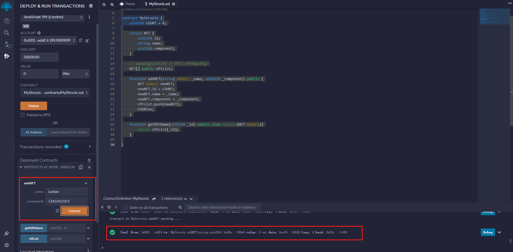
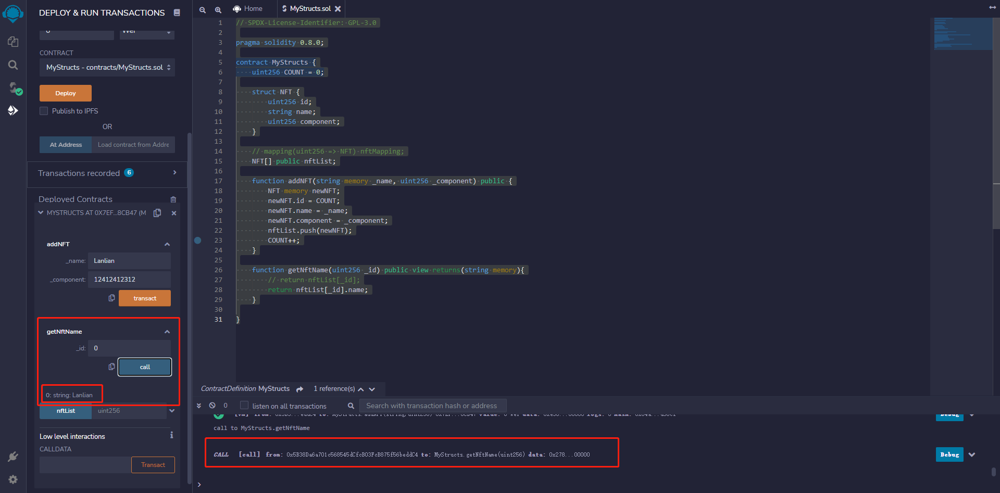
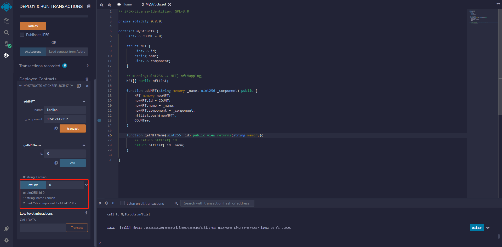

# part7


类似于C语言，Solidity 也有结构体(struct)类型，用于表示复合型数据。结构体是引用类型。

例如，一本书的信息：

- Title
- Author
- Subject
- Book ID

就可以用结构体来表示。

## 定义结构体

要定义结构，使用`struct`关键字。`struct`关键字定义了一个新的数据类型，包含多个成员。struct语句的格式如下

```javascript
struct struct_name { 
   type1 type_name_1;
   type2 type_name_2;
   type3 type_name_3;
}
```

复制

**示例**

```javascript
struct Book { 
   string title;
   string author;
   uint book_id;
}
```

复制

## 访问结构体成员

要访问结构的任何成员，使用成员访问操作符(`.`)。

**示例**

定义结构体，使用结构体，访问结构体中的成员。

```javascript
pragma solidity ^0.5.0;

contract test {
   struct Book { 
      string title;
      string author;
      uint book_id;
   }
   Book book;

   function setBook() public {
      book = Book('Learn Java', 'TP', 1);
   }
   function getBookId() public view returns (uint) {
      return book.book_id;
   }
}
```

复制

可以参考[Solidity – 第一个程序](https://www.qikegu.com/docs/4841)中的步骤，运行上述程序。

首先单击`setBook`按钮，然后单击`getBookId`获取图书id。

输出

```shell
uint256: 1
```

##  


## 编写MyStructs智能合约

- 定义一个名为NFT的结构体, 改结构体包含nft的id， nft的名字，nft所组成的一长串id(类似于nft的生成轨迹)
- 编写addNFT的方法，并在方法内初始一个NFT结构体的实例,为他赋值并且将赋值的实例添加到nftList数组之中
- 编写getNftName方法, 传入nft的id后返回该nft的所有信息

```solidity
// SPDX-License-Identifier: GPL-3.0

pragma solidity 0.8.0;

contract MyStructs {
    uint256 COUNT = 0;

    struct NFT {
        uint256 id;
        string name;
        uint256 component;
    }

    // mapping(uint256 => NFT) nftMapping;
    NFT[] public nftList;

    function addNFT(string memory _name, uint256 _component) public {
        // NFT memory newNFT;
        // newNFT.id = COUNT;
        // newNFT.name = _name;
        NFT memory newNFT = NFT(COUNT, _name, _component);
        newNFT.component = _component;
        nftList.push(newNFT);
        COUNT++;
    }

    function getNftName(uint256 _id) public view returns(string memory){
        // return nftList[_id];
        return nftList[_id].name;
    }

}
```


通过addNFT方法创建一个NFT构造体的实例

如图所示 改nft的name为Lanlian, component为12412412312




由于是生成的第一个nft，所以编号为0

在getNftName方法中输入0 查看当前编号nft的名字




由于数组nftList是public的，输入0后便可获取当前编号nft的所有信息




上文合约包含了许多数据，在合约部署后，这些数据应该怎样被保存?


Solidity中，有一些数据类型由简单数据类型组合而成，相比于简单的值类型，这些类型通常通过名称引用，被称为引用类型，

引用类型包括：

- 数组 (字符串与bytes是特殊的数组，所以也是引用类型)
- struct (结构体)
- map (映射)

这些类型涉及到的数据量较大，复制它们可能要消耗大量Gas，非常昂贵，所以使用它们时，必须考虑存储位置，例如，是保存在内存中，还是在EVM存储区中。

## 数据位置(data location)

在合约中声明和使用的变量都有一个数据位置，指明变量值应该存储在哪里。合约变量的数据位置将会影响Gas消耗量。

Solidity 提供4种类型的数据位置。

- Storage
- Memory
- Calldata
- Stack

### Storage

该存储位置存储永久数据，这意味着该数据可以被合约中的所有函数访问。可以把它视为计算机的硬盘数据，所有数据都永久存储。

保存在存储区(Storage)中的变量，以智能合约的状态存储，并且在函数调用之间保持持久性。与其他数据位置相比，存储区数据位置的成本较高。

### Memory

内存位置是临时数据，比存储位置便宜。它只能在函数中访问。

通常，内存数据用于保存临时变量，以便在函数执行期间进行计算。一旦函数执行完毕，它的内容就会被丢弃。你可以把它想象成每个单独函数的内存(RAM)。

### Calldata

Calldata是不可修改的非持久性数据位置，所有传递给函数的值，都存储在这里。此外，Calldata是外部函数的参数(而不是返回参数)的默认位置。常用于array

### Stack

堆栈是由EVM (Ethereum虚拟机)维护的非持久性数据。EVM使用堆栈数据位置在执行期间加载变量。堆栈位置最多有1024个级别的限制。

可以看到，要永久性存储，可以保存在存储区(Storage)。


## 当数据已经在区块链上，如何对其进行更新?


#### 使用storage进行数据更新

```solidity
    function updateNFTStorage(uint256 _id, string memory _name) public {
        NFT storage nftToBeUpdated = nftList[_id];
        nftToBeUpdated.name = _name;
    }
```

在获取nft时，是直接获取的源数据而非重新拷贝一份

```solidity
 NFT storage nftToBeUpdated = nftList[_id];
```


#### 使用memory进行数据更新

```solidity
    function updateNFTMemory(uint256 _id, string memory _name) public {
        NFT memory nftToBeUpdated = nftList[_id];
        nftToBeUpdated.name = _name;
        // nftList[_id] = nftToBeUpdated;
    }
```

 如果只是将storage改为memory，编辑器会提示该方法要加view，这是因为加了memory的nftToBeUpdated只是将nftList[_id]中的数据拷贝了一份，而并非在原有的数据上修改，该方法并未产生任何数据的改变 所以编辑器提示view，同样的 区块链上也不会有任何数据发生改变


为了修改区块链上的数据，我们需要将数组的指定位置进行重新赋值 也就是加入上文注释中的代码(取消注释即可) 至此该方法便和上文的updateNFTStorage方法有相同的效果

```solidity
 nftList[_id] = nftToBeUpdated;
```


## MyStructs合约完整代码

```solidity
// SPDX-License-Identifier: GPL-3.0

pragma solidity 0.8.0;

contract MyStructs {
    uint256 COUNT = 0;

    struct NFT {
        uint256 id;
        string name;
        uint256 component;
    }

    // mapping(uint256 => NFT) nftMapping;
    NFT[] public nftList;

    function addNFT(string memory _name, uint256 _component) public {
        // NFT memory newNFT;
        // newNFT.id = COUNT;
        // newNFT.name = _name;
        NFT memory newNFT = NFT(COUNT, _name, _component);
        newNFT.component = _component;
        nftList.push(newNFT);
        COUNT++;
    }

    function updateNFTStorage(uint256 _id, string memory _name) public {
        NFT storage nftToBeUpdated = nftList[_id];
        nftToBeUpdated.name = _name;
    }

    function updateNFTMemory(uint256 _id, string memory _name) public {
        NFT memory nftToBeUpdated = nftList[_id];
        nftToBeUpdated.name = _name;
        nftList[_id] = nftToBeUpdated;
    }

    function getNftName(uint256 _id) public view returns(string memory){
        // return nftList[_id];
        return nftList[_id].name;
    }

}
```


## 函数定义

Solidity中， 定义函数的语法如下：

### 语法

```javascript
function function-name(parameter-list) scope returns() {
   //语句
}
```


函数由关键字`function`声明，后面跟函数名、参数、可见性、返回值的定义。

### 示例

下面的例子，定义了一个名为`getResult`的函数，该函数不接受任何参数：

```javascript
pragma solidity ^0.8.0;

contract Test {
   function getResult() public view returns(uint){
      uint a = 1; // 局部变量
      uint b = 2;
      uint result = a + b;
      return result;
   }
}
```


## 函数调用与函数参数

要调用函数，只需使用函数名，并传入参数即可。

```javascript
pragma solidity ^0.8.0;

contract SolidityTest {   
   constructor() public{       
   }
   function getResult() public view returns(string memory){
      uint a = 1; 
      uint b = 2;
      uint result = a + b;
      return integerToString(result); // 调用函数
   }
   function integerToString(uint _i) internal pure 
      returns (string memory) {

      if (_i == 0) {
         return "0";
      }
      uint j = _i;
      uint len;

      while (j != 0) {
         len++;
         j /= 10;
      }
      bytes memory bstr = new bytes(len);
      uint k = len - 1;

      while (_i != 0) {
         bstr[k--] = byte(uint8(48 + _i % 10));
         _i /= 10;
      }
      return string(bstr);// 访问局部变量
   }
}
```


输出

```shell
0: string: 3
```


## return 语句

Solidity中， 函数可以返回多个值。

```javascript
pragma solidity ^0.8.0;

contract Test {
   function getResult() public view returns(uint product, uint sum){
      uint a = 1; // 局部变量
      uint b = 2;
      product = a * b; // 使用返回参数返回值
      sum = a + b; // 使用返回参数返回值

      // 也可以使用return返回多个值
      // return(a*b, a+b);
   }
}
```


输出

```shell
0: uint256: product 2
1: uint256: sum 3
```


## 编写MyFunctions智能合约

