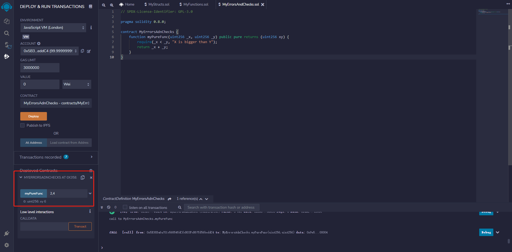
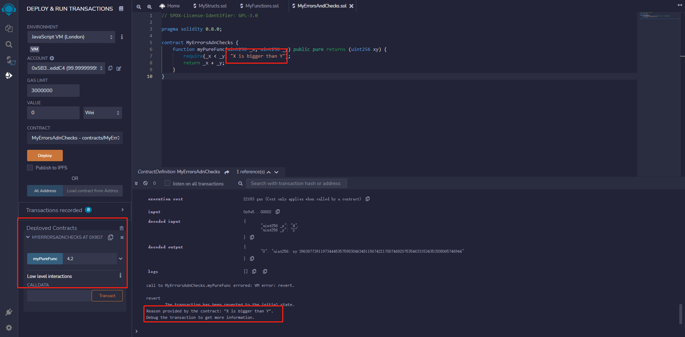
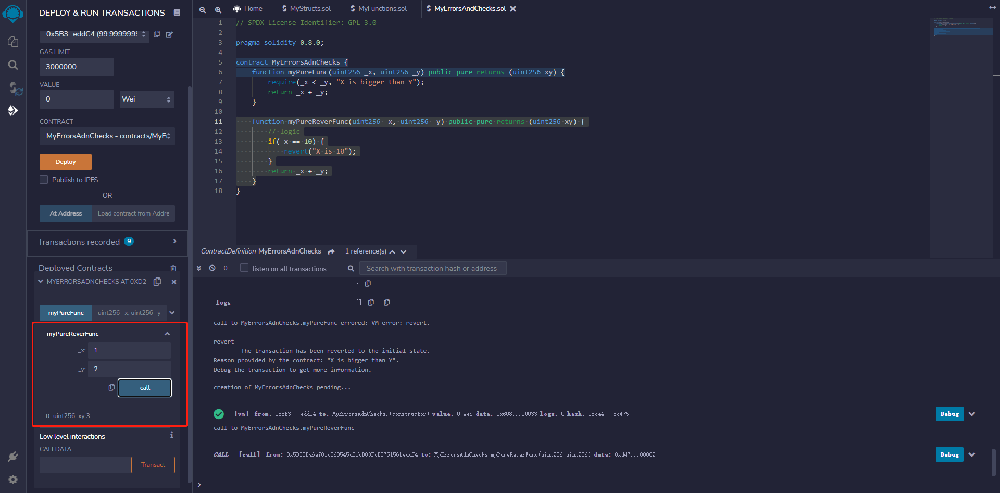
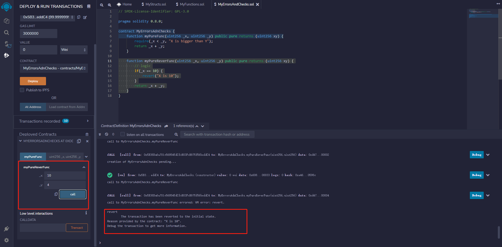
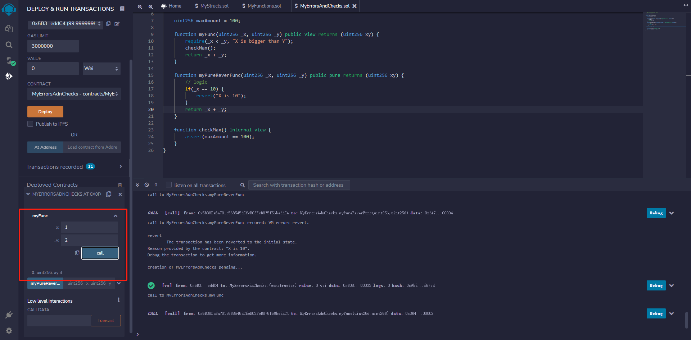
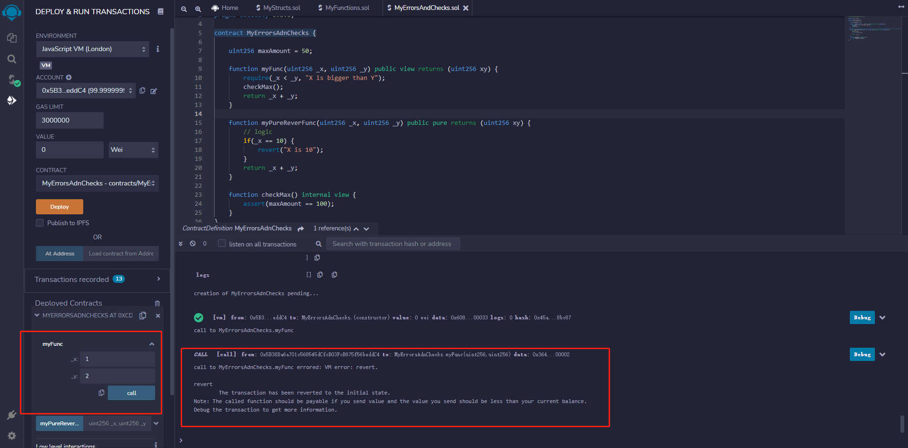

# part8 


Solidity 提供了很多错误检查和错误处理的方法。通常，检查是为了防止未经授权的代码访问，当发生错误时，状态会恢复到初始状态。

下面是错误处理中，使用的一些重要方法：

- ```solidity
  assert(bool condition)
  ```

   

  − 如果不满足条件，此方法调用将导致一个无效的操作码，对状态所做的任何更改将被还原。这个方法是用来处理内部错误的。

  

- `require(bool condition)` − 如果不满足条件，此方法调用将恢复到原始状态。此方法用于检查输入或外部组件的错误。

- `require(bool condition, string memory message)` − 如果不满足条件，此方法调用将恢复到原始状态。此方法用于检查输入或外部组件的错误。它提供了一个提供自定义消息的选项。

- `revert()` − 此方法将中止执行并将所做的更改还原为执行前状态。

- `revert(string memory reason)` − 此方法将中止执行并将所做的更改还原为执行前状态。它提供了一个提供自定义消息的选项。


#### 部署合约

##### require

```solidity
// SPDX-License-Identifier: GPL-3.0

pragma solidity 0.8.0;

contract MyErrorsAdnChecks {
    function myPureFunc(uint256 _x, uint256 _y) public pure returns (uint256 xy) {
        require(_x < _y, "X is bigger than Y");
        return _x + _y;
    }
}
```

输入x, y 分别为2, 4  其中2 < 4符合条件 便返回6(2 + 4)




x, y 分别赋值4，2  其中4并不小于2 因此产生异常

可以发现在触发异常后并未返回_x + _y的值，也就是说在不满足require的条件后，代码执行就会中断，并不会往下执行 


##### revert

添加下列方法后部署合约

```solidity
    function myPureReverFunc(uint256 _x, uint256 _y) public pure returns (uint256 xy) {
        // logic
        if(_x == 10) {
            revert("X is 10");
        }
        return _x + _y;
    }
```


在对x，y分别赋值1,2后正常返回3(1+2)




在对x, y分别赋值10 和4后并未返回值, 只是因为x = 10 进入if判断内执行了revert, revert将会终止程序并返回自定义异常消息




##### assert

合约代码

```solidity
// SPDX-License-Identifier: GPL-3.0

pragma solidity 0.8.0;

contract MyErrorsAdnChecks {

    uint256 maxAmount = 100;

    function myFunc(uint256 _x, uint256 _y) public view returns (uint256 xy) {
        require(_x < _y, "X is bigger than Y");
        checkMax();
        return _x + _y;
    }

    function myPureReverFunc(uint256 _x, uint256 _y) public pure returns (uint256 xy) {
        // logic
        if(_x == 10) {
            revert("X is 10");
        }
        return _x + _y;
    }

    function checkMax() internal view {
        assert(maxAmount == 100);
    }
}
```


将maxAmount的初始值设定为100后执行myFunc方法

方法正常执行 返回3




将代码中的maxAmount初始值设定为50后 再次部署合约执行myFunc方法

```solidity
uint256 maxAmount = 50;
```



可以看出方法执行终止并未返回任何值，这是因为assert(maxAmount == 100)条件并未满足，所以终止当前方法的执行


