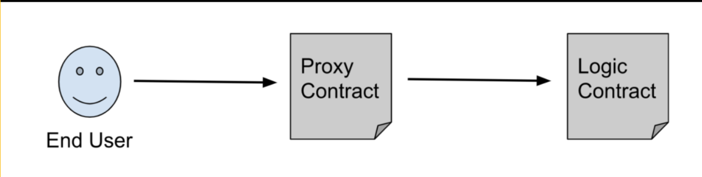
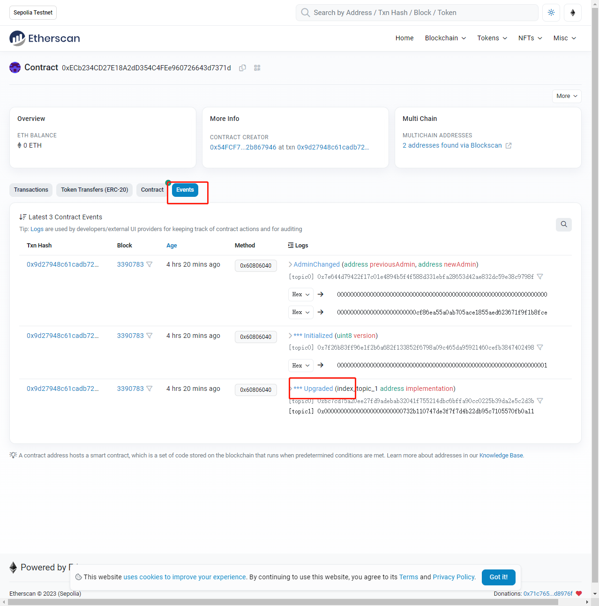

在这篇博客中，我们将学习开发可升级智能合约背后的基本设计原则。最后，你会更清楚为什么要升级智能合约，如何升级智能合约，以及升级时需要考虑的问题。本文章主要关注以太坊和基于 [EVM](https://ethereum.org/en/developers/docs/evm/) 的智能合约。

为了配合学习文章内容，你应该对[区块链的工作原理](https://blog.chain.link/what-is-blockchain-zh/)有初步的了解，尤其是以太坊区块链。本文后面有一个简短的代码演示，因此你最好拥有一些编程经验，对 [Solidity 及其编译方式](https://blog.chain.link/learn-blockchain-full-stack-web3-javascript-smart-contract-development/)、[智能合约是什么](https://chain.link/education/smart-contracts#:~:text=A smart contract is a,certain predefined conditions are satisfied.)以及部署方式有一些基本了解，以及如何使用像是 Metamask 和 Hardhat 这些工具。

## 什么是可升级智能合约?

数据的不可篡改性是区块链技术的核心原则之一。存储在以太坊区块链上的数据，包括部署到它的智能合约，也是不可变的。

在我们深入了解如何升级智能合约的细节之前，让我们先明确为什么我们需要升级智能合约。

主要原因是：

- 修复 bug。
- 改进功能。
- 删掉没用的或添加需要的函数。
- 优化代码以节省更多的 gas。
- 响应技术、市场或社会的变化。
- 避免将用户迁移到新版本的成本。

如果有足够的时间，大多数东西都需要一些维护工作。但是存储在区块链上的数据是不可变的。那么智能合约如何升级呢？

简单的说，智能合约本身无法更改——一旦部署到区块链，它们就是不可变的。但是 dApp 在设计模式上，可以有一个或多个智能合约一起运行，其中一些智能合约可以作为“后端”。这样的话，我们可以升级这些智能合约之间的交互模式。在这里，升级智能合约并不意味着修改已部署的智能合约的代码，而是将其中一个智能合约换成另一个。我们这样做的方式（在大多数情况下）可以让终端用户不必改变他们与 dApp 的交互方式。

所以真正升级智能合约是一个新智能合约替换旧智能合约的过程。当新的智能合约被使用后，旧的智能合约就会被“遗弃”在链上，因为旧的合约是不可变的。

## 如何升级合约?

智能合约通常使用“代理模式”进行升级，“代理模式”是一种软件架构模式。可以参考这个[系统设计入门第 5 节](https://www.freecodecamp.org/news/systems-design-for-interviews/)了解更多“代理模式”的细节，但是长话短说，代理可以认为是一个大软件系统中的一个软件，它代表系统的一部分。在传统的 Web2 框架中，代理位于客户端应用程序和服务器应用程序之间。其中正向代理是客户端应用程序，而反向代理是服务器应用程序。

在智能合约的架构中，代理更像是一个反向代理，代表一个智能合约。它是一种中间件，可将前端接受的请求发送给系统后端对应的智能合约。作为智能合约，代理有自己的“稳定”（即不变）的以太坊合约地址。因此，你可以把系统中的旧的智能合约替换为新部署的智能合约。dApp 的最终用户直接与代理交互，并且仅通过代理间接与其他智能合约交互。

所以，在智能合约开发中，代理模式是通过以下两个部分来实现的：

1. 代理智能合约
2. 执行合约，也称为逻辑合约或实现合约（implementation contract）。 在这篇文章中，我们将以上部分分别称为代理合约和逻辑合约。

代理模式有三种常见的变体，我们将在下面讨论。

### 简单代理模式

简单代理模式的架构如下



让我们更深入地了解它是如何工作的。

在 EVM 中，有一种叫做“execution context”的东西，你可以将其视为执行代码的所需要的空间。

代理合约有自己的 execution context，所有其他智能合约也是如此。代理合约也有自己的存储空间，数据连同自己的 ETH 余额永久存储在区块链上。智能合约相关的的数据和余额一起称为其“状态”，而状态是其 execution context 的一部分。

代理合约使用存储变量来跟踪构成 dApp 的其他智能合约的地址。这就是它可以重定向交易并调用相关智能合约的方式。

但是有一个技巧可以用来将消息调用传递给正确的合约。代理合约不只是对逻辑合约进行常规函数调用；而是使用 [Delegatecall](https://docs.soliditylang.org/en/v0.8.6/introduction-to-smart-contracts.html?highlight=delegatecall#delegatecall-callcode-and-libraries)。 Delegatecall 类似于常规函数调用，不同之处在于目标地址处的代码是在调用合约的 context 中执行的。如果逻辑合约的代码更改了存储变量，这些更改将反映在代理合约的存储变量中——即在代理合约的状态中。

那么 delegatecall 逻辑在代理合约中的什么位置呢？答案是代理合约的 [fallback 函数](https://docs.soliditylang.org/en/v0.8.17/contracts.html#fallback-function)。当代理合约收到自身无法处理的函数调用时，将调用代理合约的 fallback 函数来处理该函数调用。代理合约在其 fallback 函数中使用自定义逻辑将调用发送到逻辑合约。

将此原则应用于代理和逻辑合约，delegatecall 将调用逻辑合约的代码，但该代码在代理合约的 execution context 中运行。这意味着逻辑合约中的代码有权更改代理合约中的状态——它可以更改存储在代理合约中的状态变量和其他数据。这有效地将应用程序的状态与执行的代码分离。代理合约控制 dApp 的所有状态，也就意味着可以在不丢失 dApp 状态的情况下更改逻辑。

现在 dApp 状态和应用程序逻辑就可以在 EVM 中解耦了，我们可以通过更改逻辑合约并将新地址提供给代理来升级 dApp。但 dApp 的状态不受此升级的影响。

使用代理时，我们需要注意两个常见问题。

一个问题是[存储冲突](https://docs.openzeppelin.com/upgrades-plugins/1.x/proxies#unstructured-storage-proxies)；另一种是[代理选择器冲突（proxy selector clashing）](https://medium.com/nomic-foundation-blog/malicious-backdoors-in-ethereum-proxies-62629adf3357)。你可以阅读有关存储冲突的链接文章以了解更多信息，但现在我们将重点关注选择器冲突，因为它们是我们将要检查的代理模式的重要原因。

正如我们之前看到的，代理将所有函数调用委托给逻辑合约。但是，代理合约本身也具有函数，这些函数是它们内部的并且是它们运行所必需的。例如，代理合约需要像 upgradeTo(address newAdd) 这样的函数来升级到新逻辑合约的地址。那么如果代理合约和逻辑合约有一个具有相同名称和签名（参数和类型）的函数会怎样？代理合约如何知道是调用自己的函数还是通过 delegateCall委托给逻辑合约？这被称为“[代理选择器冲突](https://medium.com/nomic-foundation-blog/malicious-backdoors-in-ethereum-proxies-62629adf3357)”，是一个可以被利用的安全漏洞，或者至少是恼人错误的来源。

从技术上讲，这种冲突也可能发生在函数之间，即使它们具有不同的名称。这是因为每个可公开调用的函数（可以在 [ABI](https://blog.chain.link/what-are-abi-and-bytecode-in-solidity/) 中定义的函数）在字节码级别由一个[四字节长的标识](https://solidity.readthedocs.io/en/v0.4.24/abi-spec.html?highlight=signature#function-selector)符标识。由于它只有四个字节，因此从技术上讲，两个完全不同的函数签名的前四个字节也可能恰好相同，从而为不同的函数签名生成相同的标识符，从而导致冲突。

幸运的是，当冲突是由同一合约中的函数签名产生时，Solidity 编译器可以检测到这种选择器冲突的子类型，但当这种冲突发生在不同合约之间时则无法检测到。例如，如果代理合约和逻辑合约之间发生冲突，编译器将无法检测到，但在同一个代理合约内，编译器会检测到冲突。

这个问题的解决方案是“透明”代理模式，它已经被 [Open Zeppelin](https://blog.openzeppelin.com/the-transparent-proxy-pattern/) 推广。

### 透明代理模式

透明代理模式是终端用户（调用者）发起的函数调用总是路由到逻辑合约而不是代理合约。但是，如果调用者是代理合约的 admin，则代理合约就知道是调用自己的 admin 函数。这在听起来是有意义的，因为调用代理合约中的管理函数来管理可升级性和其他管理任务只能由管理员完成，如果有冲突，可以合理地假设管理员打算调用代理合约的函数而不是逻辑合约的函数。但如果调用者是任何其他非管理地址，代理就会将 delegateCall 给相关逻辑合约。我们在合约中可以通过检查 message.sender 值来识别调用者。

在这种模式中，代理合约将在其 fallback 函数中具有逻辑来解析 message.sender 和正在被调用的函数选择器，并相应地调用它自己的某个函数或将调用委托给逻辑合约。

正如我们将在代码演练中看到的那样，OpenZeppelin 合约添加了另一个抽象层，具有升级函数的 [ProxyAdmin 合约](https://github.com/OpenZeppelin/openzeppelin-contracts/blob/master/contracts/proxy/transparent/ProxyAdmin.sol)——ProxyAdmin 会作为一个或多个代理合约的管理员。此代理管理合约必须是升级相关函数的调用者。因此，最终用户将直接与代理交互，代理将 delegateCall 给逻辑合约，但升级和管理请求将通过 ProxyAdmin 合约传递，然后将升级请求转发给代理。

透明代理模式确实有一些缺点。如果处理不当，它们很容易受到函数选择器冲突的影响，而且它们可能会花费更多的 gas 来运行（因为 EVM 需要额外的 gas 来为每个 delegateCall 加载逻辑合约地址），并且以这种模式部署代理合约也花费更多的 gas。

### UUPS 模式

通用可升级代理标准（Universal Upgradable Proxy Standard：UUPS）在 [EIP1822](https://eips.ethereum.org/EIPS/eip-1822) 中被提出，作为一种为代理合约创建了标准，该标准与所有合约具有普遍兼容性。它克服了代理函数选择器冲突的问题。该模式也使用了 Solidity 的 delegatecall 操作，但是在简单/透明代理模式中所有升级都由代理合约管理，在 UUPS 中，升级由逻辑合约处理——具体来说是逻辑合约继承的“可代理”智能合约。

逻辑合约仍将在代理合约的 context 中执行，从而利用代理合约的存储、余额和地址，但逻辑合约继承自包含升级功能的 Proxiable 父合约。可代理智能合约中会包含升级逻辑，用于更新存储在代理合约中的逻辑合约地址。

由于 Solidity 编译器能够检测同一合约中出现的函数选择器冲突，因此父级可代理合约中存在升级逻辑有助于编译器识别此类冲突，从而降低发生冲突的可能性。

UUPS 代理模式也有缺点。虽然以这种模式部署更便宜（更少的 gas），但使用这种模式维护 dApp 的智能合约更复杂。

一个重要的问题是，由于升级逻辑不在代理合约中，而是在逻辑合约的可代理父合约中，如果更新后的逻辑合约无法继承可代理合约，则升级功能不会被继承，并且以后都无法升级智能合约。

但是这个问题有一个好处：UUPS 模式允许通过简单地不再继承可代理合约来移除可升级性，透明代理模式做不到这一点。这就是为什么 OpenZeppelin 和其他人[建议使用](https://docs.openzeppelin.com/contracts/4.x/api/proxy#transparent-vs-uups) UUPS 而不是透明代理，尽管目前透明仍然更受开发者的欢迎。

## Code Along

首先，我们将使用 [OpenZeppelin](https://docs.openzeppelin.com/) 升级工具的透明代理模式，该模式适用于使用 JavaScript 和 [Hardhat](https://hardhat.org/) 的常见 Web3 开发工作流。 OpenZeppelin 提供与 Hardat 和 Truffle 集成的[插件](https://docs.openzeppelin.com/upgrades-plugins/1.x/)。这次我们将使用 Hardhat。

Hardhat 插件为我们提供了诸如 deployProxy 之类的函数，可以为我们跟踪逻辑合约，调用升级函数。默认情况下，部署合约的地址就是具有管理员权限的地址，可以对合约进行升级。

让我们创建一个 Hardhat 项目——你可以随意命名它——然后从该目录中，让我们开始按照以下步骤设置我们的项目工具。

### 项目配置

安装 Hardhat 开发者工具、Web3 库和 OpenZeppelin 提供的升级插件。下面的命令也将创建你的 package.json 文件。

在本项目中所需要用到的依赖有：

```
  "dependencies": {
    "@chainlink/contracts": "^0.6.1",
    "@nomicfoundation/hardhat-toolbox": "^2.0.2",
    "@openzeppelin/contracts": "^4.8.3",
    "dotenv": "^16.0.3"
  }
```

通过npm安装依赖

```
npm install @chainlink/contracts @nomicfoundation/hardhat-toolbox @openzeppelin/contracts dotenv
```


创建hardhat项目

```
npx hardhat 
```

选择创建一个空的hardhat.config.js文件,并修改文件

```
require('dotenv').config()
require("@nomiclabs/hardhat-ethers");
require("@openzeppelin/hardhat-upgrades");

const SEPOLIA_RPC_URL = process.env.SEPOLIA_RPC_URL_HTTP
const PRIVATE_KEY = process.env.WALLET_PRIVATE_KEY_DEV1;
const ETHERSCAN_KEY = process.env.ETHERSCAN_API_KEY;

/** @type import('hardhat/config').HardhatUserConfig */
module.exports = {
 solidity: "0.8.17",
 defaultNetwork: "hardhat",
 networks: {
   localhost: {
     chainId: 31337,
   },
   sepolia: {
     url: SEPOLIA_RPC_URL,
     accounts: PRIVATE_KEY ? [PRIVATE_KEY] : [],
     chainId: 11155111,
   },
 },
 etherscan: {
   apiKey: ETHERSCAN_KEY,
 },
};
```

### 智能合约代码

在项目根目录中，创建一个 \<root\>/contracts/PriceFeedTrackerV1.sol Solidity 文件并将以下智能合约粘贴进去：

```
// SPDX-License-Identifier: MIT
pragma solidity ^0.8.0;

import "@chainlink/contracts/src/v0.8/interfaces/AggregatorV3Interface.sol";
import "@openzeppelin/contracts-upgradeable/proxy/utils/Initializable.sol";

contract PriceFeedTracker is Initializable {
   address private admin;

   function initialize(address _admin) public initializer {
       admin = _admin;
   }

   function getAdmin() public view returns (address) {
       return admin;
   }

   /**
    * Network: Sepolia
    * Aggregator: ETH/USD
    * Address: 0x694AA1769357215DE4FAC081bf1f309aDC325306
    */
   function retrievePrice() public view returns (int) {

       AggregatorV3Interface aggregator = AggregatorV3Interface(

           0x694AA1769357215DE4FAC081bf1f309aDC325306
       );
       (
           ,
           /*uint80 roundID*/
           int price, /*uint startedAt*/ /*uint timeStamp*/ /*uint80 answeredInRound*/
           ,
           ,

       ) = aggregator.latestRoundData();

       return price;
   }
} 
```


需要注意的是, 由于当前使用的测试网络是Sepolia，如果更改至其他的测试网需要更改交易对的地址，相关的地址可以在[Chainlink Feed Contract Address](https://docs.chain.link/data-feeds/price-feeds/addresses/#Sepolia%20Testnet)上查看


创建.env文件并输入自己的apiKey

```
SEPOLIA_RPC_URL_HTTP=
WALLET_PRIVATE_KEY_DEV1=
ETHERSCAN_API_KEY=
```


如果你现在运行 `npx hardhat compile` 你应该看到 Solidity 代码编译成功并且你的项目目录中有两个新文件夹，“Artifacts”和“cache”。

你会注意到，此 V1 智能合约从 Sepolia 测试网上的 Chainlink Price Feeds（Chainlink 喂价）获取 ETH/USD 价格数据。现在，喂价的地址是 hardcode 的，这意味着它只能返回 ETH/USD 价格。未来，我们将对其进行升级，以处理 Sepolia网络上任何资产对的 Price Feed 地址。

不过现在，让我们考虑一下 Initializable 和 initialize() 函数发生了什么。由于 Solidity 中的一些小问题超出了本文的范围，当我们使用 [Open Zeppelin 可升级合约时](https://docs.openzeppelin.com/learn/upgrading-smart-contracts#initialization)，我们不能在智能合约中写构造函数。相反，我们通过在 Initializable 基础合约来创建类似构造函数的函数，这有助于我们将初始化修饰符（initializer nodifier）应用于 initialize() 函数。我们可以随意命名初始化函数，通过使用初始化，Hardhat 插件就可以识别它，并默认调用该函数。如果我们有另一个名字的初始化函数，我们则需要指定初始化函数的名称。

这种带有修饰符的“初始化”模式通过确保 initialize() 仅运行一次来模拟构造函数。如果需要，我们可以在这里明确设置管理员地址——默认为部署者的地址。retrievePrice() 函数调用 [ETH/USD 喂价](https://docs.chain.link/docs/data-feeds/price-feeds/)智能合约并返回交易所价格。

### 部署脚本

让我们在 scripts/deploy_upgradeable_pricefeedtracker.js 中使用以下脚本部署此 V1 合约。

```
// Open Zeppelin 升级插件添加了 `upgrades` 属性
// 到 Hardhat 运行时环境。
const { ethers, network, upgrades } = require("hardhat");

async function main() {
// 获取对合约和 ABI 的引用。
 const PriceFeedTracker = await ethers.getContractFactory("PriceFeedTracker");
 console.log("Deploying PriceFeedTracker to ", network.name);

// 从 Hardhat 为您创建的 20 个帐户中获取第一个帐户
 const [account1] = await ethers.getSigners();

// 使用代理模式部署逻辑合约。
 const pricefeedTracker = await upgrades.deployProxy(
   PriceFeedTracker,

	//因为逻辑合约有一个initialize()函数
    // 我们需要将参数传递给 initialize()
    // 函数在这里。
   [account1.address],

	// 我们不需要明确指定这个
    // 因为 Hardhat 运行时将默认为名称“initialize”
   { initializer: "initialize" }
 );
 await pricefeedTracker.deployed();

 console.log("PriceFeedTracker deployed to:", pricefeedTracker.address);
}

main();
```

通过在 [OpenZeppelin Upgrades Plugins](https://docs.openzeppelin.com/upgrades-plugins/1.x/) 中使用 [deployProxy()](https://docs.openzeppelin.com/upgrades-plugins/1.x/api-hardhat-upgrades#deploy-proxy) ，部署的合约实例可以在以后升级。默认情况下，只有最初部署合约的地址才有升级合约的权限。

deployProxy 将创建以下交易：

1. 部署逻辑合约（PriceFeedTracker 合约）。
2. 部署代理合约并运行任何初始化函数。
3. 部署 ProxyAdmin 合约（我们代理的管理员）。

在我们运行部署脚本之前，请确保你有足够的 Spolia ETH。你可以通过 Chainlink 水龙头获取Spolia ETH。确保你还在环境变量中设置了 RPC 节点 URL 和私钥，这样你的 hardhat.config.js 文件才可以读取它们！

我们可以使用以下命令运行我们的部署脚本，将合约部署到以太坊 Sepolia测试网。

```
npx hardhat run --network sepoliascripts/deploy_upgradeable_pricefeedtracker.js
```

```
n --network spolia scripts/deploy_upgradeable_pricefeedtracker.js
```

这应该会在你的终端中产生如下所示的确认，但合约地址会不同。记下这个合约地址。请注意，它是你的代理合约的地址，而不是逻辑合约。我们需要代理合约的地址，因为这是我们将用来与我们的逻辑合约交互的稳定（不变）地址。

```
Deploying PriceFeedTracker to  sepolia
PriceFeedTracker deployed to: 0xECb234CD27E18A2dD354C4FEe960726643d7371d
```

您可以在[这里](https://docs.openzeppelin.com/upgrades-plugins/1.x/api-hardhat-upgrades#common-options)研究 deployProxy() 及其配置选项的文档。请注意，默认模式是“透明的”，但您可以通过显式设置该配置选项，来指定代理遵循 UUPS 模式。

### Hardhat 控制台

在我们升级合约之前，让我们使用 Hardhat 控制台与它交互，它允许我们编写 JavaScript 来与我们的逻辑合约交互，逻辑合约也是通过代理合约部署的。

在新的（第三个！）终端窗口中，运行以下命令将控制台连接到 Sepolia区块链：

```
yarn hardhat console --network sepolia
```


这将打开控制台，一条一条的运行以下命令：


```
> const PriceFeedTracker = await ethers.getContractFactory("PriceFeedTracker");
undefined
```


```
> const priceFeedTracker = await PriceFeedTracker.attach('<<<< 你的合约地址  >>>>') 
undefined
```

然后调用 getAdmin() getter 函数，它应该输出你的部署者钱包地址——你在部署脚本中传递给初始化函数参数的地址。


```
> (await priceFeedTracker.getAdmin())
'0xf39Fd6e51aad88F6F4ce6aB8827279cffFb92266'
```

接下来尝试获取 ETH/USD 价格。这仅仅是一个读取的调用。因为它不会修改状态或 emit 任何event，所以你不需要支付 gas。

```
> (await priceFeedTracker.retrievePrice())
BigNumber { value: "150701000000" }
```

好的！如果你得到这些结果，则代理合约可以与你部署的代理合约正确交互。

小提示：转到 spolia.etherscan.io/address/YOUR_CONTRACT_ADDRESS，然后单击“event”选项卡。您应该会看到几个类似于下图的 event。查找名为“Upgrade”的 event，然后单击它旁边的小箭头。这将向你展示合约的地址。每次升级智能合约时，这个地址最终都会被更改。





### 可升级的逻辑合约

现在让我们更新一下带有附加功能的逻辑合约。看看下面的 PriceFeedTrackerV2。你会注意到以下变化：

1. 有一个名为 price 的新公共存储变量，它是 int 类型，它将存储获取到的价格。
2. 更新喂价时，有一个新的 event 会发出两条数据。
3. retrievePrice() 函数不再 hardcode ETH/USD 地址，而是从调用者那里获取价格源的地址。它还检查是否传入了一个非零地址。一旦获取到价格，retrievePrice() 就会记录一个 event，并将价格存储在price状态变量中（这两个操作都会改变区块链的状态，因此这不再是一个 view 函数）。


```
// SPDX-License-Identifier: MIT
pragma solidity ^0.8.0;

import "@chainlink/contracts/src/v0.8/interfaces/AggregatorV3Interface.sol";
import "@openzeppelin/contracts-upgradeable/proxy/utils/Initializable.sol";

contract PriceFeedTrackerV2 is Initializable {
   address private admin;
   int public price; // NOTE: new storage slot

   // Emitted when the price is retrieved changes
   event PriceRetrievedFrom(address feed, int price);

   function initialize(address _admin) public initializer {
       admin = _admin;
   }

   function getAdmin() public view returns (address) {
       return admin;
   }

   // Fetches the price from the feed.
   // Note that the function is no longer a view function as it emits an event.
   function retrievePrice(address feed) public returns (int) {
       require(
           feed != address(0x0),
           "PriceFeedTrackerV2: Pricefeed address must not be zero address."
       );

       AggregatorV3Interface aggregator = AggregatorV3Interface(feed);
       (
           ,
           /*uint80 roundID*/
           int _price, /*uint startedAt*/ /*uint timeStamp*/ /*uint80 answeredInRound*/
           ,
           ,

       ) = aggregator.latestRoundData();

       price = _price;

       emit PriceRetrievedFrom(feed, _price);

       return price;
   }
}
```


在这个阶段，我们必须关注一个关于存储变量的重要技术问题。你会看到 admin state 变量保留在完全相同的“位置”，并且 price 变量在它之后声明。这是因为当更新逻辑合约时，它们不能更改状态变量声明的顺序，因为这会导致存储冲突（storage clash），因为 storage context 在代理合约中（如文章之前所说的一样）。这是因为在代理合约的 context 中，状态变量通常被分配到存储布局的“槽（slot）”中，并且这些槽在逻辑合约的升级过程中必须保持不变。所以我们不能更换存储槽（storage slot）或在两者之间插入新的存储槽。所有新的状态变量必须附加在最后，在一个以前没有被占用的槽中。 OpenZeppellin 使用 [EIP1967](https://eips.ethereum.org/EIPS/eip-1967) 存储槽来避免逻辑合约中的存储冲突。你可以在[此处](https://blog.openzeppelin.com/proxy-patterns/)阅读更多关于 OpenZeppelin 代理模式和存储的细节。


## 升级合约的部署脚本

升级逻辑合约具有不同的名称和新函数。我们可以通过调用 [upgradeProxy](https://docs.openzeppelin.com/upgrades-plugins/1.x/api-hardhat-upgrades#upgrade-proxy) 函数来升级 V1 实例，该函数创建以下交易：

1. 部署更新后的逻辑合约（PriceFeedTrackerV2 合约）。
2. 调用 ProxyAdmin 合约（代理合约的管理员）来更新代理合约以指向新的逻辑合约。

我们的更新脚本将在 scripts/upgrade_pricefeedtracker.js 中，看起来像这样（注意我们使用 upgradeProxy 而不是 deployProxy）。注意，你必须在运行脚本之前添加已部署合约的地址——忘记这是一个很容易犯的错误，可能会浪费你数小时来检查这个错误。


```
const { ethers, upgrades } = require("hardhat");

async function main() {
  // TODO Check this address is right before deploying.
  const deployedProxyAddress = "<<< 你的代理合约地址 >>>";

  const PriceFeedTrackerV2 = await ethers.getContractFactory(
    "PriceFeedTrackerV2"
  );
  console.log("Upgrading PriceFeedTracker...");

  await upgrades.upgradeProxy(deployedProxyAddress, PriceFeedTrackerV2);
  console.log("PriceFeedTracker upgraded");
}

main(); 
```

通过以下命令运行脚本

```
npx hardhat run --network sepolia scripts/upgrade_pricefeedtracker.js
```

然后应该会看到如下的结果

```
Compiled 2 Solidity files successfully
Upgrading PriceFeedTracker...
PriceFeedTracker upgraded
```

请注意，代理合约地址未更改。但是如果你回到 Etherscan 并查看你的代理合约发出的事件，你应该会看到一个新的“Upgraded”event 和一个新的合约地址。

如果你的合约需要很长时间才能部署，请看到本文的故障排除部分。

现在让我们使用 Hardhat 控制台与升级后的合约进行交互。

运行以下命令，一次一个。我建议您在请求价格后等待 60-90 秒，然后再检查 price 状态变量。

```
> var V2 = await ethers.getContractFactory("PriceFeedTrackerV2")
undefined

> var v2 = await V2.attach(///// INSERT PROXY CONTRACT ADDRESS /////)
undefined

// ETH/USD
> var ethusdTx = await v2.retrievePrice('0xD4a33860578De61DBAbDc8BFdb98FD742fA7028e') 
undefined

// Wait about 60-90 seconds then read the updated state variable.
> (await v2.price())
BigNumber { value: "150701000000" }

// Change to LINK/ETH
> var linkEthTx = await v2.retrievePrice('0xb4c4a493AB6356497713A78FFA6c60FB53517c63')

// Wait about 60-90 seconds then read the updated state variable.
> (await v2.price())
BigNumber { value: "4659009800000000" }
```

你会注意到，我们更新了 price 变量以存储 Chainlink 提供的 ETH/USD 的价格。

这样你就升级了你的逻辑合约，你与之交互的合约（代理合约）没有改变！代理合约将逻辑函数调用委托给在逻辑合约，而这个逻辑合约是在代理合约中注册的最新的逻辑合约！

## 故障排查

在 Spolia 网络，使用可升级合约执行交易时，可能会出现一些问题。一个问题是交易卡在内存池中，这是因为当时从我的钱包发送的 gas 少于网络所需的 gas——在撰写本文时 Spolia 上出现了 gas 峰值。没有任何错误表明发生了这种情况，所以我花了一段时间才弄明白！我使用 Alchemy 作为我的 RPC 提供者来连接 Spolia，所以我找到了[这个视频](https://www.youtube.com/watch?v=MhtJLUl51gE)来帮助我接触 pending 交易。我创建了这个[脚本](https://gist.github.com/zeuslawyer/541c941b71df7bba128665d9f7e328bf)作为 Hardhat 脚本运行，它帮助我清除了我的内存池交易。

另外请注意，最好在任何更改区块链状态的交易之后等待大约 60 ，再运行 retrievePrice() ，如果过早地从 price 存储变量中读取数据，区块链将返回旧的数据，因为状态更改写入交易可能尚未被区块确认。

## 总结

我们已经介绍了如何升级智能合约、我们为什么要升级以及围绕升级智能合约的实践。我们已经学习了一些设计模式，一些可能会让你绊倒的问题，还运行了一些代码来部署和升级一个使用来自 Chainlink 喂价数据的智能合约。