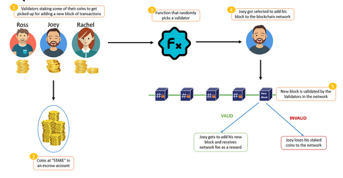
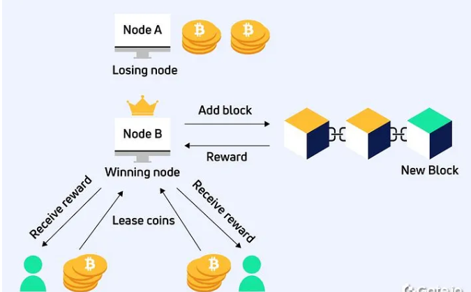
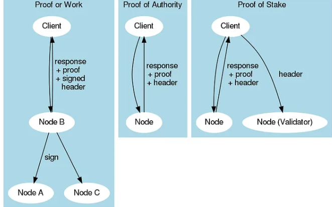
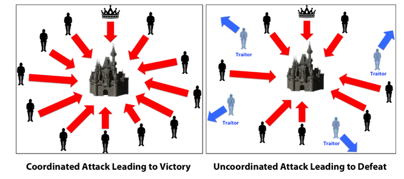
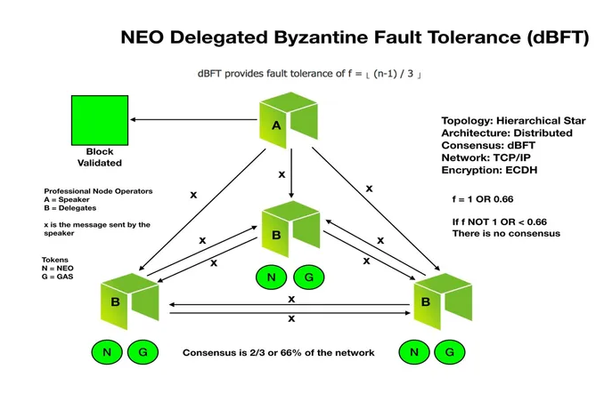
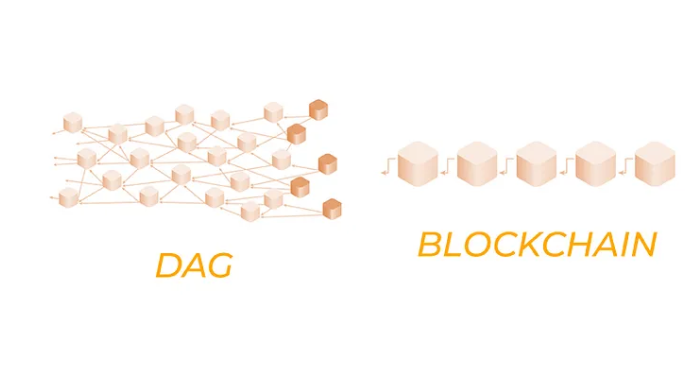
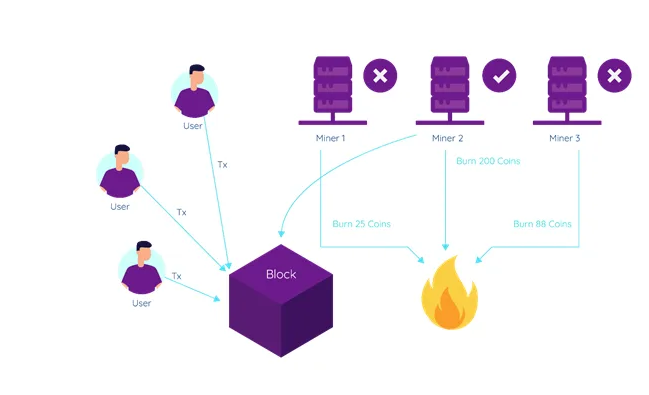
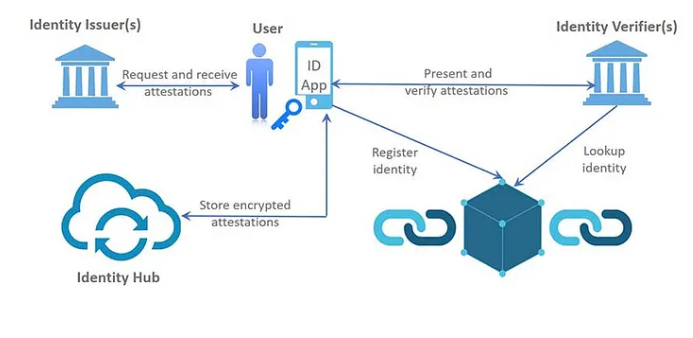
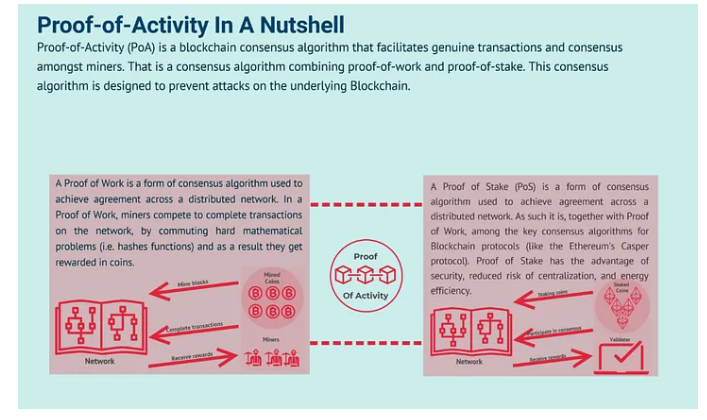
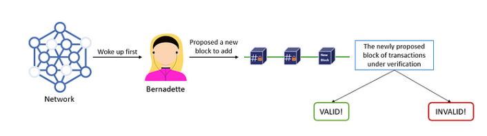

# 所有主要的区块链共识算法解释

区块链技术席卷全球，提供了一种去中心化且安全的信息存储和传输方式。它还彻底改变了交易的执行方式，随之而来的是广泛的共识算法。在这里，共识算法在确保区块链网络的完整性方面发挥着关键作用。在本文中，我们将探讨所有主要类型的[区块链共识算法](https://medium.com/@learnwithwhiteboard_digest/beginners-guide-to-consensus-algorithms-in-blockchain-technology-34c2026b2b36)、它们的含义、优点、缺点，以及为什么它们在区块链技术中必不可少。

# 区块链共识算法

共识算法是一组规则或协议，使区块链网络中的节点能够就网络的共享状态达成一致。它们用于确保网络中的所有节点就交易的有效性以及将它们添加到区块链的顺序达成共识。

> 共识算法负责通过确保没有单个节点或节点组可以操纵网络来维护区块链的完整性。

出于多种原因，共识算法在区块链技术中至关重要。

1. 它们通过防止恶意行为者控制网络、确保有效交易和顺畅的网络运行来提供安全性。
2. 它们通过确保所有节点就交易有效性达成共识来帮助实现去中心化，从而防止中心化。
3. 共识算法通过使所有交易在区块链上可见来提高透明度，从而便于跟踪和防止欺诈活动。
4. 它们通过允许节点快速就交易有效性达成一致并及时向区块链添加新块来提高效率'

# 区块链中共识算法的类型

让我们一一了解区块链中所有主要的共识算法。

# 1. 工作量证明（PoW）

工作量证明是许多区块链网络中使用的一种共识算法，用于验证交易并将新区块添加到链中。PoW 最初由比特币的创造者中本聪引入，作为保护网络和防止双重支出的一种方式。

PoW 算法要求矿工解决称为哈希的复杂数学问题，以验证交易并向链中添加新区块。PoW 算法中使用的哈希函数被设计成在计算上难以解决，这意味着它需要大量的计算能力来解决问题并向链中添加一个块。矿工相互竞争以解决问题，第一个解决问题的人将获得新铸造的加密货币作为奖励。

该算法的安全性来自于难以解决哈希问题，这意味着攻击者试图接管网络的代价是昂贵的。攻击者需要控制网络计算能力的很大一部分，即哈希率，才能发起攻击。这被称为 51% 攻击，并且很难实现，因为它需要大量资源

对 PoW 算法的批评之一是它是能源密集型的，因为矿工需要使用大量的计算能力来解决哈希问题。这导致人们担心使用 PoW 的区块链网络对环境的影响。然而，一些人认为，能源消耗对于保护网络和防止攻击是必要的。

# 2.权益证明（PoS）

股权证明是区块链网络中用于验证交易并向链中添加新区块的共识算法。与需要矿工解决复杂数学问题的工作证明 (PoW) 不同，PoS 依赖持有一定数量加密货币的验证者来验证交易并向链中添加新块。

在 PoS 网络中，选择验证器根据他们持有的加密货币数量（称为他们的股份）将新块添加到链中。股权越大，被选中向链中添加区块的机会就越大。验证者被激励诚实地行事，因为如果他们验证欺诈交易或试图攻击网络，他们就有失去股份的风险。

## PoS 与 PoW

PoS 相对于 PoW 的好处之一是它的能源密集度较低。PoW 需要矿工使用大量的计算能力来解决复杂的数学问题，而 PoS 只需要验证者持有加密货币。这使得 PoS 更加环保且运营成本更低。

## 权益证明的好处

PoS 的另一个好处是它促进了去中心化。在 PoW 网络中，拥有最大算力的矿工对网络有更多的控制权，这会导致中心化。

在 PoS 网络中，拥有最大股份的验证者拥有更多控制权，但单个验证者或验证者组很难获得对网络的控制权，因为他们需要控制大量的加密货币。

## PoS 的缺点

PoS 的一个潜在缺点是它可能导致富者愈富的局面，即拥有最大权益的验证者继续赚取更多的加密货币，从而使较小的验证者更难以参与网络。

然而，一些 PoS 网络已经实现了解决这个问题的机制，例如随机选择验证者或限制单个验证者可以持有的加密货币数量。

# 3.委托权益证明（DPoS）

委托权益证明是一些区块链网络中使用的共识算法，用于验证交易并将新区块添加到链中。DPoS 是权益证明 (PoS) 的一种变体，它依赖于一小群验证者（称为委托人或见证人）来验证交易并向链中添加新区块。

在 DPoS 网络中，代币持有者投票选出在验证过程中代表他们的代表。代表负责验证交易并将新区块添加到链中。代表们被激励诚实地行事，因为如果他们验证欺诈交易或试图攻击网络，他们将面临失去职位和奖励的风险。

## DPoS 与 PoS

DPoS 相对于 PoS 的好处之一是它更高效。PoS 要求所有验证者都参与验证过程，如果某些验证者不在线或没有积极参与，这可能会导致效率低下。In DPoS, only the elected delegates participate in the validation process, which makes it faster and more efficient.

## DPoS 的好处

DPoS 的另一个好处是它促进去中心化，同时仍然提供快速的交易处理时间。在 PoS 网络中，拥有最大股份的验证者对网络拥有更多控制权，这可能导致中心化。

在 DPoS 网络中，代币持有者对谁将成为代表有发言权，这可能会导致网络更加去中心化。

## DPoS 的缺点

DPoS 的一个潜在缺点是它可能导致权力集中在一小部分代表手中。如果一小群代表控制了大量的投票权，他们可能会合谋操纵网络。

然而，一些 DPoS 网络已经实现了解决这个问题的机制，例如限制任何一个实体可以控制的代表数量。

# 4. 租赁权益证明（LPoS）

租赁权益证明是一些区块链网络中使用的共识算法，用于验证交易并向链中添加新区块。LPoS 是权益证明 (PoS) 的一种变体，它允许较小的代币持有者通过将其代币出租给较大的验证者来参与验证过程。

在 LPoS 网络中，代币持有者将他们的代币出租给验证者，验证者使用这些代币来增加他们的股份并提高他们被选中来验证交易和向链中添加新区块的机会。代币持有者保留其代币的所有权，并根据他们租赁的代币数量按比例获得验证者获得的奖励份额。

## LPoS 的好处

LPoS 的好处之一是它允许较小的代币持有者参与验证过程并获得奖励，而无需持有大量代币。这促进了权力下放，并允许网络中的参与者群体更加多样化。

LPoS 的另一个好处是它可以潜在地提高网络的安全性。通过允许更多代币持有者参与验证过程，LPoS 可以使单个验证者或验证者组更难以获得网络控制权和操纵交易。

## LPoS 的缺点

LPoS 的一个潜在缺点是它可能比其他共识算法更复杂。代币持有者必须了解将代币出租给验证者的风险和回报，验证者必须以负责任的方式管理他们租用的代币。

# 5.权威证明（PoA）

权威证明是一些区块链网络中使用的共识算法，用于验证交易并向链中添加新块。与工作量证明 (PoW) 和权益证明 (PoS) 等其他共识算法不同，PoA 依赖于一组受信任的验证器，而不是分散的节点网络。

在 PoA 网络中，一组验证器被指定为权威并负责验证交易并向链中添加新块。验证者通常是根据他们的声誉和专业知识来选择的，并且他们被激励诚实地行事，因为他们的声誉是在线的。

## PoA 的好处

PoA 的好处之一是它比其他共识算法更高效。PoW 需要大量的计算能力来验证交易，这可能既昂贵又耗时。PoS 需要大量的股份才能参与验证过程，这可能导致中心化。另一方面，PoA 依赖于一小群受信任的验证者，这使得它更快、更高效。

PoA 的另一个好处是它可以更适合私有或企业区块链网络。在这些网络中，拥有一个去中心化的节点网络来验证交易可能是不可行或不可取的。PoA 允许采用更加受控和集中的验证方法，这在这些情况下可能更合适。

## PoA的缺点

PoA 的一个潜在缺点是它不如其他共识算法安全。由于 PoA 依赖于一小群验证者，如果一个或多个验证者受到损害或恶意行为，网络更容易受到攻击。然而，一些 PoA 网络已经实现了解决这个问题的机制，例如要求多个验证者在交易上签字。

# 6.拜占庭容错（BFT）

[拜占庭容错](https://medium.com/@learnwithwhiteboard_digest/what-is-byzantine-fault-tolerance-bft-in-blockchain-explained-cb06a12559be)是计算机科学中的一个概念，指的是即使系统的某些组件出现故障或出现恶意行为，系统仍能正确运行并达成共识的能力。在区块链技术背景下，拜占庭容错是一种共识算法，即使在面临恶意攻击或系统故障的情况下，也能使分布式网络中的节点就交易的有效性达成一致，并保持区块链的完整性。

BFT 旨在防止“**拜占庭将军问题**”，这是一种理论场景，在这种情况下，一群将军必须协调对一座城市的攻击，但有些将军是叛徒，可能会向其他人发送虚假信息。在区块链网络中，拜占庭将军问题可以表现为网络上的节点恶意行为或无法正确通信。

BFT 通过要求一定比例的节点在将交易添加到区块链之前就交易的有效性达成一致来解决这个问题。在传统的 BFT 算法中，该百分比设置为节点总数的三分之二。如果三分之二的节点同意交易的有效性，那么它就会被添加到区块链中。如果少于三分之二的节点同意，则交易被拒绝。

## BFT 与 PoW 和 PoS

BFT 与其他共识算法（例如工作量证明或股权证明）不同，因为它不需要大量的计算能力或股权来参与验证过程。相反，它依赖于一小部分节点就交易的有效性达成一致，这使得它比其他共识算法更高效、更快速。

## BFT 的缺点

BFT 的一个潜在缺点是它需要对网络参与者更高级别的信任。如果很大比例的节点表现出恶意或无法正确通信，则网络可能无法达成共识并维持区块链的完整性。但是，BFT 通常用于参与者已知且受信任的私人或企业区块链网络。

# 7.实用拜占庭容错（PBFT）

这是一种共识算法，它扩展了拜占庭容错 (BFT) 算法，以在分布式系统中提供高级别的容错能力。PBFT 通常用于企业区块链网络和其他需要高度共识的分布式系统。

PBFT 的工作原理是将共识过程分解为一系列对每笔交易重复的步骤。每个步骤涉及网络中的不同节点，每个节点负责在将交易传递给下一个节点之前验证交易的有效性。

PBFT 算法需要一定数量的节点对一笔交易的有效性达成共识，然后才能将其添加到区块链中。

在 PBFT 中，这个数字由公式确定；**f = (n-1)/3**，其中 f 是系统可以容忍的最大故障节点数，n 是网络中的节点总数。

PBFT 被设计为具有容错性，这意味着即使网络中的某些节点出现故障或恶意行为，它也可以继续正常运行。该算法通过允许节点相互通信并就交易的有效性达成共识来实现这一点。如果一个节点出现故障或恶意行为，其他节点可以检测到问题并将该节点排除在共识过程之外。

## PBFT 的好处

PBFT 的好处之一是它可以实现高吞吐量和低延迟，即使在具有大量节点的网络中也是如此。PBFT 还以其高级别的安全性而闻名，因为它可以在不损害区块链完整性的情况下容忍多达 f 个故障节点。

## PBFT 的缺点

然而，PBFT 确实有一些局限性。它需要一定数量的节点才能达成共识，这意味着它可能不适合小型网络。PBFT 还需要比其他一些共识算法更高水平的计算能力，这可能会降低其能效。

# 8.委托拜占庭容错（dBFT）

现在，这种共识算法结合了拜占庭容错（BFT）和委托权益证明（DPoS）算法的优点。dBFT 通常用于需要高水平共识和吞吐量的区块链网络。

与 BFT 和 PBFT 一样，dBFT 被设计为具有容错性，这意味着即使网络中的某些节点发生故障或恶意行为，它也可以继续正常运行。在 dBFT 中，共识是通过投票过程达成的，网络中的每个节点都可以对交易的有效性进行投票。

然而，与 BFT 和 PBFT 不同，dBFT 使用委托模型，其中网络参与者将他们的投票权委托给较少数量的可信节点，称为验证器。验证者负责验证交易并就交易的有效性达成共识。

dBFT 基于循环系统，验证者轮流验证交易。验证者是根据他们在网络中的声誉和权益来选择的。验证者被激励诚实行事，因为任何恶意行为都可能导致声誉和权益的损失。

## dBFT 的好处

dBFT 的好处之一是它可以实现高吞吐量和低延迟，因为只需要少量的验证者就可以达成共识。dBFT 还降低了集中化的风险，因为验证者是根据他们的声誉和权益而不是他们的计算能力来选择的。

## dBFT 的缺点

然而，dBFT 确实有一些限制。它需要对所选验证器的高度信任，如果大量验证器由单个实体控制，这可能会导致潜在的漏洞。dBFT 也不适合所有类型的区块链网络，因为对于某些用例可能没有必要达成如此高水平的共识。

# 9.有向无环图（DAG）

这是一种常用于分布式账本技术和区块链系统的数据结构。与传统的区块链架构以线性的、按时间顺序排列的块顺序组织数据不同，DAG 允许以更灵活、更高效的方式来存储和验证数据。

DAG 是由顶点和边组成的图，其中每个顶点代表一个交易，每条边代表交易之间的关系。在 DAG 中，交易不像传统区块链那样以线性链组织，而是以更复杂的结构组织，其中每个交易都链接到多个其他交易。

## DAG 的好处

基于 DAG 的系统的好处之一是它们可以实现高可扩展性和交易吞吐量。事务可以并发处理，只要它们之间没有冲突。这意味着可以同时验证多笔交易，从而提高系统的整体效率。

DAG 的另一个优势是它们能够处理网络中的分叉。在传统的区块链中，当同时创建两个区块时，只有其中一个可以被接受到链中。这可能会导致之前被认为有效的区块突然被拒绝，从而导致链中出现分叉。

在基于 DAG 的系统中，分叉是自动解决的，因为交易是根据它们与图中其他交易的关系进行验证的。

## 例子

基于 DAG 的系统的一个例子是[IOTA](https://www.iota.org/)，这是一种为物联网 (IoT) 设备设计的分布式账本技术。在 IOTA 中，交易被表示为 DAG 中的节点，每个交易都必须确认之前的两个交易才能被验证。这创建了一个更高效和可扩展的系统，因为可以同时处理多个事务。

## DAG 的缺点

然而，基于 DAG 的系统也有一些局限性。使用 DAG 的挑战之一是需要一种复杂的共识机制来确定图中交易的顺序。此外，DAG 可能并不适合所有类型的区块链应用程序，因为它们可能需要比传统区块链系统更复杂的架构。

# 10.容量证明（PoC）

容量证明是一些区块链网络中使用的共识机制，用于验证交易并维护区块链的完整性。PoC 类似于工作证明 (PoW)，因为它要求参与者解决计算难题以向区块链添加新块，但它的不同之处在于它如何利用计算机存储而不是计算能力。

在 PoC 系统中，参与者分配他们计算机硬盘空间的一部分作为绘图，这本质上是预先计算的数据段，可用于生成计算难题的解决方案。当需要将新区块添加到区块链时，会搜索参与者的地块以找到解决难题的方法。第一个找到有效解决方案的参与者可以将新块添加到区块链并获得加密货币形式的奖励。

制。由于参与者不需要不断地执行复杂的计算，因此 PoC 需要的电力更少，对环境的影响也更小。

## PoC 的缺点

然而，PoC 的一个缺点是它可能容易受到某些类型的攻击，例如预计算和 Sybil 攻击。在预计算攻击中，攻击者可以预计算大量图，然后使用它们快速解决计算难题并将新块添加到区块链中，从而使他们相对于其他参与者具有不公平的优势。

在 Sybil 攻击中，攻击者可以创建多个身份以增加他们找到谜题解决方案的机会。

为了减轻这些风险，一些 PoC 系统采用了额外的安全措施，例如要求参与者通过执行质询-响应协议来证明他们不是 Sybil 攻击者。

# 11. 燃烧证明 (PoB)

现在，这是一些区块链网络中使用的共识机制，用于验证交易并向区块链添加新区块。PoB 不像其他共识机制那样使用计算能力或存储空间，而是要求参与者销毁或销毁加密货币令牌以证明他们对网络的承诺。

要参与 PoB 系统，用户必须将一定数量的加密货币发送到一个地址，该地址将被永久销毁。这种销毁加密货币的行为被称为销毁。一旦加密货币被销毁，用户就有权向区块链添加新区块并因此获得奖励。

PoB 背后的想法是，通过燃烧加密货币，用户正在做出经济上的牺牲并表明他们对网络的承诺。这降低了恶意行为者试图攻击网络的可能性，因为他们必须燃烧大量的加密货币才能这样做。

## PoB 的好处

PoB 的一个潜在好处是它可以帮助减少加密货币生态系统中的通货膨胀。由于代币被销毁而不是被创造，代币的整体供应量减少，这有助于稳定加密货币的价值。

## PoB的缺点

然而，PoB 也有一些缺点。一是很难确定销毁代币的价值，因为它们已被永久销毁且无法恢复。这会使准确衡量网络中的承诺和投资水平变得困难。此外，燃烧代币可以被视为浪费和环境不友好。

# 12. 身份证明 (PoI)

它是一种共识机制，用于验证网络参与者的身份。它是一种共识机制，旨在促进区块链交易中的信任、安全和真实性。

PoI 的工作原理是要求参与者提供与现实世界身份验证过程相关联的数字身份。这可以通过多种方法实现，例如政府颁发的 ID、生物识别数据或其他形式的可验证身份凭证。身份验证过程确保每个参与者都是真实的、可识别的个体，这有助于防止网络中的欺诈或恶意活动。

一旦参与者的身份得到验证，他们就有权参与网络并为达成共识做出贡献。这可以通过不同的机制来实现，具体取决于特定的区块链网络。

例如，一些 PoI 网络可能要求参与者对提议的交易进行投票，而其他网络可能允许参与者自己提议交易。

## 身份证明的好处

PoI 的主要好处之一是它可以帮助防止 Sybil 攻击，在这种攻击中，单个参与者在网络中创建多个身份以获得控制或操纵系统。通过要求参与者提供可验证的身份凭证，PoI 确保每个参与者都是网络中唯一的、可识别的实体。

## 身份证明的缺点

然而，PoI 也有一些缺点。一是很难在匿名和隐私与身份验证之间取得平衡。一些参与者可能不想透露他们的身份以维护他们的隐私，而其他人可能无法访问必要的身份验证工具。

此外，身份验证过程可能既费时又费钱，这可能会阻止一些参与者加入网络。

# 13. 活动证明（PoA）

它是一种混合共识机制，结合了工作量证明（PoW）和权益证明（PoS），以实现更安全和高效的区块链网络。PoA 的开发是为了替代传统的 PoW 和 PoS 机制，这些机制因高能耗和中心化风险而受到批评。

在 PoA 中，区块链网络首先使用 PoW 产生新的区块，类似于比特币。然而，与比特币不同，PoA 并不仅仅依赖 PoW 来达成共识。相反，一旦生成新块，系统就会根据 PoS 持有量从网络中随机选择一组验证器。然后这些验证者需要签署新区块，提供第二层共识验证。

通过结合 PoW 和 PoS，PoA 旨在实现更加安全和高效的共识机制。PoW 确保块难以创建并有助于防止恶意攻击，而 PoS 鼓励长期网络参与并通过根据参与者持有的股份数量分配奖励来防止中心化。

## 活动证明的好处

PoA 的主要好处之一是它比 PoW 消耗更少的能源，因为它不需要矿工不断地解决复杂的数学问题。此外，PoA 的 PoS 元素有助于防止中心化，因为它鼓励更多参与者持有网络中的股份并减少大型矿池支配网络的动机。

## 活动证明的缺点

然而，PoA 也有一些缺点。一个是它仍然容易受到 51% 攻击，在这种情况下，一群验证者串通起来操纵网络。此外，PoA 的实施可能比传统的 PoW 或 PoS 机制更复杂，因为它需要两者的结合。

# 14. 经过时间证明（PoET）

它是英特尔开发的用于许可区块链网络的共识算法。PoET 旨在成为比特币等公共区块链中使用的传统工作量证明 (PoW) 算法的一种更节能、更安全的替代方案。

在 PoET 中，网络中的每个参与者都被分配了一个随机等待时间，类似于彩票。参与者竞争成为第一个完成等待时间的人，第一个完成的人被授予创建下一个区块的权利。这个过程被称为“领导人选举”。

与参与者竞争解决复杂数学问题的 PoW 不同，PoET 参与者只需等待分配给他们的时间结束。这个等待时间是使用英特尔硬件提供的可信执行环境（TEE）来确定的，这保证了等待时间是随机的，不受参与者的影响。

## PoET 的好处

PoET 的主要好处之一是它比 PoW 消耗的能源少得多，因为它不需要参与者持续执行复杂的计算。这使得它更适合在参与者已知且受信任的许可区块链网络中使用。

PoET 还被设计为高度安全的。由于每个参与者都被分配了一个随机等待时间，因此单个参与者或一组参与者很难操纵网络。此外，英特尔 TEE 的使用可确保等待时间真正随机，参与者无法预测或影响。

## PoET 的缺点

然而，PoET 的一个潜在缺点是它需要使用英特尔的硬件，这在某些情况下可能会限制其采用。此外，由于 PoET 是为在许可网络中使用而设计的，它可能不适合任何人都可以参与的公共区块链。

# 15. 重要性证明

这是 NEM 区块链网络中使用的共识算法。它旨在根据网络中的整体参与和投资水平来确定网络中的哪些节点有权创建新区块并验证交易。

在重要性证明中，节点的重要性由两个因素决定：其原生加密货币 ( [XEM](https://bitflyer.com/en-jp/s/learn/nem) ) 的余额及其在网络中的整体参与度。一个节点持有的 XEM 越多，他们进行的交易越多，其重要性得分就越高。然后使用该分数来确定哪些节点有权创建新块和验证交易。

## 重要性证明的好处

重要性证明的好处之一是它旨在鼓励积极参与网络。持有大量 XEM 但不参与交易的节点的重要性得分低于积极参与网络的节点。这会激励节点成为网络的积极参与者，这有助于提高区块链的整体安全性和可靠性。

PoI 的另一个好处是它被设计成比其他一些区块链网络中使用的传统工作量证明 (PoW) 算法更节能。由于 PoI 不需要节点执行复杂的计算，因此它使用的能量和计算资源更少。

## 重要性证明的缺点

然而，PoI 的一个潜在缺点是它可能不像其他一些共识算法那样安全。由于节点的重要性部分取决于其 XEM 余额，因此存在大量 XEM 可能集中在少数节点手中的风险，从而使它们对网络产生不成比例的影响。

# 结论

总之，选择正确的共识算法是设计区块链网络时的关键决策。每种共识算法都有自己的优点和缺点，选择错误的算法会对网络的安全性、去中心化和性能造成严重后果。

因此，在选择共识算法时，必须评估区块链应用的需求，并考虑可扩展性、效率、安全性和去中心化等因素。设计良好的共识算法可以提供多种好处，例如提高安全性、提高效率、缩短交易时间和增强去中心化。另一方面，不合适的共识算法会导致交易速度变慢、成本增加和安全性降低。

最终，正确的共识算法选择可以决定区块链应用的成功与否，因此明智地选择至关重要。随着区块链技术的不断发展和新的共识算法的出现，必须保持最新状态并了解最新信息，以便为每个独特的区块链应用程序做出最佳决策。