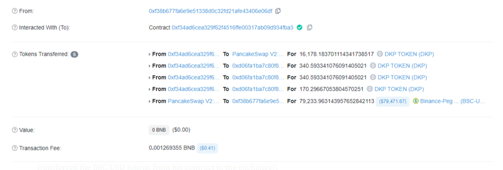
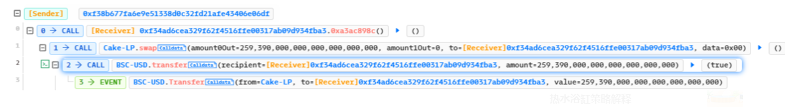
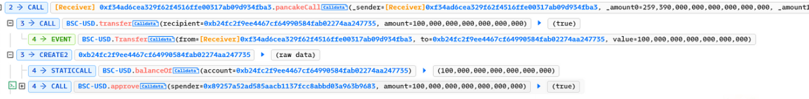
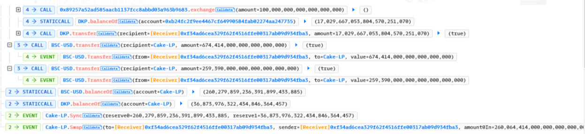
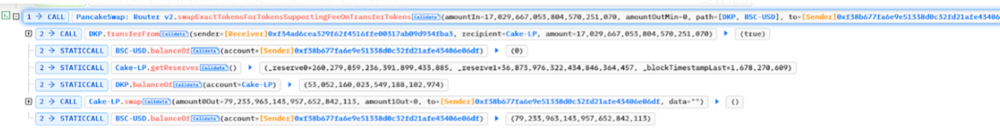

# **概述：**

2023 年 2 月 8 日，针对 DKP 协议的闪电贷攻击导致该协议的用户损失了 8 万美元，因为 execute() 函数取决于 USDT-DKP 对中两种代币的余额比率。

**智能合约黑客概述：**

- 攻击者的交易：[0x0c850f](https://bscscan.com/tx/0x0c850f54c1b497c077109b3d2ef13c042bb70f7f697201bcf2a4d0cb95e74271)，[0x2d31](https://bscscan.com/tx/0x2d31e45dce58572a99c51357164dc5283ff0c02d609250df1e6f4248bd62ee01)
- 攻击者地址：[0xF38](https://bscscan.com/address/0xF38B677fa6E9E51338D0c32FD21afe43406E06Df)
- 利用合同：[0xf34ad](https://bscscan.com/address/0xf34ad6cea329f62f4516ffe00317ab09d934fba3#code)
- DKP合约代码：[0xd06fa](https://bscscan.com/address/0xd06fa1ba7c80f8e113c2dc669a23a9524775cf19#code)
- DKP交易对：[0xBE654](https://bscscan.com/address/0xBE654FA75bAD4Fd82D3611391fDa6628bB000CC7#code)

**解码智能合约漏洞：**

- 攻击从向漏洞利用合约传输 259,390 BSC-USD 代币的闪贷开始。

  

- 然后，攻击者调用他的合约的 `pancakeCall()` 方法，并将 BSC-USD 代币从他的合约转移到 exchange() 函数。

- 然后攻击者使用该`exchange()`方法将 100 BSC-USD 转换为 17,029 DKP 代币，随后将其传输到漏洞利用合约。

- 攻击者发起了一项新交易`swapExactTokensForTokensSupportingFeeOnTransferTokens`，将 DKP 代币兑换回他们的 USDT 对手方，并从中获利颇丰。

**缓解措施和最佳实践：**

- 通过诸如 Chain Links 之类的预言机和对这些提要参数的输入验证，可以在更大程度上减轻价格操纵尝试，以防止数据过时。
- 使用加权时间算法，而不是严重依赖令牌算法。
- 定期检查欺诈存款的情况并防止套利。