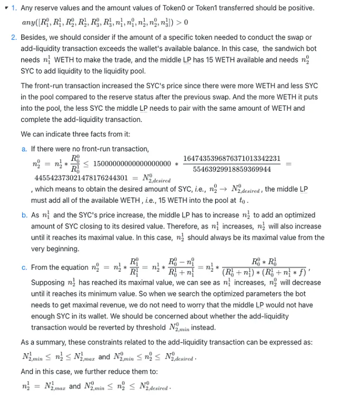
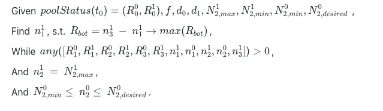

2022 年 11 月 4 日，[EigenPhi](https://eigenphi.io/)检测到一种全新类型的[三明治交易](https://www.eigenphi.io/mev/ethereum/tx/0x8b82e58ba636c97681623a42e91683266ba7ca823855c352a3bb1b22d41824de)：一个[三明治机器人](https://eigenphi.io/mev/ethereum/sandwich/attacker/0x00004ec2008200e43b243a000590d4cd46360000)挤压了一笔增加流动性的[交易](https://etherscan.io/tx/0x2d38eeebe9deac4c6a180dc94f04b60c28773a829d432f38a2569817e574aae5)，根据我们的常识，这很奇怪。这样做有利可图吗？有什么限制吗？与之前关于包括 37 笔交易的巨大三明治交易的[文章](https://eigenphi.substack.com/p/a-super-37-layer-sandwich-trade-including)不同，该机器人展示了一种截然不同的创新策略。而本文将带你一探AMM旗下LP的现状有多危险。

# 摘要和代币流程图

从这笔交易中，三明治机器人获得了 0.922832 WETH 的收入。减去前台交易和后台交易的 gas 成本后，剩余的利润约为 0.023346 WETH。该机器人在一揽子交易中实现了完美的无风险套利，没有对 WETH 以外的资产进行风险敞口。

# 交易步骤

- **Front-run Tx：**三明治机器人的发件人[地址](https://etherscan.io/address/0x7944e84d18803f926743fa56fb7a9bb9ba5f5f24)调用其合约（[到地址](https://eigenphi.io/mev/ethereum/sandwich/attacker/0x00004ec2008200e43b243a000590d4cd46360000)）并通过[Uniswap V2：SYC 6将 21.477791967255461888 WETH 交换为 458,875.769333569771126592 ](https://www.eigenphi.io/mev/ethereum/lp/0x3048d907593f7c2e845ed174c8d6356b16e9b304)[SYC](https://etherscan.io/address/0x0A41E6d4D4897E8Cec819ce7D10B2D7cDa61Dc94)。
- **中间Tx：** [有人](https://www.eigenphi.io/mev/ethereum/sandwich/victim/0x3fd884f571512ae8f273992b25bdf32787cf5b36)在矿池合约中加入15个WETH和231,712.963735470964309251 SYC，Uniswap V2: SYC 6，得到1,792.628826087529628699 UNI-V2作为凭证。我们将其称为中间流动性提供者 (LP)，如下所示。
- **回跑Tx：**三明治机器人将在前跑交易中获得的458,875.769333569771126592 SYC换回22.400624171075764224 WETH。

下图展示了每笔交易的[代币流向图](https://www.eigenphi.io/mev/ethereum/eigentx/0x6d174d460f7fc2eec5d851d213c7ae39590bbada768ab40400a97e4fe16f4cdf,0x2d38eeebe9deac4c6a180dc94f04b60c28773a829d432f38a2569817e574aae5,0xc82ed6a0514000c42fa817dbc707f04542bdc7610330c05cbe8059dbd758e7ff?rankdir=BT)。

# 该策略的定量分析

为什么三明治机器人可以从增加流动性的交易中获利？它的收入究竟从何而来？它是否获得了最大可能的收入？谁是受害者？

接下来，我们将对此策略进行详细分析。你会看到，与被挤压交易的用户相比，这个池子的所有流动性提供者承担的损失最大。更有趣的是，三明治机器人有可能在没有严格先决条件的情况下自行指导这项交易。

# 常量和变量

首先，我们列出了计算三明治机器人收入所需的常量和变量。如下表所示，我们用一串字符来表示夹心交易前后池子状态对应的参数。对于每个字符，我们用下标表示对应的时间，用上标表示对应的token。在这种情况下，token0 表示 SYC，token1 表示 WETH。

这是表中的上一个[ [Previous Swap](https://etherscan.io/tx/0x2c8cdc653aa63c3b8c38bfaa89f6dca820e875ab80198941aef05073404e988e)。](https://etherscan.io/tx/0x2c8cdc653aa63c3b8c38bfaa89f6dca820e875ab80198941aef05073404e988e)

需要几个常量来进行计算，我们可以从事件日志和交易数据中获取它们。要理解这里的计算逻辑，您可能需要一些与[Uniswap](https://etherscan.io/address/0x3048d907593f7c2e845ed174c8d6356b16e9b304#code) V2 及其[Router](https://etherscan.io/address/0x7a250d5630b4cf539739df2c5dacb4c659f2488d#code)合约相关的背景知识。例如，`swap()`和等函数中的逻辑`addLiquidity()`。

# 约束条件

其次，三明治机器人也应该遵守一些约束条件。

# 优化问题

现在我们关注优化问题。给定流动资金池的初始状态和相对恒定的参数，我们将攻击向量公式化为涉及所有已定义参数的约束优化问题。

我们可以通过分析方法或模拟来解决这个问题。

# 黑暗中的受害者

本质上，机器人的收益来自于一笔相同数量的掉期交易在增加流动性前后所面临的滑点的变化。**换句话说，它是针对滑点变化的无风险套利。**作为交易对手的有限合伙人呢？他们的 PnL 是多少？

基于前面的分析，我们继续计算LP在本次交易中的盈亏。我们考虑两种情况并定义如下所列的参数。

# 仿真结果

## 情况1：

上图右下面板显示，三明治机器人设置的参数对应其他LP承受的最大损失。

除此之外，我们还可以发现，超过这个门槛，机器人的收益主要来自中间LP的损失，随着机器人投入池中的WETH越来越多，其他LP的掉期费收益将超过其损失。

**从这个角度来看，中间 LP 设置的 reversion checkpoint 提供了关键的保护。**

而且，中间LP设置的reversion checkpoint巧妙地与其他LP最大损失对应的阈值重合。有人想知道这是否是一项自我导向的三明治交易；至少，它远不是一个失败者**。**三明治机器人既可以发起三明治交易，也可以发起增加流动性的交易，前提是保证总损益为正。

从左下图看，在特定的参数设置下，中间的LP似乎甚至可以从这笔交易中获利，值得仔细检查。

## 案例二：

如果我们假设中间的 LP 是一个独立的个体，不知道三明治机器人，我们应该用另一种方式计算它的指定本金。三种参与者的PnL结果如下图所示。

在这种情况下，sandwich bot 设置的初始参数不再对应其他 LP 的最大损失，如果为真则交易将被撤销。

案例 1 更可能与三明治机器人的策略一致。

为简化分析，以上计算均未考虑bot实际支付的Gas费用，结论并没有因此而改变。

# 自我导向的三明治交易会赚钱吗？

这个案例值得我们思考和学习的地方更多。例如，

- 什么样的资金池适合做类似的交易？
- 三明治机器人可以在没有第三方发起增加流动性交易的情况下实施该策略吗？

# 特定案例的推论

要找到上述问题的答案，需要对本文中的模型进行概括。在进行系统的研究之前，我们可以进行一个简短的反事实推理来了解一下。

考虑到前台和后台交易的收入和利润分别为 0.922832 WETH 和 0.023346 WETH，我们可以得出结论，三明治机器人无法通过模拟中间 LP 获利。

# 模拟模型

有人可能会问，这种策略是否取决于池及其状态？解决这个问题需要一个通用的模型和系统的学习。我们先在这里给出一个分析框架，并在以后的报告中分享更深入的研究。

我们在下表中列出了这六个步骤对 pool 的影响。

# 结论

我们强调从这个案例中获得的关键见解：

- 一个三明治机器人通过在 Uniswap V2 的 SYC-WETH 池中夹入一笔增加流动性的交易，赚取了近 1 WETH 的盈余。验证者通过汽油费获得大部分收入。
- 新策略可以看作是针对池中流动性前后滑点变化的无风险套利。
- 与中间 LP 相比，其他 LP 在这种情况下承担的损失要大得多。sandwich bot 设置的参数和中间 LP 施加的检查点约束巧妙地与其他 LP 的最大损失对应的阈值相吻合。
- LP 应谨慎设置检查点阈值，例如在发行增加流动性交易时要增加的最低流动性。否则，他们可能会因为这种三明治机器人而蒙受损失。
- 从我们的初步分析来看，机器人无法在不等待第三方增加流动性交易的情况下自行指导整个交易步骤。但是需要用一种更系统的模型来验证这一点。
- 并且该策略对池的初始状态非常敏感，机器人必须将其参数调整到特定范围以从其他 LP 获得最大盈余。